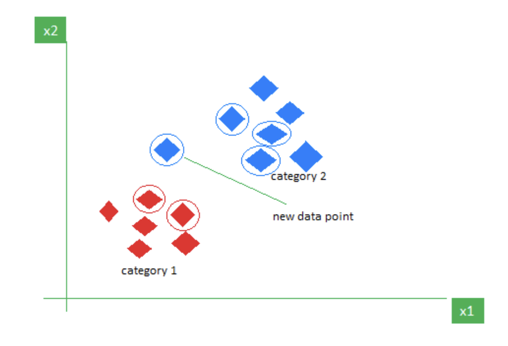

# KNN
- K-nearest neighbour
- Supervised Model
- Can be used for both classification and regression tasks
- Classify samples by looking at what’s nearby
- The **k** in the KNN algorithm tells **how many neighbours should be look** for in order to decide the label for the new datapoint
- Its a Non parametric model
- Objective: Similar data points must be close to each other
- Its not a linear classifier

# Working of KNN
- **Choose** an optimal **value of K**(No of neighbours to look at)
- **Calculate the distances** between the new datapoint to every other datapoint present
- Find the **closest k distances**: These data points will be called as the neighbours of the new sample
- The labels associated with the neighbouring samples will be influencing the label of the new sample
- The **label** of the **new data** point will be that **label that appears the most** amongst all its neighbours.
- In case of **regression** we will take the **average of the values of the K nearest neighbours**, which will generate a real value for the unseen data and in the case of classification the most occurring category will be unseen data label
- It can also be used for imputing the missing values in a feature, which can be either categorical or continuous categories.
- KNN is the only algorithm that can be **used for data imputation**
- Example working of KNN

- Here the value of K = 5, thus 5 closest labels are circled these are the K neighbours for the new datapoint
- Out of the 5 neighbours 3 are class blue and 2 are of class red, since the majority class is blue the new label will be of class blue
- KNN can also be used for image processing by converting the 3D image into a 1D vector and passing it as an input to the KNN algorithm

# Why are KNNs called the Lazy Learners

- KNN **does not build** the model **during training**
- Thus time complexity during training is O(1) but during inference O(N*No of features). Where N= No of samples
- It just stores the data and does all the **computation at prediction time**
- Its easy to build but computationally expensive for larger datasets as **during inference it will have to scan through each and every sample present**
- During prediction, it computes distances against every data point present in the dataset, which will become very slow when the dataset size is huge
- On adding a new unseen data the training data will be modified as this point will be included in the training set thus for the next prediction the decision boundary might be shifted by a bit

# Why is feature scaling required in KNN?

- As we are using **distances** they will be **affected** by the **magnitude** of values. Thus normalization is required
- For eg: If feature 1 is between 0-1 and feature 2 is between 100-200. Then while computing distances the features which have higher magnitude will be given higher importance

# Advantages of KNN

- Simple
- Easy to understand
- No complex training as it compares during the run time. Thus training time = 0
- Performs well when the dataset is small as its a lazy learner
- Its **faster** in terms of training as there **no** actual **function** that the model is trying to derive using the training samples
- Only **2 parameters** are required: **K, Distance metric**

# Disadvantages of KNN

- Computationally expensive at inference as KNN is a Lazy Learner
- Highly effected by outliers because distance metric is used
- Memory intensive as the entire training dataset must be loaded even during run time
- Choosing the right value of k is tricky
- It does not return a probability score like Logistic regression
- As the **dataset size increases** the amount of **noise** introduced also **increases**, which affects the KNN algorithm drastically
- Does **not work** well with **larger datasets**
- Values must be scaled else higher weightage will be provided to those values which are having higher magnitude

# Why is odd value of K preferred over even values in KNN?

- To ensure there will be no tie between the class labels
- For eg: If k = 4 and the neighbours labels are 2 blue and 2 red then its a tie and it will be difficult to determine the class of the unseen label
- But if it is odd it will always ensure that 1 of the classes will have a majority over the other

# Determining the right value for K

- Determines the number of neighbours that have to be considered while making predictions
- **Smaller k: Sensitive** to noise and **outliers. It leads to overfitting**
- **Large k**: Under-fit the data, by **misclassifying** the samples
- Right value for K must be determines as it directly impacts the bias and variance trade off

# Different methods used to determine the value of k

**1. Trial and Error**

- Try out different values of K and see which suits the best for your application

**2. Square root method**

- K = $\sqrt{No Of Samples Present}$
- As the value of K must be odd, to avoid ties if $\sqrt{No Of Samples Present}$ is even then it can be made odd by subracting or adding 1
- 

**3. Elbow Method**

- Start with Min value of K i.e. k =1
- Compute the **accuracy** of the model **over different values of K**
- The **optimal value** of K appears at the **elbow** point, which is where the **error stabilizes** and then increases again.
- K = Beginning of the stable region.

**5. Domain Knowledge**

- Using the domain knowledge to predict the good value for K

# Clubbing KNN with K-mean clustering (Optimised KNN)

- This approach will reduce the computational costs involved in KNN
- First K means clustering can be applied to generate different groups
- Then on each group/ cluster KNN can be applied to generate the labels
- It reduces the search space as first you are creating K clusters and then you check to which cluster is the unseen data closest to and then you apply KNN only on the elements present in the closest cluster

# Why is feature selection important in KNN

- **Removes irrelevant and redundant features** which will impact the distance metrices
- This **reduces** the no of **features**, therby increases accuracy and **reduces computational time**

# Implementation
- [Predict whether the user will buy the product or not based on their age and estimated salary](./practicals/knn.ipynb)