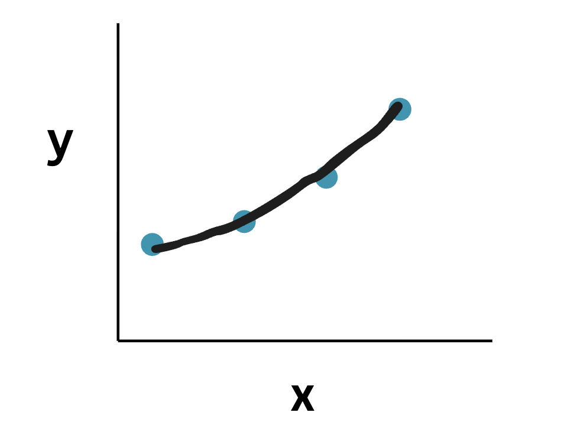

# Polynomial Regression
- In multiple linear regression the powers of x was 1 i.e. $y = w_1*x_1 + w_2*x_2 + ... w_{n}*x_{n} + b $
- Here instead of $x_1, x_2..$, its a single variable but in different powers i.e. $x_1, x_{1}^2, x_{1}^3...x_{1}^n$
- Polynomial Regression is a type of regression where the relationship between input and output is modeled as a polynomial (curved) function instead of a straight line.
- When data is not linear, fit a curve instead of a straight line.

# Formula 
- $y = w_1*x_1 + w_2*x_1^2 + w_3*x_1^3 + ... + w_{n}*x_1^n$
- We can choose the maximum degree of the polynomial, i.e. if degree is set to 2 then the regression formula will be 
$y = w_1*x_1 + w_2*x_1^2 + b$

# Why is polynomial regression still a linear model?
- Only the input features are in their polynomial powers, whereas all the parameters i.e. weights are all linear
- Linear here refers to being liner in parameters and not being liner in input features i.e. x
- So if we treat $x_1, x_1^2, x_2^3$ etc as other variables i.e. $x_1 = x_1, x_2 = x_1^2, x_3 = x_1^3$ then we will get $y = w_1*x_1+w_2*x_2+w_3*x3$ which is same as multiple linear regression
- Its a special case of multiple linear regression

# Implementation
- [Predict the Salary give the level of job](./practicals/polynomial_linear_regression.ipynb)