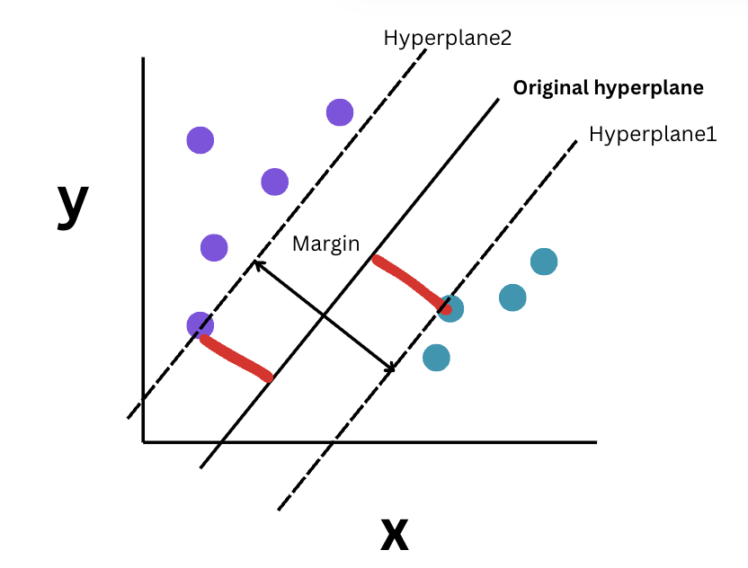
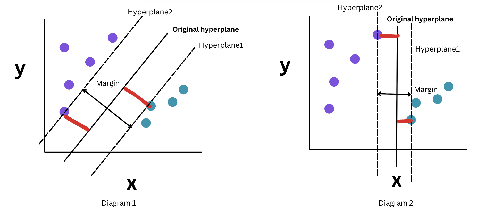
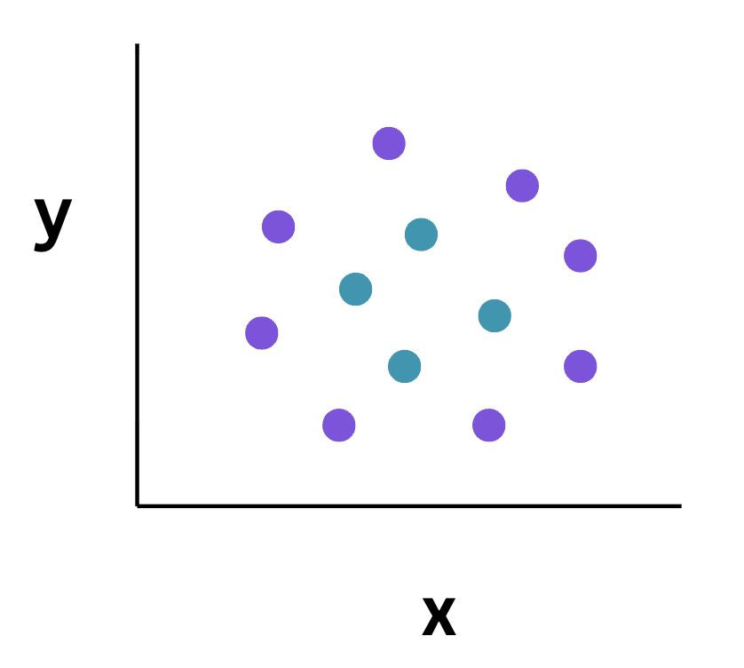
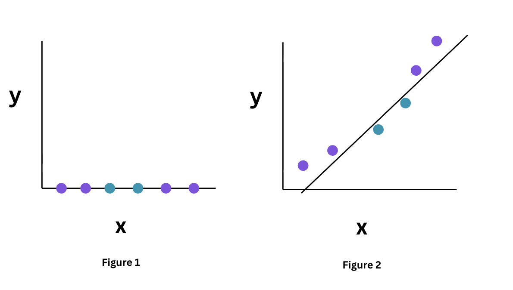

# Support Vector Machine

- Used for **classification (Support Vector Classification) and regression (Support Vector Regression)** problems
- It identifies the boundaries such that it classifies/ distinguishes the classes into their respective classes correctly
- Assumption of SVM is that data must be linearly separable


# Working of SVM

- 1 decision boundary is considered which is called the hyperplane or maximum margin hyperplane or maximum margin classifier. This boundary will be seperating the classes exactly (completely seperable) 
- To the hyperplane 2 more parallel hyperplanes will be created, one is the positive hyperplane and the other is the negative hyperplane
- Each of the newly created hyperplane must pass through one of the closest point from the original hyperplane and these points must belong to different classes i.e. if 2 classes are positive and negative then **1 of the newly created hyperplane must pass through that positive point which is the closest to the original hyperplane, and another hyperplane must pass through the negative point that is closest to the original hyperplane.**
- The perpendicular distance between the newely created positive plane and negative hyperplane is called as the **margin**
- Intuition behind the algorithm is consider the classification of apples and oranges what SVM does is that it finds all those oranges which are very close to the apples (when plotted, [support vectors](#support-vectors) of oranges will appear closer to the apples cluster) and all those apples which are very similar to oranges (support vectors of apples)
- Support vectors are the ones which contribute to the model building as it considers extremes cases



- The boundary for
    - 2D: Linear Line
    - 3D: Plane
    - nD: Hyperplane (cannot be visualized)
- Given the training dataset we can create **multiple hyperplanes**, but we need to **choose** that **hyperplane** such that the **margin value maximum**.
- Diagram showing multiple hyperplanes for the same dataset is given below



- Diagram1 has greater marginal distance than over diagram 2, thus we choose diagram1, as the **aim of SVM is the maximize the margin**
- Hyperplane1 and hyperplane2 can also be called as the marginal plane1 and maginal plane2
- **Greater the maginal distance** implies that the model is more generalized


# Support Vectors

- These are the **vectors that passes through the maginal plane**.
- There **can be more than 1 support vector on the single marginal plane**

# Kernal Trick

- These are **used** when the **data** is **not easily seperable** into its respective classes. This implies that we are **aiming at converting non linear problems into linear problems by increasing the number of dimensions**
- If the graph is 2D then converting into 3D can be done using SVM kernals by applying some function to the existing data
- This is like performing some **transformation on the dataset in order to fit the hyperplane and make SVM work**
- For eg: when data is spread in the circular fashion in a 2D graph. Here drawing a straight line will not help us seperate the points into 2 different classes. Thus we introduce another axis call it Z axis. Then the points might become seperable and then the same concept of hyperplanes can be used on the transformed data.
- This will be extremely computer intensive process
- Kernel trick is a technique that uses kernel functions to convert non linearly seperable to linearly seperable



- For instance, in the diagram below, the data is in 1D thus the seperator must be a point and there is no way to find a single point which can seperate the 2 classes thus when we apply a kernal function lets say `x^2` then point will be converted from 1D to 2D as shown in figure2. Now the data is linearly seperable as we can draw a line to seperate the 2 classes. This transformation of data is called the kernal transformation



# Kernels
- Function that computes the similarity (dot product) between two data points in a higher-dimensional space.


# Types of kernals

## 1. Linear Kernal

- Its a basic kernel
- Proves to be the best function when there are many features

```python
model = SVC(kernel = "linear")
```

## 2. Gaussian rbf kernel
- Gaussian Radial Basis formula
- Mostly used kernel in SVM
- Chosen when the data is non linear
- Formula $Kernal(x,x') = e^{(-\gamma||x-x'||^2)}$
- Where, $\gamma =\frac{1}{2* \sigma ^2}$
- $\gamma$ control the spread of the kernel. Higher the value of $\gamma$ lesser the kernals influence and lower the value higher its influence

```python
model = SVC(kernel="rbf")
```
## 3. Sigmoid Kernel

## 4. Polynomial Kernel

# Advantages

- Very robust model
- Can work with non linearable problems

