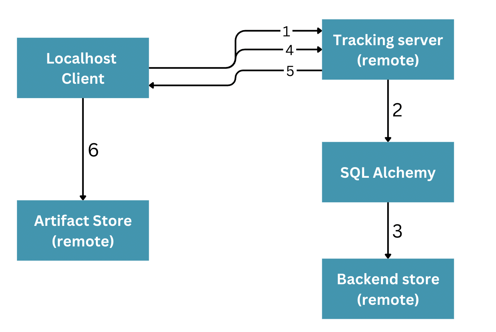

# MLFlow Tracking Server
- Whatever logging is done using autolog, or log_metric, log_artifact etc are all on local, thus these results cannot be accessed by others
- So all of these logs must be stored elsewhere which is accessible to all, thats done by MLFlow tracking servers
- So its a centeralized repository to store and log all the metadata, artifacts etc thats generated on training the models
- These results can be shared across and can be logged by multiple people at a single central place

# Why MLFlow Tracking Server is required?
- Without tracking server
    - Each user will have their only `mlruns` folder in their local
    - No sharing of experiments
    - No team visibility
    - Not production ready
- With tracking server
    - Team collaboration
    - Centralized experiment tracking
    - Production-grade MLOps
    - Web UI for everyone


# Components of tracking server
1. Storage
2. Networking / Communication

# MLflow tracking server - storage
- Helps in storing the artifacts, model information etc thats generated at the time of training
- Storage has 2 stores 
    - Backend Store
        - Stores metadata related to the    
            - Experiments
            - Runs
            - Metrics
            - Tags
            - Run Status
            - Start & End time 
            - Model version etc
        - 2 type of backend stores
            - DB store
                - Uses Databases like SQLite, MySQL, PostgresSQL etc to store information
            - File Store
                - Uses local or cloud platform like GCS, Amazon S3, Azure etc to store information
    - Artifact Store
        - Stores artifacts such as 
            - Trained models
            - Input data
            - Output files
            - Visuals 
            - Images
            - CSVs etc
            - Anything that comes under `log_artifacts`
        - Can be stored in cloud or local
- There is artifact store and backend store because to store large binaries like the models etc databases are not good, instead object store is cheaper and scalable


# MLflow tracking server - Networking
- Helps the users, machines, services to interact with the tracking server over the network using the REST APIs or RPC (Remote Procedure Call)
- It implies we need to establish a connection between the client and the server
- It supports 2 types of protocols
    - REST API
        - Helps in accessing the tracking server via HTTP
    - RPC
        - Helps in accessing the tracking server via gRPC
        - This is more effcient  
- Which protocol to choose depends on the requirements

# Implement MLFlow Tracking server
- To run the MLFlow tracking server
```shell
mlflow server --backend-store-uri sqlite:///mlflow.db --default-artifact-root <path to where you want the artifacts to be stored> --host 127.0.0.1 --port 5000 
```
- Where,
    - mlflow.db is the name of the database
- This will create a tracking server at the given host and given port
- If the backend store uri and artifact uri is not given then it will store locally in the `mlruns` directory
- There are many other parameters within mlflow server command
- Now if you want to store your runs results in this URI then pass this URI in `set_tracking_uri`
```python
mlflow.set_tracking_uri(uri = "http://127.0.0.1:5000")

mlflow.set_experiment("experiment1")

with mlflow.start_run():
    # Code
```
- Now if you go to the URI that you passed via `set_tracking_uri` you will be able to view the metadata under the experiment named "experiment1"
- If host its 0.0.0.0 then its localhost
- On your local you will be able to see mlflow.db and ./actifacts being created in your current working directory
- Once this server is stopped the tracking URI will not be accessible, thus this cannot be used in the production grade applications


# How to enable MLFlow tracking servers in Production
- You will not use `mlflow server` as a terminal command
- You must use Docker or Kubernetes or System services, cloud load balancer, managed databases, object storage 
- This will ensure that the server is always running, auto restarted if crashes, accessible to teams, secure and scalable
- If docker is used then MLFlow runs as a docker instead of a terminal command
```shell
docker run -d \
  -p 5000:5000 \
  mlflow/mlflow \
  mlflow server \
    --backend-store-uri postgresql://... \
    --default-artifact-root s3://...
```
- This is easy to deploy, and runs in the background

# MLFlow on localhost
- Here MLFlow on the local system
- Here the artifacts and the backend store can share a common directory called `mlruns`
- On implementing mlflow in the scripts and by running, it automatically creates the dedicates files and folders thats required for tracking

# MLFlow on localhost with SQLite
- Here we use SQLite as the backend store on local machine for tracking runs
- The artifacts is stored in the local system i.e. by default in `mlruns`
- In this case we will need to set the tracking URI
```python
mlflow.set_tracking_uri(uri="sqlite:///mlflow.db")
```

# MLFlow supports distributed architecture this means that
- Accepts logs from multiple machines, clients, services etc
- Centralized metadata, and artifacts


# MLFlow with remote
- MLFlow supports distributed architectures, i.e. artifacts store, backend store and tracking server are stored at different places
- These usually are present on the remote host. They are hosted on cloud services like AWS, Azure etc
- On localhost when the run is executed the MLFlow client will make a REST API call to the tracking server
- Tracking server will create an instance of SQL Alchemy store which is used by MLFlow to talk to the backend store.
- This results in storing data in the Database which is present on the remote host
- Now to store the artifacts the client will ask "Where should I store the artifacts for this run", this response is given by the tracking server
- Localhost client sends a request to tracking server to fetch the artifacts store uri, and sends it back to localhost, then it stores the artifacts in that uri which can be S3 or anything else




- This is used in production level

# Proxied Artifacts
- Instead of the MLFlow client uploading artifacts directly to the artifact store, the MLFlow tracking server will do it on the clients behalf
- For this first the client sends the artifacts to the tracking server and then the tracking server uploads them to the artifact store
- So here the MLFlow tracking server acts like a proxy i.e. middleman for artifact uploads and downloads
- When the client is trying to directly upload it to artifact store then the client must have all access keys and credentials to AWS, and must have the network access to S3
- Proxied Artifacts helps in maintaining security as no cloud credentials are required by the user
- Client setup is easier in this case
- If `--server-artifacts` is present as an argument in `mlflow server` then it enables artifact proxying through tracking server

```shell
mlflow server \
    --backend-store-uri postgresql://... \
    --default-artifact-root s3://mybucket/mlflow-artifacts \
    --serve-artifacts
```