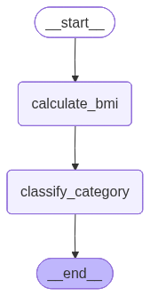

-   Its a non LLM based workflow
-   4 nodes
    -   Input = height, weight
    -   Calculation
    -   Based on BMI value classify as obese or healthy
    -   Output
-   State
    -   Height
    -   Weight
    -   BMI value
    -   Category
-   START, END are the dummy nodes that are used to indicate the start
    and the end of the graph


```python
from langgraph.graph import StateGraph, START, END
from typing import TypedDict
```

# Define the State

-   State will be of type type dict or pydantic


```python
from unicodedata import category


class BMIState(TypedDict):
    height: float
    weight: float
    bmi: float
    category: str


```

# Define the graph

-   You need to create a graph object which is of type StateGraph
-   Add nodes to the graph
-   You also need to pass the state to the node
-   Add edges
-   Compile the graph
-   Execute the graph


```python
# Define the graph
graph = StateGraph(BMIState)

```

# Function defination for BMI calculation

-   As this function will be executed by the node, the input to this
    node will be a state which will be of type BMIState and will also
    return a state which will be of type BMIState
-   The weight and the height input values can be fetched from the state
-   And the final output must also be stored back in the state


```python
def calculate_bmi(state: BMIState) -> BMIState:
    state["bmi"] = state["weight"] / (state["height"] ** 2)
    return state

```

# Function defination for classfying the category based on BMI value


```python
def classify_category(state: BMIState) -> BMIState:
    if state["bmi"] > 30:
        state["category"] = "Obese"
    else:
        state["category"] = "Healthy"
    return state

```

# Add nodes to the graph

-   Syntax:
    -   `graph.add_node(Name of the Node, Function Name)`


```python
graph.add_node("calculate_bmi", calculate_bmi)
graph.add_node("classify_category", classify_category)
```

``` text
<langgraph.graph.state.StateGraph at 0x10ede7c50>
```

# Add edges

-   Start Node -\> calculate_bmi Node -\> classify_category Node -\> End
    Node
-   Totally 3 edges i.e.
    -   START Node -\> calculate_bmi Node
    -   calculate_bmi Node -\> classify_category Node
    -   classify_category Node -\> END Node
-   Syntax
    -   `graph.add_edge(Node1, Node2)`


```python
graph.add_edge(START, "calculate_bmi")
graph.add_edge("calculate_bmi", "classify_category")
graph.add_edge("classify_category", END)

```

``` text
<langgraph.graph.state.StateGraph at 0x10ede7c50>
```

# Compile Graph


```python
workflow = graph.compile()
```

# Execute the Graph

-   Syntax
    -   `workflow.invoke(initial_state)`
-   This will also return a state


```python
initial_state = {"height": 170, "weight": 70}
final_state = workflow.invoke(initial_state)
print(final_state)
```

``` text
{'height': 170, 'weight': 70, 'bmi': 0.002422145328719723, 'category': 'Healthy'}
```

# View the graph visually

1.  Print workflow
2.  Using IPython.display

## Option 1: Printing workflow


```python
workflow
```



## Option 2: Using IPython.display \{#option-2-using-ipython.display\}


```python
from IPython.display import Image, display
display(Image(workflow.get_graph().draw_mermaid_png()))
```


