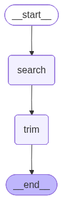

-   Tools in LangGraph are external functions or APIs that the LLM can
    call to perform specific tasks
-   Tools extend the capability of an LLM
-   Eg: LLM will not have the information of what happened today, so it
    will have an external tool which will connect to internet and then
    fetch the answers from there
-   In graphs, all the tools are reprsented by an inbuilt node called
    Tool Node
-   Tools condition
    -   This is a prebuilt conditional edge function that helps your
        graph decide on whether the tool must invoke a tool or not
-   Tools can be prebuilt(DuckDuckGoSearchRun) or custom tools
-   Problem Statement:
    -   Given the query the answer must be fetched from DuckDuckGo and
        then the result must be trimmed by using another custom tool for
        trimming


```python
from typing import TypedDict
from langgraph.graph import StateGraph, END
from langchain_community.tools import DuckDuckGoSearchRun
from langchain.tools import tool
```


```python
class State(TypedDict):
    query: str
    search_result: str
    final_answer: str
```

# Inbuilt tool


```python
search_tool = DuckDuckGoSearchRun()

```

# Custom tool

-   Use the decorator `@tool`
-   You can specify the name and the description of the tool within the
    decorator i.e. (**tool?**)(name = “tool name”, description=“What the
    tool does”)
-   By default the description of the tool is picked up from the
    docStrings


```python
@tool
def trim(text):
    """Trims the text"""
    return text[:300]
```

# Function defination


```python
def search_node(state:State):
    query = state["query"]

    result = search_tool.invoke(query)
    
    return {"search_result": result}

def trim_node(state:State):
    text = state["search_result"]

    trimmed_resullt = trim.invoke({"text": text})
    return {"final_answer": trimmed_resullt}
```

# Build the graph


```python
graph = StateGraph(State)

# Add nodes
graph.add_node("search", search_node)
graph.add_node("trim", trim_node)

```

``` text
<langgraph.graph.state.StateGraph at 0x112fe1590>
```

# Adding edges

-   If an edge must be created from START -\> Node1 we use
    `graph.add_edge(START, "node1")`
-   This can also be replaced by `graph.set_entry_point("node1")`. Both
    of these means the same


```python
graph.set_entry_point("search")
graph.add_edge("search","trim")
graph.add_edge("trim", END)

workflow = graph.compile()
workflow
```




```python
initial_state = {"query": "What is langGraph?"}

workflow.invoke(initial_state)
```

``` text
{'query': 'What is langGraph?',
 'search_result': 'Whatdoes all this information mean? The following example can offer a clearer understanding ofLangGraph: Think about these graph-based architectures ... WhatisLangGraph? ...LangGraphisa library for developing complex, stateful applications with Large Language Models (LLMs) that involve multiple ... WhatisLangGraph? ...LangGraphisa library built on top of Langchain thatisdesigned to facilitate the creation of cyclic graphs for large ... WhatisLangGraph? A Comprehensive Guide to Graph-Based Language Models ... Are you familiar with LangChain? Did you knowLangGraphisthe extension ... WhatisLangGraph? ...LangGraph’ s ability to produce ...LangGraphMemoryisa part of theLangGraphstructure that boosts language models.',
 'final_answer': 'Whatdoes all this information mean? The following example can offer a clearer understanding ofLangGraph: Think about these graph-based architectures ... WhatisLangGraph? ...LangGraphisa library for developing complex, stateful applications with Large Language Models (LLMs) that involve multiple ... '}
```
