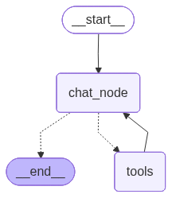

-   RAG is created as a seperate tool


```python
from langchain_groq import ChatGroq
from langchain_community.document_loaders import PyPDFLoader
from langchain_text_splitters import RecursiveCharacterTextSplitter
from langchain_community.vectorstores import FAISS
from langchain_core.tools import tool
from langgraph.graph import START, END, StateGraph
from typing import Annotated, TypedDict
from langgraph.graph.message import add_messages
from langchain_core.messages import HumanMessage, AIMessage, BaseMessage
from langgraph.prebuilt import ToolNode, tools_condition

```

``` text
/Users/ritumalage/Documents/my_github/Notes/.venv_langgraph/lib/python3.13/site-packages/tqdm/auto.py:21: TqdmWarning: IProgress not found. Please update jupyter and ipywidgets. See https://ipywidgets.readthedocs.io/en/stable/user_install.html
  from .autonotebook import tqdm as notebook_tqdm
```


```python
model = ChatGroq(model = "qwen/qwen3-32b") 
```

# Load the PDF


```python
loader = PyPDFLoader("./utils/langgraph.pdf")
docs = loader.load()
```

# Split the PDF


```python
splitter = RecursiveCharacterTextSplitter(chunk_size = 1000, chunk_overlap = 200)
chunks = splitter.split_documents(docs)
```

# Embed each document, and store it in the vectorDB


```python
from langchain_community.embeddings import HuggingFaceEmbeddings
embedding_model = HuggingFaceEmbeddings(
    model_name="sentence-transformers/all-MiniLM-L6-v2"
)

vector_store = FAISS.from_documents(chunks, embedding_model)


```

``` text
Loading weights: 100%|██████████| 103/103 [00:00<00:00, 8059.65it/s]
BertModel LOAD REPORT from: sentence-transformers/all-MiniLM-L6-v2
Key                     | Status     |  | 
------------------------+------------+--+-
embeddings.position_ids | UNEXPECTED |  | 

Notes:
- UNEXPECTED    :can be ignored when loading from different task/architecture; not ok if you expect identical arch.
```

# Creating the retriever objects


```python
retriever = vector_store.as_retriever(search_type = "similarity", search_kwargs = {"k": 4})

```

# Creating the RAG tool


```python
@tool
def rag_tool(query):
    """
    Answers the given query based on the document shared. Use this tool when user wants a very sepcific information thats related to the document passed, or stored
    """
    result = retriever.invoke(query)

    context = [doc.page_content for doc in result]
    metadata = [doc.metadata for doc in result]

    return {
        "query": query,
        "context": context,
        "metadata": metadata
    }
```


```python
tools = [rag_tool]
model_with_tools = model.bind_tools(tools)

```


```python
class State(TypedDict):
    messages: Annotated[list[BaseMessage], add_messages]
```


```python
def chat_node(state: State):
    message = state["messages"]
    response = model_with_tools.invoke(message)
    return {"messages": [response]}
```


```python
tool_node = ToolNode(tools)
```


```python
graph = StateGraph(State)

graph.add_node("chat_node", chat_node)
graph.add_node("tools", tool_node)

graph.add_edge(START, "chat_node")
graph.add_conditional_edges("chat_node", tools_condition)
graph.add_edge("tools", "chat_node")

workflow = graph.compile()
workflow
```




```python
initial_state = {"messages": [HumanMessage(content = "What are the core concepts in langgraph?")]}
workflow.invoke(initial_state)
```

``` text
{'messages': [HumanMessage(content='What are the core concepts in langgraph?', additional_kwargs={}, response_metadata={}, id='afcedf36-a022-4146-bffe-6723a057fe74'),
  AIMessage(content='', additional_kwargs={'reasoning_content': 'Okay, the user is asking about the core concepts in LangGraph. I need to figure out how to approach this. Since the user mentioned "core concepts," they probably want an overview of the fundamental ideas or components that make up LangGraph.\n\nFirst, I should check if there\'s a document or resource that explains LangGraph\'s structure. The available tool is the rag_tool, which is for retrieving specific information from a document. But the user isn\'t asking for a very specific detail; they want core concepts. However, since the tool is designed for when the user needs info related to a document, maybe the answer is in the provided document. \n\nI don\'t have prior knowledge about LangGraph beyond what\'s in the document. So, I should use the rag_tool to query the document for the core concepts. The function requires a query parameter. The user\'s question is general, so I need to phrase the query in a way that the document can provide a comprehensive answer. \n\nI should call the rag_tool with the query "What are the core concepts in LangGraph?" to get the relevant information from the document. That way, the response will be based on the document\'s content, which is what the tool is for. There\'s no need to use other functions since they aren\'t available. \n\nSo, the next step is to generate the tool call with the specified query. I have to make sure the JSON is correctly formatted with the function name and arguments. Let me structure that properly.\n', 'tool_calls': [{'id': '2kphd9mmf', 'function': {'arguments': '{"query":"What are the core concepts in LangGraph?"}', 'name': 'rag_tool'}, 'type': 'function'}]}, response_metadata={'token_usage': {'completion_tokens': 334, 'prompt_tokens': 175, 'total_tokens': 509, 'completion_time': 0.667262929, 'completion_tokens_details': {'reasoning_tokens': 302}, 'prompt_time': 0.011360521, 'prompt_tokens_details': None, 'queue_time': 0.047123499, 'total_time': 0.67862345}, 'model_name': 'qwen/qwen3-32b', 'system_fingerprint': 'fp_5cf921caa2', 'service_tier': 'on_demand', 'finish_reason': 'tool_calls', 'logprobs': None, 'model_provider': 'groq'}, id='lc_run--019cd2ef-9c95-7011-9ba2-1629056f4faa-0', tool_calls=[{'name': 'rag_tool', 'args': {'query': 'What are the core concepts in LangGraph?'}, 'id': '2kphd9mmf', 'type': 'tool_call'}], invalid_tool_calls=[], usage_metadata={'input_tokens': 175, 'output_tokens': 334, 'total_tokens': 509, 'output_token_details': {'reasoning': 302}}),
  ToolMessage(content='{"query": "What are the core concepts in LangGraph?", "context": ["2. Core Concepts in LangGraph\\nLangGraph introduces several key abstractions that form the foundation of its architecture. State:\\nThe state object stores the information shared between nodes. Each node can read from the state\\nand update it. The state typically contains conversation history, intermediate results, tool outputs,\\nand control signals. Nodes: Nodes represent individual computation steps. A node can call an LLM,\\nperform retrieval, execute a tool, or process data. Nodes receive the current state and return\\nupdates to the state. Edges: Edges define the transitions between nodes. When a node finishes\\nexecution, the workflow moves along an edge to the next node. Edges can be static or conditional.\\nConditional Edges: Conditional routing enables the workflow to branch depending on runtime\\noutputs. For example, if the LLM decides a tool is needed, the workflow moves to a tool node.\\nOtherwise, it returns a final answer. Entry Point: The entry point specifies where the workflow", "outputs. For example, if the LLM decides a tool is needed, the workflow moves to a tool node.\\nOtherwise, it returns a final answer. Entry Point: The entry point specifies where the workflow\\nbegins. This is typically the main LLM node responsible for interpreting user input. Termination: A\\nworkflow eventually reaches an END node. This indicates that the process has completed and the\\nfinal result should be returned.\\n3. Building an Agent with LangGraph\\nA common use case for LangGraph is building AI agents capable of interacting with external tools.\\nThese agents typically follow a loop of reasoning and action. The LLM first analyzes the problem\\nand decides whether a tool should be used. If a tool is required, the workflow transitions to a tool\\nnode that executes the requested action. The result is then returned to the LLM for further\\nreasoning. This loop continues until the model decides that no further actions are necessary. The", "augmented generation (RAG), and iterative planning. LangGraph addresses these limitations by\\nallowing developers to construct workflows where the execution path can change based on\\nintermediate outputs. For example, a chatbot might decide to call a search tool, then summarize\\nresults, and finally generate a response. Another example is an AI agent that repeatedly plans,\\nexecutes, evaluates, and revises its strategy until a goal is achieved. Graph-based execution\\nmakes these workflows easier to represent. Each step in the workflow is represented as a node.\\nEdges define the possible transitions between nodes. Conditional edges enable dynamic branching\\ndepending on the output of a node. This approach provides transparency and control. Developers\\ncan visualize the flow of data, debug individual nodes, and observe how decisions are made inside\\nthe system.", "LangGraph: A Practical Guide to Building Agentic\\n AI Workflows\\nLangGraph is a framework designed to build stateful, multi■step AI applications using large\\nlanguage models (LLMs). It extends the capabilities of LLM orchestration frameworks by\\nintroducing graph■based workflows where nodes represent steps in a computation and edges\\nrepresent transitions between those steps. This structure enables developers to construct complex\\nreasoning pipelines, agent systems, and iterative workflows in a structured and controllable way.\\nModern AI applications often require more than a single prompt to a language model. Many\\nsystems must combine tool usage, memory, reasoning loops, and conditional logic. LangGraph\\nprovides a framework to model these workflows explicitly using graphs. By defining nodes and\\nedges, developers can create deterministic and non■deterministic flows where LLMs interact with\\ntools, APIs, and external systems. The framework is especially useful for building agentic systems"], "metadata": [{"producer": "ReportLab PDF Library - (opensource)", "creator": "(unspecified)", "creationdate": "2026-03-09T14:02:01+00:00", "author": "(anonymous)", "keywords": "", "moddate": "2026-03-09T14:02:01+00:00", "subject": "(unspecified)", "title": "(anonymous)", "trapped": "/False", "source": "./utils/langgraph.pdf", "total_pages": 4, "page": 1, "page_label": "2"}, {"producer": "ReportLab PDF Library - (opensource)", "creator": "(unspecified)", "creationdate": "2026-03-09T14:02:01+00:00", "author": "(anonymous)", "keywords": "", "moddate": "2026-03-09T14:02:01+00:00", "subject": "(unspecified)", "title": "(anonymous)", "trapped": "/False", "source": "./utils/langgraph.pdf", "total_pages": 4, "page": 1, "page_label": "2"}, {"producer": "ReportLab PDF Library - (opensource)", "creator": "(unspecified)", "creationdate": "2026-03-09T14:02:01+00:00", "author": "(anonymous)", "keywords": "", "moddate": "2026-03-09T14:02:01+00:00", "subject": "(unspecified)", "title": "(anonymous)", "trapped": "/False", "source": "./utils/langgraph.pdf", "total_pages": 4, "page": 0, "page_label": "1"}, {"producer": "ReportLab PDF Library - (opensource)", "creator": "(unspecified)", "creationdate": "2026-03-09T14:02:01+00:00", "author": "(anonymous)", "keywords": "", "moddate": "2026-03-09T14:02:01+00:00", "subject": "(unspecified)", "title": "(anonymous)", "trapped": "/False", "source": "./utils/langgraph.pdf", "total_pages": 4, "page": 0, "page_label": "1"}]}', name='rag_tool', id='797e4bc3-a573-44b3-af7c-edeae1d19ee6', tool_call_id='2kphd9mmf'),
  AIMessage(content='The core concepts in LangGraph, as outlined in the provided document, are:\n\n1. **State**  \n   - Stores shared information between nodes (e.g., conversation history, intermediate results, tool outputs, and control signals).  \n   - Acts as the dynamic memory of the workflow, updated by each node during execution.\n\n2. **Nodes**  \n   - Represent individual computation steps (e.g., calling an LLM, performing retrieval, executing a tool, or processing data).  \n   - Nodes receive the current state and return updates to it.\n\n3. **Edges**  \n   - Define transitions between nodes.  \n   - **Static edges** follow a fixed path, while **conditional edges** branch based on runtime outputs (e.g., if an LLM decides a tool is needed, the workflow routes to a tool node).\n\n4. **Entry Point**  \n   - The starting point of the workflow, typically an LLM node responsible for interpreting user input.\n\n5. **Termination**  \n   - The workflow concludes when it reaches an **END node**, signaling the process is complete and the final result is ready.\n\n6. **Workflow Execution**  \n   - Workflows are built as graphs where:  \n     - Each step is a node.  \n     - Edges define transitions.  \n     - Conditional logic enables dynamic branching based on node outputs (e.g., an AI agent loops through reasoning, action, and evaluation until a goal is achieved).\n\n**Example Use Case**:  \nLangGraph is ideal for building agentic systems (e.g., AI agents) that combine tool usage, memory, and iterative reasoning. For instance, a chatbot might:  \n1. Use an LLM to decide if a search tool is needed.  \n2. Transition to a tool node for execution.  \n3. Return results to the LLM for summarization and response generation.  \n\nThis graph-based approach provides transparency, control, and modularity for complex AI workflows.', additional_kwargs={'reasoning_content': 'Okay, let\'s break down the user\'s question about the core concepts in LangGraph. The user provided a document that outlines several key abstractions. First, I need to parse the context given in the tool response.\n\nThe document mentions "State," which is where information is stored and shared between nodes. Each node can read and update the state. Then there are "Nodes," which are individual computation steps like calling an LLM or executing a tool. "Edges" define transitions between nodes, including conditional edges that allow branching based on runtime outputs. The "Entry Point" is where the workflow starts, usually an LLM node, and "Termination" is when the workflow reaches an END node.\n\nI should structure the answer to highlight each concept clearly. Start with State, explaining its role in holding conversation history and intermediate results. Then explain Nodes and their functions. Next, Edges and Conditional Edges to show how workflows transition. Mention the Entry Point and Termination to outline the workflow lifecycle. Also, include the example of building an agent with LangGraph to illustrate practical use. Make sure to use bullet points for clarity and reference the document\'s sections where each concept is detailed. Avoid technical jargon where possible and ensure the explanation is concise but comprehensive.\n'}, response_metadata={'token_usage': {'completion_tokens': 654, 'prompt_tokens': 1558, 'total_tokens': 2212, 'completion_time': 1.325842238, 'completion_tokens_details': {'reasoning_tokens': 253}, 'prompt_time': 0.086530788, 'prompt_tokens_details': None, 'queue_time': 0.046876172, 'total_time': 1.412373026}, 'model_name': 'qwen/qwen3-32b', 'system_fingerprint': 'fp_5cf921caa2', 'service_tier': 'on_demand', 'finish_reason': 'stop', 'logprobs': None, 'model_provider': 'groq'}, id='lc_run--019cd2ef-a4ea-7873-8a21-33e7b4abe572-0', tool_calls=[], invalid_tool_calls=[], usage_metadata={'input_tokens': 1558, 'output_tokens': 654, 'total_tokens': 2212, 'output_token_details': {'reasoning': 253}})]}
```
