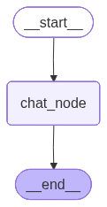

-   Workflow
    -   START -\> Chat Node -\> END
-   Concept of interrupts is used. It will be inside the Chat Node. This
    will pause the execution and will save the current state
-   The flow is interupted, so that the graph execution is paused and is
    waiting for an external input i.e. humans feedback
-   Problem Statement: To ask the user once again on whether the user
    wants to continue asking the question to LLM or not. This is just to
    understand the working of HIL
-   This can be achieved by making use of `interrupt()` function
-   The execution flow of `interrupt()` is
    -   Node -\> interrupt() -\> Pause workflow -\> wait for input -\>
        Resume workflow
-   Checkpointer is a must in HIL


```python
from langchain_groq import ChatGroq
from langgraph.graph import START, END, StateGraph
from typing import Annotated, TypedDict
from langgraph.graph.message import add_messages
from langchain_core.messages import HumanMessage, AIMessage, BaseMessage
from langgraph.checkpoint.memory import MemorySaver
```

``` text
/Users/ritumalage/Documents/my_github/Notes/.venv_langgraph/lib/python3.13/site-packages/tqdm/auto.py:21: TqdmWarning: IProgress not found. Please update jupyter and ipywidgets. See https://ipywidgets.readthedocs.io/en/stable/user_install.html
  from .autonotebook import tqdm as notebook_tqdm
```


```python
model = ChatGroq(model = "qwen/qwen3-32b") 
```


```python
class State(TypedDict):
    messages: Annotated[list[BaseMessage], add_messages]
```

-   The fields within the interrupt function can be anything, just that
    it must be a dictionary of key value pairs


```python
from langchain_core.messages import content
from langgraph.types import interrupt
from urllib3 import response


def chat_node(state: State):
    decision = interrupt({
            "type": "approval",
            "question": state["messages"][-1].content,
            "instruction": "Approve this question yes or no"
        }
    )
    # If the decision from human is NO then the question is not asked to the LLM else it is asked
    if decision["approved"] =="no":
        return {"messages": [AIMessage(content="Not Approved")]}

    else:
        response = model.invoke(state["messages"])
        return {"messages": [response]}
```


```python
graph = StateGraph(State)

graph.add_node("chat_node", chat_node)


graph.add_edge(START, "chat_node")
graph.add_edge("chat_node", END)

checkpointer = MemorySaver()

workflow = graph.compile(checkpointer = checkpointer)
workflow
```




```python
config = {"configurable": {"thread_id": "1"}}
initial_state = {"messages":[HumanMessage(content="What is Langgraph?")]}

workflow.invoke(initial_state, config = config)
```

``` text
{'messages': [HumanMessage(content='What is Langgraph?', additional_kwargs={}, response_metadata={}, id='7e77dce0-63c3-497b-8dfc-a210815825f8')],
 '__interrupt__': [Interrupt(value={'type': 'approval', 'question': 'What is Langgraph?', 'instruction': 'Approve this question yes or no'}, id='19741b2e924efd9e3d6d283243ffece9')]}
```

-   Now the execution of graph has been interrupted as in the chat_node
    we had included interrupt function
-   Now it is waiting for humans approval, based on the decision, the
    workflow will continue

# Seeking users approval


```python
# Lets say user replied with a NO
user_input = "no"
print(user_input)
```

``` text
no
```

# Resume the execution


```python
from langgraph.types import Command


final_result = workflow.invoke(Command(
    resume={"approved": user_input}),
    config = config
)
final_result
```

``` text
{'messages': [HumanMessage(content='What is Langgraph?', additional_kwargs={}, response_metadata={}, id='7e77dce0-63c3-497b-8dfc-a210815825f8'),
  AIMessage(content='Not Approved', additional_kwargs={}, response_metadata={}, id='1ccae1f8-6370-428c-9485-5cd38ee4d18c', tool_calls=[], invalid_tool_calls=[])]}
```

-   The AI Message says that it was not approved by the user
-   Now lets say the users response was an YES
-   `Command()` has a key word called `resume` which is used to resume
    the flow from where it was interupted
-   The other keyword are
    -   `resume`: To continue from where it has left
    -   `goto`: To jump to a specific Node
    -   `stop`: To stop execution
    -   `update`: Modify state


```python
user_input = "yes"

final_result = workflow.invoke(Command(
    resume={"approved": user_input}),
    config = config
)
final_result

```

``` text
{'messages': [HumanMessage(content='What is Langgraph?', additional_kwargs={}, response_metadata={}, id='7e77dce0-63c3-497b-8dfc-a210815825f8'),
  AIMessage(content='Not Approved', additional_kwargs={}, response_metadata={}, id='1ccae1f8-6370-428c-9485-5cd38ee4d18c', tool_calls=[], invalid_tool_calls=[])]}
```

-   This will not yield an LLM response even though the users input is
    YES
-   This is because LangGraph resumes only from an existing checkpoint
    for the given thread ID and not from the beginning
-   If the workflow has already ended, i.e. when users input was a NO
    the workflow ended, there is nothing to resume thus calling the
    resume function will not produce any new output
-   With re-running the config, and initial state for the same thread,
    you will now see the LLM response being appended to the state of
    messages


```python
user_input = "yes"

config = {"configurable": {"thread_id": "1"}}
initial_state = {"messages":[HumanMessage(content="What is Langgraph?")]}

workflow.invoke(initial_state, config = config)

final_result = workflow.invoke(Command(
    resume={"approved": user_input}),
    config = config
)
final_result

```

``` text
{'messages': [HumanMessage(content='What is Langgraph?', additional_kwargs={}, response_metadata={}, id='7e77dce0-63c3-497b-8dfc-a210815825f8'),
  AIMessage(content='Not Approved', additional_kwargs={}, response_metadata={}, id='1ccae1f8-6370-428c-9485-5cd38ee4d18c', tool_calls=[], invalid_tool_calls=[]),
  HumanMessage(content='What is Langgraph?', additional_kwargs={}, response_metadata={}, id='f281719f-6893-4321-85b7-f31d9ad4b5c1'),
  AIMessage(content='<think>\nOkay, the user is asking about "Langgraph" again. Let me check my previous response. Oh, right, the first time I said it wasn\'t approved. Now they\'re asking again. Maybe they\'re not satisfied with the answer or want more details.\n\nI need to make sure about what Langgraph is. Let me search for information. It seems like Langgraph is a framework for building state-of-the-art language models, specifically by graph neural networks. It\'s used in some research projects to enhance language processing tasks by leveraging graph structures to capture relationships between words or concepts.\n\nWait, the user might be referring to a different Langgraph. Maybe a tool or library? But from what I found, it\'s primarily associated with the graph-based language model approach. However, since my previous response was "Not Approved," perhaps there\'s a specific context or reason for that. Maybe it\'s related to a company or product that isn\'t publicly available or approved for discussion.\n\nI should verify if there are any other definitions. Let me double-check. No, most references point to the research framework. The user might be confused or there could be a different Langgraph they\'re thinking of. Since I can\'t provide unverified information, I need to stay cautious. But the user is asking again, so they might need clarification.\n\nI should explain that Langgraph isn\'t widely recognized and could refer to different things based on context. It\'s possible the user heard about it in a specific project or company. I\'ll mention that it might be a research framework for language models using graph structures, but without more context, it\'s hard to be precise. That way, I provide useful information while acknowledging the uncertainty.\n</think>\n\nThe term "Langgraph" does not correspond to a widely recognized or standardized framework, tool, or concept in the public domain as of my knowledge cutoff in July 2024. It could refer to:\n\n1. **A Research Framework**: In some contexts, "Langgraph" might be used informally to describe a graph-based approach for processing language, such as using graph neural networks (GNNs) to model relationships between words, concepts, or entities in a language model.\n\n2. **A Proprietary Tool**: It could be a specialized or internal tool developed by a company or research group for language processing tasks, which may not be publicly documented.\n\n3. **A Typo or Misinterpretation**: The term might be a typo or a misinterpretation of another term (e.g., "LangChain" or "LangGraph" in a specific project).\n\nIf you encountered this term in a specific context (e.g., a paper, company, or project), providing additional details would help clarify its meaning. Let me know if you\'d like further guidance!', additional_kwargs={}, response_metadata={'token_usage': {'completion_tokens': 565, 'prompt_tokens': 30, 'total_tokens': 595, 'completion_time': 1.5778921289999999, 'completion_tokens_details': None, 'prompt_time': 0.001433058, 'prompt_tokens_details': None, 'queue_time': 0.307808021, 'total_time': 1.579325187}, 'model_name': 'qwen/qwen3-32b', 'system_fingerprint': 'fp_99d722e776', 'service_tier': 'on_demand', 'finish_reason': 'stop', 'logprobs': None, 'model_provider': 'groq'}, id='lc_run--019cdd29-c820-7af2-88e6-36aa21418f49-0', tool_calls=[], invalid_tool_calls=[], usage_metadata={'input_tokens': 30, 'output_tokens': 565, 'total_tokens': 595})]}
```

-   The AIMessage is now the reply from the LLM
