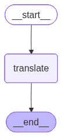
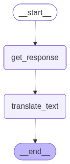

-   Problem Statement: When a user asks a question to LLM and the LLM
    responds it in English, this inturn is passed into another sub graph
    which is responsible for translation, and then the translated output
    is generated
-   Workflow
    -   START -\> Q&A -\> Translation -\> END
    -   This workflow will maintain a state say state1
-   For Q&A there will be an LLM
-   The translation node will invoke another subgraph which is
    responsible for translation
-   START -\> Translate -\> End
    -   This workflow will maintain another state say state2

# Sub graph implementation using method 1 i.e. invoking a subgraph from a node \{#sub-graph-implementation-using-method-1-i.e.-invoking-a-subgraph-from-a-node\}


```python
from typing import TypedDict
from langgraph.graph import StateGraph, START, END
from langchain_groq import ChatGroq

```

``` text
/Users/ritumalage/Documents/my_github/Notes/.venv_langgraph/lib/python3.13/site-packages/tqdm/auto.py:21: TqdmWarning: IProgress not found. Please update jupyter and ipywidgets. See https://ipywidgets.readthedocs.io/en/stable/user_install.html
  from .autonotebook import tqdm as notebook_tqdm
```


```python
model = ChatGroq(model = "qwen/qwen3-32b") 
```

# Defining the state for the translation sub graph

-   The input to this graph will be an english text
-   The output will be the translated text


```python
class state2(TypedDict):
    input_text: str
    translated_text: str
    
```

# Defining the function


```python
def translate(state: state2):
    prompt = f"Translate the following text: {state["input_text"]} to Kannada"

    translated_text = model.invoke(prompt).content

    return {"translated_text": translated_text}
```

# Building the sub graph


```python
from gettext import translation


translation_subgraph = StateGraph(state2)

# Adding nodes
translation_subgraph.add_node("translate", translate)

# Adding edges
translation_subgraph.add_edge(START, "translate")
translation_subgraph.add_edge("translate", END)

# Compiling the graph
translation_workflow = translation_subgraph.compile()
translation_workflow
```



# Defining the state of the parent graph

-   The state will have the information about the question asked by the
    user, response and the translated text


```python
class state1(TypedDict):
    question: str
    response: str
    translated_text_response: str
```

# Defining the function for getting LLM Response

-   Under the parent graph there are 4 nodes
    -   START
    -   END
    -   get_response
    -   translate_text: This will inturn call the translation_workflow
        which is a subgraph
-   The value of result will contain the full state of the subgraph
    i.e. input_text and translated_text


```python
def get_response(state: state1):
    prompt = f"Answer the given question: {state["question"]}"
    response = model.invoke(prompt).content

    return {"response": response}


def translate_text(state: state1):
    result = translation_workflow.invoke({"input_text": state["response"]})

    return {"translated_text_response": result["translated_text"]}
```

# Building the graph


```python
graph = StateGraph(state1)

# Adding nodes
graph.add_node("get_response", get_response)
graph.add_node("translate_text",translate_text)

# Adding edges
graph.add_edge(START, "get_response")
graph.add_edge("get_response", "translate_text")
graph.add_edge("translate_text", END)

# Compile
workflow = graph.compile()

workflow

```




```python
workflow.invoke({"question": "What is Langgraph?"})
```

``` text
{'question': 'What is Langgraph?',
 'response': '<think>\nOkay, so I need to figure out what LangGraph is. Let me start by breaking down the term. "Lang" might stand for language, and "Graph" likely refers to a data structure used to represent relationships between entities. So, putting them together, LangGraph could be a framework or tool that uses graph structures for language-related tasks.\n\nFirst, I should check if there\'s any existing knowledge about LangGraph. I know that in the field of artificial intelligence, especially natural language processing (NLP), there are various frameworks and libraries. For example, TensorFlow, PyTorch, Hugging Face\'s Transformers, and others. But LangGraph isn\'t one I\'m immediately familiar with, so it might be a newer or less well-known project.\n\nI can start by searching online. Maybe there\'s a GitHub repository, a documentation page, or a research paper. Let me think about possible sources. If I were to search, I might look for "LangGraph official website" or "LangGraph GitHub". Since I can\'t actually browse the internet, I\'ll have to rely on my existing knowledge up to 2023 and any possible connections I might have made between terms.\n\nAnother angle: sometimes frameworks are developed by companies or research groups. For example, Hugging Face has various tools, Anthropic has their own, but I don\'t recall LangGraph being associated with any major company. Alternatively, it could be a project by an individual or a smaller team.\n\nI should also consider the components. Graphs in AI contexts are often used for knowledge graphs, where nodes represent entities and edges represent relationships. In NLP, perhaps LangGraph uses graph networks to model language structures, like relationships between words, sentences, or concepts. This could be useful for tasks like semantic analysis, relationship extraction, or even for building more interpretable models.\n\nWait, there\'s also the concept of graph neural networks (GNNs), which apply neural networks to graph-structured data. Maybe LangGraph is a framework that integrates GNNs with natural language processing tasks. For example, using GNNs to process text by representing sentences as graphs where nodes are words or phrases and edges represent syntactic or semantic relationships.\n\nAlternatively, LangGraph could be a specific implementation or API that allows developers to create and manipulate graph data structures tailored for language processing. It might provide tools to convert text into graph representations, perform operations on those graphs, and then extract features or insights.\n\nAnother possibility is that LangGraph is part of a larger ecosystem. For instance, if there\'s a library like LangChain, which is a framework for building applications with large language models, maybe LangGraph is an extension or component of that. However, LangChain is a known project, but I\'m not sure about LangGraph\'s relation to it.\n\nI should also consider if "LangGraph" is a typo or a misheard term. Maybe the user meant "LangChain" or another similar term. But assuming the question is correct, I need to proceed with the assumption that LangGraph is a distinct entity.\n\nIn research papers, there are projects that combine graphs with language models. For example, some work uses knowledge graphs to enhance the performance of language models by incorporating structured data. If LangGraph is related to such work, it might facilitate integrating knowledge graphs with NLP models.\n\nAnother angle is to think about the components of a graph in language. Each node could represent a concept, and edges could represent how these concepts relate. For example, in a sentence, each word could be a node, and edges could show grammatical relationships. Processing such a graph with algorithms could help in understanding the sentence structure or improving machine learning models that process text.\n\nI should also consider if there are any specific tasks LangGraph is designed for. For example, question answering, text summarization, or information retrieval could benefit from graph-based approaches. If LangGraph provides tools to model these tasks using graphs, it could be a specialized framework.\n\nIn summary, based on the components of the name and common AI/NLP concepts, LangGraph is likely a framework or tool that uses graph structures to enhance or facilitate natural language processing tasks. It could involve techniques like graph neural networks, knowledge graphs, or other graph-based representations of language data. Without more specific information, this is the most plausible explanation, but the exact details would depend on the project\'s documentation or the team behind it.\n</think>\n\nLangGraph is a framework or tool designed to leverage graph-based structures for natural language processing (NLP) tasks. While there isn\'t a widely recognized or established project by this exact name as of 2023, the term can be interpreted in the context of existing AI/ML concepts and trends. Here\'s a breakdown of its likely purpose and functionality:\n\n1. **Graph Structures in NLP**:  \n   LangGraph likely uses **graph data structures** to model relationships in language. For example:\n   - **Nodes** could represent words, phrases, or concepts.\n   - **Edges** might encode syntactic (e.g., grammar) or semantic (e.g., meaning) relationships.\n\n2. **Applications**:  \n   - **Knowledge Graphs**: Integrating structured data (e.g., entities and their relations) with language models to enhance tasks like question answering or information retrieval.\n   - **Graph Neural Networks (GNNs)**: Applying GNNs to process textual graphs for tasks like sentiment analysis, text classification, or relation extraction.\n   - **Semantic Modeling**: Representing text as graphs to capture hierarchical or relational patterns beyond sequential data.\n\n3. **Potential Features**:  \n   - Tools to convert text into graph representations (e.g., dependency trees, semantic networks).\n   - Libraries for training or fine-tuning models on graph-structured language data.\n   - Integration with existing NLP frameworks (e.g., Hugging Face, TensorFlow, or PyTorch).\n\n4. **Relation to Existing Projects**:  \n   - **LangChain**: If "LangGraph" is a typo or extension of **LangChain** (a framework for building LLM-powered apps), it might focus on chaining or graph-based workflows for language models.\n   - **Graph Neural Networks (GNNs)**: Tools like **DeepGraph** or **StellarGraph** could provide foundations for LangGraph’s graph-processing capabilities.\n\n5. **Research Context**:  \n   Recent studies combine language models with graphs to improve interpretability, factual consistency, or performance in tasks like multi-hop reasoning. LangGraph could serve as a bridge between these domains.\n\n**Conclusion**: While not a widely documented project, LangGraph likely represents a conceptual or niche framework blending graph theory with NLP. It may assist in modeling complex language relationships, enhancing model performance, or enabling novel approaches like graph-based reasoning in text. For precise details, refer to specific documentation or repositories associated with the term.',
 'translated_text_response': '<think>\nOkay, let me start by breaking down the user\'s query. They want the provided text translated into Kannada. The text is a detailed explanation of what LangGraph might be, based on the user\'s analysis and existing knowledge up to 2023.\n\nFirst, I need to understand the original content thoroughly to ensure an accurate translation. The text discusses the components of "LangGraph" (language + graph), possible applications in NLP, connections to graph neural networks, knowledge graphs, and potential relationships with existing frameworks like LangChain.\n\nNext, I\'ll identify key technical terms and concepts that need precise translation. For example, "graph data structures" should be translated to "ಗ್ರಾಫ್ ಡೇಟಾ ರಚನೆಗಳು" in Kannada. Similarly, terms like "Graph Neural Networks (GNNs)" become "ಗ್ರಾಫ್ ನರ್ವ್ಸ್ ನೆಟ್ವರ್ಕ್ಸ್ (GNNs)".\n\nI need to maintain the technical accuracy while ensuring the translation flows naturally in Kannada. Since Kannada is a Dravidian language with a different script and grammar structure, I have to be careful with sentence structure and word order. For example, in Kannada, the verb often comes at the end of the sentence, so I\'ll adjust accordingly.\n\nI should also check for consistency in terminology. For instance, using "ನೈಸರ್ಗಿಕ ಭಾಷಾ ಪ್ರಕ್ರಿಯೆ (NLP)" for Natural Language Processing. It\'s important that all acronyms like NLP are retained as they are, but the full form is translated.\n\nAnother consideration is the use of examples and hypothetical scenarios in the original text. These need to be translated in a way that preserves the illustrative nature. For example, converting "nodes represent entities and edges relationships" into "ನೋಡ್ಸ್ ಪ್ರತಿನಿಧಿಸುತ್ತವೆ ಮತ್ತು ಕೊಂಡಿ ಸಂಬಂಧಗಳನ್ನು" while maintaining clarity.\n\nI should also pay attention to the structure of the original text, which is a coherent explanation with sections and bullet points. In Kannada, using appropriate punctuation and formatting to maintain this structure is essential for readability. Since the user mentioned translating the text, they might be looking for a direct translation that mirrors the original\'s format.\n\nAdditionally, the text references existing projects like LangChain, TensorFlow, and PyTorch. These names should remain in English as they are proper nouns. However, when explaining them, the translation should be accurate. For example, "LangChain" stays the same, but the explanation around it is in Kannada.\n\nI\'ll also need to handle the conclusion part carefully, where the user summarizes their analysis. Ensuring that the summary is clear and concise in Kannada will help the reader grasp the key points without confusion.\n\nLastly, I\'ll review the entire translation to check for any grammatical errors, script consistency (Kannada script), and ensure that the meaning aligns with the original text. Since the user is likely looking for a precise and professional translation, accuracy is paramount.\n</think>\n\nಲಂಗ್ಗ್ರಾಫ್ ಎಂದರೇನು?  \n"ಲಂಗ್ಗ್ರಾಫ್" ಎಂದು ಕರೆಯಲ್ಪಡುವ ಕಾರ್ಯನಿರ್ವಹನೆಯನ್ನು ಬಗೆಹರಿಸುವ ಮುನ್ನ, "ಲಂಗ್" ಪದವು ಭಾಷೆಯನ್ನು ಮತ್ತು "ಗ್ರಾಫ್" ಪದವು ಸಂಬಂಧಗಳನ್ನು ಪ್ರತಿನಿಧಿಸುವ ಡೇಟಾ ರಚನೆಯನ್ನು ಸೂಚಿಸುತ್ತದೆ. ಇದನ್ನು ಜೋಡಿಸುವುದರಿಂದ, "ಲಂಗ್ಗ್ರಾಫ್" ಭಾಷಾ ಸಂಪರ್ಕದಲ್ಲಿನ ಗ್ರಾಫ್ ರಚನೆಗಳನ್ನು ಉಪಯೋಗಿಸುವ ನೈಸರ್ಗಿಕ ಭಾಷಾ ಪ್ರಕ್ರಿಯೆ (NLP) ಸಂಬಂಧ ಹೊಂದಿರುವ ಕೆಲಸಗಳಿಗೆ ಸಂಬಂಧಿಸಿದ ಸಾಧನ ಅಥವಾ ನೆಟ್ವರ್ಕ್ ಆಗಿರಬಹುದು.\n\nಅಗತ್ಯತೆ:  \n- **ನೈಸರ್ಗಿಕ ಭಾಷಾ ಪ್ರಕ್ರಿಯೆ (NLP)**: ಉದಾಹರಣೆಗೆ, "ಟೆನ್ಸರ್ಫ್ಲೋ", "ಪೈಟೋರ್ಚ್", "ಹಚಿಂಗ್ ಫೇಸ್ ಸ್ಟ್ರಾನ್ಸ್ಫಾರ್ಮರ್ಸ್" ಇತ್ಯಾದಿಗಳು ಇರುತ್ತವೆ.  \n- **ಗ್ರಾಫ್ ನರ್ವ್ಸ್ ನೆಟ್ವರ್ಕ್ಸ್ (GNNs)**: ಗ್ರಾಫ್ ರಚನೆಯ ಡೇಟಾ ಮೇಲೆ ನರ್ವ್ಸ್ ನೆಟ್ವರ್ಕ್ಸ್ ಅನ್ವಯಿಸುವುದು.  \n- **ಜ್ಞಾನ ಗ್ರಾಫ್ಗಳು**: ಸಂರಚಿತ ಡೇಟಾ (ಅಂಶಗಳು ಮತ್ತು ಸಂಬಂಧಗಳು) ಅನ್ನು ಭಾಷಾ ಮಾದರಿಗಳಲ್ಲಿ ಸೇರಿಸುವುದು.  \n- **ಸೆಮಂಟಿಕ್ ವಿಶ್ಲೇಷಣೆ**: ಪದಗಳ ಮಧ್ಯೆ ಸಂಬಂಧವನ್ನು ಪರಿಗಣಿಸಿ ವಾಕ್ಯ ಗ್ರಹಿಕೆಯನ್ನು ಅರ್ಥಮಾಡಿಕೊಳ್ಳುವುದು.\n\nಉದ್ದೇಶ:  \n- **ಸಂಭವನೀಯ ಕೆಲಸಗಳು**: ಪ್ರಶ್ನೆ ಉತ್ತರ, ಪಠ್ಯ ಸಾರಾಂಶ, ಅಥವಾ ಮಾಹಿತಿ ಸಂಗ್ರಹಣೆಗೆ ಗ್ರಾಫ್ ಆಧಾರದ ಪ್ರಕ್ರಿಯೆಯನ್ನು ಸಾಕ್ಷಾತ್ಕರಿಸುವುದು.  \n- **ಲಂಗ್ಚೈನ್**ಗೆ ಸಂಬಂಧಿಸಿದ: ಇದು "ಲಂಗ್ಚೈನ್" ನ ವಿಸ್ತರಣೆಯಾಗಬಹುದು, ಇದು ವಿಶಾಲ'}
```

-   In this the sub graph and the parent graphs are maintaining their
    own states

# Sub graph implementation using method 2 a graph has a node as its sub graph

-   But if you want to invoke a sub graph within the parent then these
    are the changes to be incorporated
-   There will be a shared state and no 2 states present


```bash
class state1(TypedDict):
    question: star
    answer: str
    translated_text: str

```

-   Instead of passing state2 for the translation subgraph state1 is
    only passed
-   The parent graph will not contain a defination for translate_text
-   The parent graph will directly add the subgraph
    i.e. translation_workflow as a node


```bash
graph = StateGraph(state1)

graph.add_node("get_response", get_response)
graph.add_node("translate", translation_workflow) # Subgraph is used as a node

graph.add_edge(START, "get_response")
graph.add_edge("get_response", "translate")
graph.add_edge("translate", END)
```
