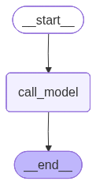

-   It trims the past messages before sending it as a context to the LLM
-   We use `trim_messages` from langchain


```python
from typing import TypedDict
from langgraph.graph import StateGraph, START, END, MessagesState
from langchain_groq import ChatGroq
from langchain_core.messages.utils import trim_messages, count_tokens_approximately
from langgraph.checkpoint.memory import InMemorySaver

```

``` text
/Users/ritumalage/Documents/my_github/Notes/.venv_langgraph/lib/python3.13/site-packages/tqdm/auto.py:21: TqdmWarning: IProgress not found. Please update jupyter and ipywidgets. See https://ipywidgets.readthedocs.io/en/stable/user_install.html
  from .autonotebook import tqdm as notebook_tqdm
```


```python
model = ChatGroq(model = "qwen/qwen3-32b") 
```

# Defining the max tokens

-   If the no of tokens passed as an input context is \> MAX_TOKENS then
    trimming will be performed


```python
MAX_TOKENS = 150
```

# Defining the function

-   Even before the past conversations is passed to the LLM, first we
    call the `trim_messages` function and then passed the trimmed output
    to the LLM to avoid context overflow
-   In the state still the full history is stored
-   To the LLM only trimmed information is passed


```python
def call_model(state: MessagesState):

    print(f"Token count before trimming: {count_tokens_approximately(messages=state["messages"])}")
    
    trimmed_messages = trim_messages(
        state["messages"],
        strategy="last", # Only last N tokens will be considered
        token_counter=count_tokens_approximately, # Counts the no of tokens
        max_tokens=MAX_TOKENS # Max no of tokens that can exist
    )
    
    print(f"Token count after trimming: {count_tokens_approximately(messages=trimmed_messages)}")
    response = model.invoke(trimmed_messages)
    
    return {"messages": [response]}
```


```python
graph = StateGraph(MessagesState)

graph.add_node("call_model", call_model)
graph.add_edge(START, "call_model")


checkpointer = InMemorySaver()

workflow = graph.compile(checkpointer=checkpointer)
workflow
```




```python
from langchain_core.messages import HumanMessage

config = {"configurable": {"thread_id": "1"}}

response = workflow.invoke(
    {"messages": HumanMessage(content="Hi my name is John")}, 
    config
)
response["messages"][-1].content
```

``` text
Token count before trimming: 9
Token count after trimming: 9
```

``` text
'<think>\nOkay, the user introduced himself as John. First, I should respond in a friendly and welcoming manner. I need to acknowledge his name and ask how I can assist him to keep the conversation going. The response should be concise, avoiding complex sentences. At the same time, I should maintain a natural and warm tone, not too formal. I should check if there are any special requirements, but since there are none, just follow the basic guidelines. Let me make sure the response is in English and meets all the requirements.\n</think>\n\nHello John! Nice to meet you. How can I assist you today? 😊'
```

# Continuing the conversation


```python

response = workflow.invoke(
    {"messages": HumanMessage(content="I am learning LangGraph, so can you explain me what is LangGraph, and why is it used?")}, 
    config
)
response
```

``` text
Token count before trimming: 190
Token count after trimming: 26
```

``` text
{'messages': [HumanMessage(content='Hi my name is John', additional_kwargs={}, response_metadata={}, id='6984fc7d-7902-4de2-937c-00ac1d502bcd'),
  AIMessage(content='<think>\nOkay, the user introduced himself as John. First, I should respond in a friendly and welcoming manner. I need to acknowledge his name and ask how I can assist him to keep the conversation going. The response should be concise, avoiding complex sentences. At the same time, I should maintain a natural and warm tone, not too formal. I should check if there are any special requirements, but since there are none, just follow the basic guidelines. Let me make sure the response is in English and meets all the requirements.\n</think>\n\nHello John! Nice to meet you. How can I assist you today? 😊', additional_kwargs={}, response_metadata={'token_usage': {'completion_tokens': 127, 'prompt_tokens': 13, 'total_tokens': 140, 'completion_time': 0.278997809, 'completion_tokens_details': None, 'prompt_time': 0.000353724, 'prompt_tokens_details': None, 'queue_time': 0.045948395, 'total_time': 0.279351533}, 'model_name': 'qwen/qwen3-32b', 'system_fingerprint': 'fp_5cf921caa2', 'service_tier': 'on_demand', 'finish_reason': 'stop', 'logprobs': None, 'model_provider': 'groq'}, id='lc_run--019cec6e-63b0-72e0-916e-a1c84a162340-0', tool_calls=[], invalid_tool_calls=[], usage_metadata={'input_tokens': 13, 'output_tokens': 127, 'total_tokens': 140}),
  HumanMessage(content='I am learning LangGraph, so can you explain me what is LangGraph, and why is it used?', additional_kwargs={}, response_metadata={}, id='ca215dee-9dd3-417a-999f-f23d64c5d331'),
  AIMessage(content='<think>\nOkay, the user is asking about LangGraph, so first I need to figure out what LangGraph is. I remember that LangGraph is related to LangChain, a framework for building AI applications. But wait, LangGraph itself might be a specific component or part of that ecosystem.\n\nLet me start by confirming the basics. LangChain is a framework that helps developers create applications with LLMs. It includes modules for prompts, memory, agents, and more. Now, LangGraph—maybe it\'s a module within LangChain focused on graph-based workflows? Or perhaps it\'s a separate library? I need to make sure I get the correct information.\n\nI should check if LangGraph is part of the LangChain ecosystem. From what I recall, LangChain has different components like LangChain Core, LangChain Agents, LangChain DB, etc. Maybe LangGraph is a newer addition or a less-known part. Alternatively, could LangGraph refer to a graph database or a graph-based machine learning library? That might be a different thing, but the user is connecting it to LangChain.\n\nAssuming it\'s part of LangChain, LangGraph might be about using graph structures to manage workflows. In traditional programming, workflows can be linear or branched. With LangGraph, perhaps you model these workflows as graphs, allowing for more complex and dynamic execution paths. This would be useful for applications that require branching logic, conditional steps, or iterative processes.\n\nWhy use LangGraph? Well, if you\'re building an application that needs to handle multiple steps that depend on each other in non-linear ways, a graph-based approach could make the logic clearer and more manageable. For example, an agent might need to decide between different actions based on the response from an LLM, and LangGraph could structure that decision-making process as a graph.\n\nI should also consider the user\'s background. They mentioned they\'re learning LangGraph, so they might be a developer looking to build AI apps. Explaining the benefits in terms of workflow management, modularity, and scalability would be helpful. Maybe provide an example, like a customer support chatbot that routes queries through different nodes based on the issue type.\n\nWait, I need to make sure about the terminology. Let me verify if LangGraph is indeed the correct name. Sometimes projects have similar names. Maybe the user meant LangChain\'s graph capabilities? Like, when LangChain introduced a way to build stateful graphs or workflows, they might refer to it as LangGraph. Alternatively, perhaps it\'s called "LangChain Graph" or part of the "LangChain SDK." \n\nIf I\'m unsure, I should state that LangGraph might be a newer or less-documented component, and that my explanation is based on possible interpretations. It\'s important to be clear and not spread incorrect information. Maybe suggest checking the official LangChain documentation or GitHub repository for the most accurate details.\n\nSo, putting it all together: LangGraph is likely a component of LangChain that allows developers to model and execute application workflows as graphs. This approach is beneficial for applications requiring complex, non-linear processes, enabling better organization, scalability, and dynamic execution paths. It\'s used to handle tasks that involve multiple interacting components or conditional logic, making it easier to manage complexity in AI-powered apps.\n</think>\n\n**LangGraph** is a component of the **LangChain ecosystem**, designed to help developers build **graph-based workflows** for applications powered by Large Language Models (LLMs). It allows you to model complex, branching logic and workflows as **directed acyclic graphs (DAGs)**, enabling dynamic, modular, and scalable AI application architectures.\n\n---\n\n### **What is LangGraph?**\nLangGraph is part of LangChain\'s framework for structuring workflows that involve **conditional logic, parallel processing, and stateful execution**. It abstracts away the complexity of managing control flow in applications that require:\n- **Branching logic** (e.g., "if this, then that" decisions),\n- **Looping** (e.g., iterative refinement of results),\n- **Parallelism** (e.g., running multiple LLM calls in parallel), or\n- **State management** (e.g., tracking context between steps).\n\nAt its core, LangGraph uses **graph structures** to represent workflows. Each node in the graph represents a specific task (like an LLM call, a database lookup, or a custom function), and edges define how control flows between nodes.\n\n---\n\n### **Why Use LangGraph?**\nLangGraph is used to simplify and organize **complex workflows** in AI applications. Here are its key benefits:\n\n1. **Visual and Modular Design**:\n   - You define workflows as graphs, which are easy to visualize and debug.\n   - Each node is a reusable component (e.g., a prompt template, an LLM, a tool call), making workflows modular.\n\n2. **Dynamic Control Flow**:\n   - Supports conditional branches (e.g., "if the user asks for a summary, go to node A; otherwise, go to node B").\n   - Enables loops (e.g., iterate until a condition is met).\n\n3. **Scalability**:\n   - Handles large, multi-step applications (e.g., multi-turn conversations, multi-agent systems).\n   - Integrates with other LangChain components like memory, tools, and prompts.\n\n4. **State Management**:\n   - Tracks and persists state across nodes (e.g., user session data) using **checkpoints**.\n   - Supports resuming workflows from a specific step.\n\n5. **Tool Integration**:\n   - Seamlessly connects LLMs with external APIs, databases, or tools (e.g., search engines, calculators).\n\n---\n\n### **Example Use Case**\nImagine building a **customer support chatbot**:\n1. **Node A**: Use an LLM to classify the user\'s query (e.g., "billing issue" or "technical problem").\n2. **Node B (Condition)**: If the issue is technical, route to Node C (troubleshooting steps); else, route to Node D (billing team contact).\n3. **Node C**: Use an API to fetch troubleshooting guides.\n4. **Node D**: Generate a response with a support ticket link.\n\nThis workflow can be modeled as a graph, with conditional edges directing the flow based on the LLM\'s output.\n\n---\n\n### **Key Concepts in LangGraph**\n1. **Nodes**:\n   - Represent individual tasks (e.g., an LLM call, a tool call).\n   - Can be **entry points**, **exit points**, or **intermediate steps**.\n\n2. **Edges**:\n   - Define transitions between nodes.\n   - Can be **conditional** (e.g., "if X, go to Node Y").\n\n3. **Channels**:\n   - Pass data between nodes (e.g., input for one node is the output of another).\n\n4. **Checkpoints**:\n   - Save and restore the state of a workflow (useful for resuming or debugging).\n\n5. **Graph Execution**:\n   - LangGraph handles the execution order and data flow automatically.\n\n---\n\n### **When to Use LangGraph?**\n- Building **multi-agent systems** (e.g., agents that delegate tasks to each other).\n- Creating **multi-turn conversations** (e.g., chatbots that track context across messages).\n- Designing **custom pipelines** for data processing, document analysis, or decision-making.\n- Applications requiring **dynamic, non-linear workflows** (e.g., legal document analysis, medical diagnosis).\n\n---\n\n### **Getting Started**\nTo use LangGraph:\n1. Install LangChain:  \n   ```bash\n   pip install langchain langgraph\n   ```\n2. Define your workflow as a graph using Python code.\n3. Use nodes for specific tasks and edges for control flow.\n\nFor example:\n```python\nfrom langgraph.graph import Graph\nfrom langchain.chat_models import ChatOpenAI\nfrom langchain.prompts import PromptTemplate\n\nmodel = ChatOpenAI(model="gpt-3.5-turbo")\n\n# Node: Classify user query\ndef classify_query(query):\n    prompt = PromptTemplate.from_template("Classify this query: {query}")\n    return model.invoke(prompt.format(query=query)).content\n\n# Node: Generate response based on classification\ndef generate_response(classification, query):\n    if classification == "billing":\n        return "Contact billing team."\n    else:\n        return "Check troubleshooting guide."\n\n# Build the graph\nworkflow = Graph()\nworkflow.add_node("classify", classify_query)\nworkflow.add_node("respond", generate_response)\nworkflow.add_edge("classify", "respond")\nworkflow.set_entry_point("classify")\nworkflow.set_finish_point("respond")\n\n# Run the workflow\nresult = workflow.invoke({"query": "My bill is incorrect."})\nprint(result)  # Output: "Contact billing team."\n```\n\n---\n\n### **Limitations**\n- **Learning Curve**: Requires understanding of both LangChain and graph concepts.\n- **Documentation**: As of now, LangGraph is relatively new and less documented than core LangChain.\n\n---\n\n### **Conclusion**\nLangGraph is a powerful tool for managing **complex, dynamic workflows** in AI applications. By modeling workflows as graphs, it provides clarity, scalability, and flexibility—making it ideal for advanced LangChain users building multi-step, conditional, or iterative AI systems. For more details, check the official [LangChain documentation](https://python.langchain.com/).', additional_kwargs={}, response_metadata={'token_usage': {'completion_tokens': 1924, 'prompt_tokens': 30, 'total_tokens': 1954, 'completion_time': 5.654965552, 'completion_tokens_details': None, 'prompt_time': 0.000959075, 'prompt_tokens_details': None, 'queue_time': 0.046622425, 'total_time': 5.655924627}, 'model_name': 'qwen/qwen3-32b', 'system_fingerprint': 'fp_5cf921caa2', 'service_tier': 'on_demand', 'finish_reason': 'stop', 'logprobs': None, 'model_provider': 'groq'}, id='lc_run--019cec6e-65c3-73d1-a7fc-a19a921bf736-0', tool_calls=[], invalid_tool_calls=[], usage_metadata={'input_tokens': 30, 'output_tokens': 1924, 'total_tokens': 1954})]}
```


```python

response = workflow.invoke(
    {"messages": HumanMessage(content="Hi now can you tell me what is my name again?")}, 
    config
)
response["messages"][-1].content
```

``` text
Token count before trimming: 2464
Token count after trimming: 16
```

``` text
'<think>\nOkay, the user is asking for their name again. Let me check the conversation history. Hmm, the user mentioned "Hi now can you tell me what is my name again?" but I don\'t see any previous messages where they provided their name.\n\nWait, maybe they forgot to mention their name in earlier messages. But looking at the history, the first message is their current question. They haven\'t given their name before. \n\nI need to respond politely. Since I don\'t have their name, I should inform them that I don\'t know it and ask them to provide it. I should make sure to be helpful and not assume any information they haven\'t given. Let me phrase it in a friendly way to encourage them to share their name so I can address them properly in future interactions.\n</think>\n\nI don\'t have access to personal information about users unless you share it with me directly. Could you please tell me your name? I\'d be happy to address you by name in future conversations if you\'d like!'
```

-   Since only last N messages were passed as context to LLM, the
    starting messages were ignored, and there is where the user has
    mentioned their name, since that was not being passed the LLM does
    not have the answer for the same
-   This is the issue with triming
