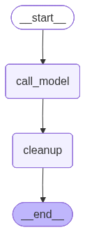

-   When we summarize the past conversation, we store the summarized
    version in the state by deleting the past conversations/messages
-   To delete messages `RemoveMessage` from langchain is used


```python
from typing import TypedDict
from langgraph.graph import StateGraph, START, END, MessagesState
from langchain_groq import ChatGroq
from langchain_core.messages.utils import trim_messages, count_tokens_approximately
from langgraph.checkpoint.memory import InMemorySaver
from langchain.messages import RemoveMessage
```

``` text
/Users/ritumalage/Documents/my_github/Notes/.venv_langgraph/lib/python3.13/site-packages/tqdm/auto.py:21: TqdmWarning: IProgress not found. Please update jupyter and ipywidgets. See https://ipywidgets.readthedocs.io/en/stable/user_install.html
  from .autonotebook import tqdm as notebook_tqdm
```


```python
model = ChatGroq(model = "qwen/qwen3-32b") 
```

# Defining the functions

-   1 node to invoke the model to answer the question
-   Another node to invoke the delete the old conversations from the
    state
-   In delete_old_messages node
    -   If the message of messages is greater than or equal to 5 then we
        remove all those messages
    -   While using RemoveMessage we need to provide the id of the
        message that has to be removed
    -   Note to return \{“messages” : \[ RemoveMessage(id=message.id) \]\}
    -   If the list is not used then it will not work


```python
def call_model(state: MessagesState):
    response = model.invoke(state["messages"])
    
    return {"messages": [response]}

def delete_old_messages(state: MessagesState):
    messages = state["messages"]
    print(f"No of messages before cleanup: {len(messages)}")
    if len(messages) >= 5:
        return {"messages": [RemoveMessage(id = message.id) for message in messages]}
```


```python
graph = StateGraph(MessagesState)

graph.add_node("call_model", call_model)
graph.add_node("cleanup", delete_old_messages)

graph.add_edge(START, "call_model")
graph.add_edge("call_model", "cleanup")
graph.add_edge("cleanup", END)


checkpointer = InMemorySaver()

workflow = graph.compile(checkpointer=checkpointer)
workflow
```



# Conversation1


```python
from langchain.messages import HumanMessage


config = {"configurable": {"thread_id":"1"}}

workflow.invoke({"messages": HumanMessage(content = "Hi, my name is John")}, config)

```

``` text
No of messages before cleanup: 2
```

``` text
{'messages': [HumanMessage(content='Hi, my name is John', additional_kwargs={}, response_metadata={}, id='21bf9b3a-054a-49c5-8e82-024342369f20'),
  AIMessage(content='<think>\nOkay, the user introduced himself as John and said hello. I need to respond politely. First, I should greet him back warmly. Maybe say "Hello John!" or "Hi John!" to be friendly. Then, offer assistance. Since I don\'t know what he needs help with yet, I should keep it open-ended. Maybe ask "How can I assist you today?" or "What can I help you with?" to encourage him to explain his needs. I should keep the tone positive and approachable, making sure he feels comfortable to ask questions or share his concerns. Also, check for any typos or errors in the response. Keep it concise and welcoming.\n</think>\n\nHello, John! Nice to meet you. How can I assist you today? 😊', additional_kwargs={}, response_metadata={'token_usage': {'completion_tokens': 158, 'prompt_tokens': 14, 'total_tokens': 172, 'completion_time': 0.340896281, 'completion_tokens_details': None, 'prompt_time': 0.00055972, 'prompt_tokens_details': None, 'queue_time': 0.28442086, 'total_time': 0.341456001}, 'model_name': 'qwen/qwen3-32b', 'system_fingerprint': 'fp_d58dbe76cd', 'service_tier': 'on_demand', 'finish_reason': 'stop', 'logprobs': None, 'model_provider': 'groq'}, id='lc_run--019ceca1-de63-7d61-b3cf-29b071730044-0', tool_calls=[], invalid_tool_calls=[], usage_metadata={'input_tokens': 14, 'output_tokens': 158, 'total_tokens': 172})]}
```

# Conversation2


```python
workflow.invoke({"messages": HumanMessage(content = "Can you explain langGraph")}, config)

```

``` text
No of messages before cleanup: 4
```

``` text
{'messages': [HumanMessage(content='Hi, my name is John', additional_kwargs={}, response_metadata={}, id='21bf9b3a-054a-49c5-8e82-024342369f20'),
  AIMessage(content='<think>\nOkay, the user introduced himself as John and said hello. I need to respond politely. First, I should greet him back warmly. Maybe say "Hello John!" or "Hi John!" to be friendly. Then, offer assistance. Since I don\'t know what he needs help with yet, I should keep it open-ended. Maybe ask "How can I assist you today?" or "What can I help you with?" to encourage him to explain his needs. I should keep the tone positive and approachable, making sure he feels comfortable to ask questions or share his concerns. Also, check for any typos or errors in the response. Keep it concise and welcoming.\n</think>\n\nHello, John! Nice to meet you. How can I assist you today? 😊', additional_kwargs={}, response_metadata={'token_usage': {'completion_tokens': 158, 'prompt_tokens': 14, 'total_tokens': 172, 'completion_time': 0.340896281, 'completion_tokens_details': None, 'prompt_time': 0.00055972, 'prompt_tokens_details': None, 'queue_time': 0.28442086, 'total_time': 0.341456001}, 'model_name': 'qwen/qwen3-32b', 'system_fingerprint': 'fp_d58dbe76cd', 'service_tier': 'on_demand', 'finish_reason': 'stop', 'logprobs': None, 'model_provider': 'groq'}, id='lc_run--019ceca1-de63-7d61-b3cf-29b071730044-0', tool_calls=[], invalid_tool_calls=[], usage_metadata={'input_tokens': 14, 'output_tokens': 158, 'total_tokens': 172}),
  HumanMessage(content='Can you explain langGraph', additional_kwargs={}, response_metadata={}, id='ac4c31ce-b2b5-4ac2-8a5c-f8789d30ffd5'),
  AIMessage(content='<think>\nOkay, the user is asking about LangGraph. I need to explain it clearly. Let me start by recalling what LangGraph is. It\'s a framework for building stateful, graph-based agents with LLMs, right? So, it\'s part of the LangChain ecosystem. \n\nFirst, I should mention that LangGraph allows developers to create complex workflows where each node in the graph represents a specific function or decision point. The state is maintained as the agent moves through the graph, which is different from simple linear chains. \n\nI should break down the key components. Maybe start with the concept of nodes and edges. Nodes can be actions, decisions, or tools, and edges determine the flow based on some logic. The state management is crucial here because the agent\'s memory is carried over between steps. \n\nThen, the user might be interested in use cases. Examples like customer support bots, data processing pipelines, or interactive apps where the agent needs to remember past interactions would be good. Also, mentioning that it\'s built on top of LangChain\'s tools and integrations would highlight its flexibility.\n\nI need to explain how it works in a step-by-step manner. Start with defining nodes, setting up the graph structure, and then how the agent traverses the graph, updating state as it goes. Maybe a simple example would help, like a customer service scenario where the agent routes the user through different steps based on their input.\n\nWait, the user mentioned their name is John, so maybe they\'re a developer looking to build an application with LLMs. They might want to know how LangGraph compares to other frameworks or if it\'s suitable for specific tasks. I should emphasize its strengths in handling complex, stateful interactions, which can be challenging with simpler chains.\n\nAlso, I should mention the key features: modularity, reusability of nodes, and the ability to handle loops and conditional branches. Maybe touch on the fact that it\'s open-source and part of the LangChain ecosystem, which has a lot of resources and community support.\n\nI need to make sure the explanation is not too technical but still comprehensive. Avoid jargon where possible, but if necessary, explain it. Check if there\'s anything else the user might need, like examples or links to documentation. Since the user asked for an explanation, they might be looking to get started with it, so offering further assistance would be helpful.\n</think>\n\nHi John! Sure, I’d be happy to explain **LangGraph** — it’s an exciting framework for building **stateful, graph-based workflows** with large language models (LLMs). It’s part of the **LangChain ecosystem**, designed to help developers create complex, dynamic applications by modeling workflows as **directed acyclic graphs (DAGs)**. Let’s break it down:\n\n---\n\n### **What is LangGraph?**\nLangGraph is a **framework for building agents** that can:\n- Traverse a **graph of nodes** (each node represents a specific function, tool, or decision point).\n- Maintain **state** between steps (e.g., memory of previous interactions).\n- Handle **conditional logic** and **loops** in workflows.\n\nIt’s particularly useful when you need an agent to:\n- Follow a **non-linear path** based on user input or dynamic conditions.\n- Interact with **multiple tools** (e.g., databases, APIs) in a structured way.\n- Retain **context/state** across multiple steps of a conversation or task.\n\n---\n\n### **Key Concepts**\n1. **Nodes**:\n   - Each node in the graph represents a step in the workflow (e.g., "Analyze user query," "Call a database," "Generate a response").\n   - Nodes can be **LLM-powered** (using prompts) or **tool-based** (interacting with APIs, databases, etc.).\n\n2. **Edges**:\n   - Define the **flow** between nodes. For example:\n     - A node might output a "next step" (like a router) to determine which node to execute next.\n     - Edges can include **conditional logic** (e.g., "If the user asks for help, go to Support Node").\n\n3. **State**:\n   - LangGraph maintains a **shared state** (memory) across all nodes. This lets the agent:\n     - Remember past interactions.\n     - Pass data between steps.\n     - Handle long-running tasks.\n\n4. **Graph Execution**:\n   - The agent starts at an **entry node**, then follows edges based on logic or user input.\n   - It can loop through nodes (e.g., retry a step) or branch into subgraphs.\n\n---\n\n### **Example Use Cases**\n- **Customer Support Agent**:\n  - Nodes: `Greet User` → `Analyze Query` → `Route to Support Team` → `Generate Response`.\n  - Uses state to remember the user’s issue and history.\n\n- **Document Processing Pipeline**:\n  - Nodes: `Extract Text` → `Classify Content` → `Summarize` → `Store in Database`.\n\n- **Interactive Chatbots**:\n  - Nodes: `Check User Intent` → `Answer FAQ` **or** `Escalate to Human Agent` (based on confidence score).\n\n---\n\n### **How It Works (Simplified)**\n1. **Define Nodes**:\n   ```python\n   from langgraph.graph import Graph\n   from langchain.chat_models import ChatOpenAI\n\n   model = ChatOpenAI(model="gpt-4")\n\n   def analyze_query(state):\n       return model.invoke("Analyze this query: " + state["query"])\n\n   def generate_response(state):\n       return model.invoke("Generate a response: " + state["context"])\n   ```\n\n2. **Build the Graph**:\n   ```python\n   workflow = Graph()\n   workflow.add_node("analyze", analyze_query)\n   workflow.add_node("generate", generate_response)\n\n   workflow.set_entry_point("analyze")\n   workflow.add_edge("analyze", "generate")\n   ```\n\n3. **Run the Workflow**:\n   ```python\n   state = {"query": "How do I reset my password?"}\n   result = workflow.invoke(state)\n   print(result["response"])  # Output from the final node\n   ```\n\n---\n\n### **Why Use LangGraph?**\n- **Flexibility**: Model any workflow as a graph, not just linear chains.\n- **State Management**: Easily track context across steps (critical for multi-turn interactions).\n- **Tool Integration**: Works with LangChain’s rich ecosystem of tools (e.g., APIs, databases).\n- **Scalability**: Modular design makes it easy to reuse and extend workflows.\n\n---\n\n### **When to Use It**\n- You need an agent to handle **complex, branching logic**.\n- You want to **persist state** across multiple interactions (e.g., chatbots, assistants).\n- You’re building **multi-step pipelines** with conditional steps.\n\n---\n\nIf you’d like, I can walk you through a **hands-on example** (e.g., building a simple Q&A bot with LangGraph) or explain how it compares to other frameworks like **LangChain** or **Haystack**. Let me know! 😊', additional_kwargs={}, response_metadata={'token_usage': {'completion_tokens': 1474, 'prompt_tokens': 47, 'total_tokens': 1521, 'completion_time': 3.227630325, 'completion_tokens_details': None, 'prompt_time': 0.002111897, 'prompt_tokens_details': None, 'queue_time': 0.047689563, 'total_time': 3.229742222}, 'model_name': 'qwen/qwen3-32b', 'system_fingerprint': 'fp_5cf921caa2', 'service_tier': 'on_demand', 'finish_reason': 'stop', 'logprobs': None, 'model_provider': 'groq'}, id='lc_run--019ceca1-e168-7f02-9f69-e604ce7a888e-0', tool_calls=[], invalid_tool_calls=[], usage_metadata={'input_tokens': 47, 'output_tokens': 1474, 'total_tokens': 1521})]}
```

-   Now the no of messages in the state is 4
-   2 due to the previous question and answer and 2 more for the current
    question and answer
-   Since we have added a condition saying if the state has more than 4
    messages (\>=5 messages) then we delete all the messages in the
    state
-   So if we start the next conversation the state will be cleared and
    will start filling up from beginning from the next conversation
-   Currently after deleting the messages we are not calling the LLM to
    answer the current conversation, we are just deleting
-   Thus again from conversation4 you will see the state filling up

# Conversation3


```python
workflow.invoke({"messages": HumanMessage(content = "Can you explain AIML")}, config)

```

``` text
No of messages before cleanup: 6
```

``` text
{'messages': []}
```

# Conversation4


```python
workflow.invoke({"messages": HumanMessage(content = "Can you explain AIML")}, config)

```

``` text
No of messages before cleanup: 2
```

``` text
{'messages': [HumanMessage(content='Can you explain AIML', additional_kwargs={}, response_metadata={}, id='032a056f-465c-4f6a-93ad-c7a1a63bad4a'),
  AIMessage(content='<think>\nOkay, I need to explain what AIML is. Let me start by recalling what I know about it. AIML stands for Artificial Intelligence Markup Language. I think it\'s used for creating chatbots, right? But I\'m not entirely sure about the details.\n\nFirst, I should define AIML clearly. Maybe start by mentioning that it\'s an XML-based language designed for creating natural language software agents. But then, I should explain what that means. How does it work exactly? I remember that it uses a pattern-matching approach. So when a user inputs a message, the chatbot looks for patterns in the input and then responds with predefined answers. That\'s probably a key part of AIML.\n\nWait, how does the pattern matching work? I think it uses categories with patterns and templates. Each category has a pattern that the user input is matched against, and the template contains the response. For example, if the pattern is "Hello", the template might be "Hi there!" So if the user says "Hello", the bot responds with "Hi there!"\n\nBut I should also mention that the matching isn\'t just exact. There\'s some flexibility, maybe using wildcards or variables. Like using * to represent any part of the input. For example, a pattern could be "I like *", and the response could be "That\'s great! I like it too." So if the user says "I like apples", the bot responds with "That\'s great! I like it too."\n\nI should also talk about the structure of an AIML file. It\'s XML, so it\'s hierarchical. The root element is <aiml>, then <category> elements, each containing <pattern>, <that>, and <template>. Wait, what\'s <that> for? Oh right, it\'s for tracking the previous interaction. So if the user says something in response to a previous answer, <that> helps the bot remember the context. For example, if the bot asked "What\'s your favorite color?" and the user responds "Blue", the next pattern could be "My favorite is *<that>What\'s your favorite color?" So the bot knows the context and can respond appropriately.\n\nAnother thing is the use of variables and predicates. Variables can store information from the user\'s input, which can be referenced later. For example, using <set> to set a variable like <set name="color">blue</set>, and then later using <get name="color"> in a response. Predicates are similar but more for internal tracking.\n\nI should also mention that AIML has been around since the late 90s, maybe 1999 or 2000. Alan Apt developed it for the ALICE bot, which was one of the early chatbots that won the Loebner Prize. So it\'s been used in notable projects.\n\nBut what are the limitations? Since it\'s rule-based, it\'s not as flexible as modern neural network-based chatbots. It\'s great for predefined scenarios but struggles with understanding complex or nuanced queries. Also, creating a comprehensive AIML set requires a lot of manual work and can become unwieldy for large applications.\n\nAre there any tools or frameworks that support AIML? I think there are several, like Pandorabots, which is an online platform for hosting AIML bots. Also, there are open-source implementations like A.L.I.C.E. which is a collection of AIML files. So developers can use these tools to build and deploy their chatbots.\n\nI should also touch on how AIML is used today. While it\'s not as popular as it once was due to advancements in machine learning and NLP, it\'s still used in certain contexts where a rule-based approach is sufficient. For example, customer service bots with a limited scope, or educational tools where specific interactions are needed.\n\nWait, maybe I should clarify the difference between AIML and modern chatbots. AIML is deterministic and requires explicit programming of responses, whereas modern AI chatbots like those based on GPT use statistical models to generate responses, allowing for more natural and flexible interactions but potentially with less control over specific answers.\n\nAlso, the syntax of AIML is important to mention. Since it\'s XML-based, it\'s structured with tags. For example:\n\n<aiml>\n  <category>\n    <pattern>HELLO</pattern>\n    <template>Hi! How can I help you today?</template>\n  </category>\n</aiml>\n\nBut users can add more complexity with variables, wildcards, and other elements.\n\nI should also mention that AIML is case-insensitive in terms of the pattern matching, so "Hello" and "HELLO" would both trigger the same response. That\'s a useful feature for handling variations in user input.\n\nAre there any best practices for creating AIML? Maybe organizing categories logically, using wildcards appropriately to handle variations, and testing extensively to cover common user inputs. Also, using <random> tags to add variety in responses.\n\nIn conclusion, AIML is a markup language for creating chatbots through pattern-matching and response templates, useful for rule-based interactions but limited in comparison to modern AI techniques. It\'s still used in specific applications where a deterministic approach is preferred.\n</think>\n\n**AIML (Artificial Intelligence Markup Language)** is an XML-based framework designed to create rule-based chatbots and natural language processing agents. Developed by Dr. Richard Wallace in the late 1990s, it was popularized through the ALICE (Artificial Linguistic Internet Computer Entity) chatbot, which won the Loebner Prize for its performance. Below is a structured explanation of its key aspects:\n\n---\n\n### **Core Functionality**\n- **Pattern-Matching Logic**:  \n  AIML uses a **category-based system** where each `category` contains a `pattern` (user input) and a `template` (response). When a user inputs a query, the chatbot matches it against predefined patterns and returns the corresponding template.  \n  Example:  \n  ```xml\n  <category>\n    <pattern>HELLO</pattern>\n    <template>Hi! How can I help you today?</template>\n  </category>\n  ```\n\n- **Wildcards and Flexibility**:  \n  Patterns can include wildcards (`*`) to handle variations. For instance, a pattern like `I LIKE *` can match "I like apples" and respond with a generic template.\n\n- **Context Tracking with `<that>`**:  \n  The `<that>` tag allows the bot to reference the previous response, enabling contextual conversations.  \n  Example:  \n  ```xml\n  <category>\n    <pattern>WHAT IS YOUR NAME?</pattern>\n    <template>My name is ALICE.</template>\n  </category>\n  <category>\n    <pattern>WHAT IS YOUR NAME?</pattern>\n    <that>MY NAME IS ALICE.</that>\n    <template>Nice to meet you!</template>\n  </category>\n  ```\n\n- **Variables and Predicates**:  \n  - `<set>` and `<get>` store/retrieve user-specific data (e.g., `<set name="color">blue</set>`).  \n  - `<predicate>` tracks internal states (e.g., user preferences).\n\n---\n\n### **Structure of an AIML File**\n- **XML Hierarchy**:  \n  - `<aiml>`: Root element.  \n  - `<category>`: Contains a `pattern` and `template`.  \n  - Optional elements: `<that>` (context), `<topic>` (conversation topics), `<srai>` (subroutine calls).  \n\nExample:\n```xml\n<aiml>\n  <category>\n    <pattern>MY NAME IS *</pattern>\n    <template>Nice to meet you, <star/>. How can I assist?</template>\n  </category>\n</aiml>\n```\n\n---\n\n### **Key Features**\n1. **Deterministic Responses**:  \n   Responses are predefined, making AIML ideal for predictable interactions (e.g., FAQs, simple customer service).\n\n2. **Extensibility**:  \n   Developers can link multiple AIML files using `<include>` to manage large knowledge bases.\n\n3. **Tools and Ecosystem**:  \n   - **Pandorabots**: A platform for hosting and deploying AIML chatbots.  \n   - **Open-Source Implementations**: Projects like ALICE include thousands of categories for general conversation.\n\n---\n\n### **Limitations**\n- **Scalability Challenges**:  \n  Creating comprehensive bots requires extensive manual coding of patterns, which can become unwieldy.\n- **Lack of Nuance**:  \n  Struggles with understanding context beyond predefined rules, unlike modern AI models (e.g., GPT).\n- **Stiff Responses**:  \n  Responses are static unless randomized using `<random>` tags.\n\n---\n\n### **Use Cases**\n- **Customer Support Bots**: For handling scripted queries.  \n- **Educational Tools**: Interactive Q&A systems with specific scopes.  \n- **Legacy Systems**: Where rule-based logic is sufficient and cost-effective.\n\n---\n\n### **Comparison to Modern AI Bots**\n| Feature               | AIML                                | Modern AI (e.g., GPT)         |\n|----------------------|-------------------------------------|-------------------------------|\n| **Response Generation** | Rule-based, deterministic          | Statistical, probabilistic    |\n| **Learning**          | Requires manual updates            | Continuously learns from data |\n| **Flexibility**       | Limited to predefined patterns     | Handles nuanced, novel inputs   |\n| **Complexity**        | High for large domains             | Low (training data required)  |\n\n---\n\n### **Best Practices**\n1. **Organize Patterns**: Group related categories logically.  \n2. **Use Wildcards Wisely**: Avoid overgeneralization that may lead to incorrect matches.  \n3. **Test Extensively**: Cover common user inputs and edge cases.  \n4. **Leverage `<srai>`**: For modular, reusable response chains.\n\n---\n\n### **Legacy and Relevance', additional_kwargs={}, response_metadata={'token_usage': {'completion_tokens': 2048, 'prompt_tokens': 13, 'total_tokens': 2061, 'completion_time': 6.070045565, 'completion_tokens_details': None, 'prompt_time': 0.000341395, 'prompt_tokens_details': None, 'queue_time': 0.046593855, 'total_time': 6.07038696}, 'model_name': 'qwen/qwen3-32b', 'system_fingerprint': 'fp_5cf921caa2', 'service_tier': 'on_demand', 'finish_reason': 'length', 'logprobs': None, 'model_provider': 'groq'}, id='lc_run--019ceca2-0323-79b1-924b-cd0819d64af1-0', tool_calls=[], invalid_tool_calls=[], usage_metadata={'input_tokens': 13, 'output_tokens': 2048, 'total_tokens': 2061})]}
```
