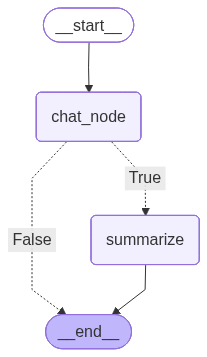

-   Problem Statement: If the no of messages in the state is more than 6
    we summarize the past conversations and pass the current question as
    a part of context
-   For this 4 nodes are required
    -   START
    -   chat_node
    -   summary_node (will be invoked only when the no of messages \>=6)
    -   END


```python
from typing import TypedDict
from langgraph.graph import StateGraph, START, END, MessagesState
from langchain_groq import ChatGroq
from langchain_core.messages.utils import trim_messages, count_tokens_approximately
from langgraph.checkpoint.memory import InMemorySaver
from langchain.messages import RemoveMessage, HumanMessage
```

``` text
/Users/ritumalage/Documents/my_github/Notes/.venv_langgraph/lib/python3.13/site-packages/tqdm/auto.py:21: TqdmWarning: IProgress not found. Please update jupyter and ipywidgets. See https://ipywidgets.readthedocs.io/en/stable/user_install.html
  from .autonotebook import tqdm as notebook_tqdm
```


```python
model = ChatGroq(model = "qwen/qwen3-32b") 
```

# Define the State

-   We cannot use the inbuilt state (MessageState) as it is, because
    that contains only 1 attribute i.e. messages, in this case we have
    to store its summary as well, so we derive from MessageState and
    then custom it


```python
class State(MessagesState):
    summary: str
```

# Function defination for chat_node

-   The LLM is invoked here, to get the answer to the users question
-   2 cases are possible
    1.  Only messages exists, but summary is not
        -   When the no of messages \< 6
        -   To the LLM only message is sent
    2.  Both messages and summary are present
        -   To the LLM both message and summary is sent


```python
from langchain.messages import SystemMessage


def chat_node(state: State):
    messages = []

    # Check if summary exists in the state
    if state["summary"]:
        messages.append(SystemMessage(content = f"Conversational summary: {state["summary"]}"))
    
    # Including the current messages
    messages.extend(state["messages"])

    response = model.invoke(messages)
    
    return {"messages": [response]}
```

# Function defination for summarization

-   2 tasks should be performed, 1 is to summarize the past
    conversations and the other is to delete the previous messages
-   In summarization task 2 possibilities exists
    -   Its the first time that you will be summarizing
    -   The summary already exists and you have to edit it


```python
def summarize(state: State):
    existing_summary = state["summary"]

    # Checking if the summary already exists or not
    if existing_summary: 
        # If summary already exists then we edit it
        prompt = f"""The existing conversational summary is {existing_summary}
        Create a new summary using the new conversations
        """
    
    # If summary does not exist, we need to ask LLM to summary the conversation
    else:
        prompt = "Summarize the given conversation"
    

    message_to_summarize = state["messages"] + [HumanMessage(content=prompt)]

    response = model.invoke(message_to_summarize)

    # Keeping only last 2 messages and deleting the rest
    messages_to_delete = state["messages"][:-2]

    return {
        "summary": response.content,
        "messages": [RemoveMessage(id = message.id) for message in messages_to_delete]
    }
```

# The summarize node must be executed in a conditional manner, thus defining the conditional node


```python
def should_summarize(state: State):
    return len(state["messages"])> 6
```

# Building the graph


```python
graph = StateGraph(State)

graph.add_node("chat_node", chat_node)
graph.add_node("summarize", summarize)

graph.add_edge(START, "chat_node")
# If should_summarize returns True the summarize node is invoke else it goes to END
graph.add_conditional_edges("chat_node",should_summarize, {True: "summarize", False: END}) 
graph.add_edge("summarize", END)


checkpointer = InMemorySaver()

workflow = graph.compile(checkpointer=checkpointer)
workflow
```



# Conversation1


```python
from langchain.messages import HumanMessage


config = {"configurable": {"thread_id":"1"}}

workflow.invoke({
    "messages": [HumanMessage(content = "Hi, my name is John")], 
    "summary":""
    }, 
    config)

```

``` text
{'messages': [HumanMessage(content='Hi, my name is John', additional_kwargs={}, response_metadata={}, id='4ffe1f1a-fcaf-401c-8a5d-1572c8108ac7'),
  AIMessage(content='<think>\nOkay, the user said, "Hi, my name is John," and I need to respond appropriately. First, I should greet him warmly and acknowledge his name. Since this is the first interaction, I\'ll keep it friendly and open-ended to encourage further conversation. I\'ll ask how I can assist him today, making sure to present myself as helpful and ready to provide support. I need to keep the tone positive and approachable.\n\nI should use formal language but not overly stiff, just simple and clear. Let me check if there\'s anything else needed - the user might want to ask a question or seek help with something specific. I\'ll make sure to invite him to share more details so I can be of assistance. Also, I should remember his name for the conversation, which helps create a more personal experience. Let me put that together in a concise way.\n</think>\n\nHello John! 🌟 Nice to meet you. How can I assist you today? Feel free to ask me anything or let me know if there\'s something specific you\'d like help with! 😊', additional_kwargs={}, response_metadata={'token_usage': {'completion_tokens': 220, 'prompt_tokens': 14, 'total_tokens': 234, 'completion_time': 0.910893354, 'completion_tokens_details': None, 'prompt_time': 0.000383584, 'prompt_tokens_details': None, 'queue_time': 0.046292286, 'total_time': 0.911276938}, 'model_name': 'qwen/qwen3-32b', 'system_fingerprint': 'fp_5cf921caa2', 'service_tier': 'on_demand', 'finish_reason': 'stop', 'logprobs': None, 'model_provider': 'groq'}, id='lc_run--019ced5c-fb02-7360-8e7c-569008ab518f-0', tool_calls=[], invalid_tool_calls=[], usage_metadata={'input_tokens': 14, 'output_tokens': 220, 'total_tokens': 234})],
 'summary': ''}
```

# Conversation2


```python
workflow.invoke({
    "messages": [HumanMessage(content = "I like painting, so what can I do over weekends that revolves around painting")], 
    }, 
    config)
```

``` text
{'messages': [HumanMessage(content='Hi, my name is John', additional_kwargs={}, response_metadata={}, id='4ffe1f1a-fcaf-401c-8a5d-1572c8108ac7'),
  AIMessage(content='<think>\nOkay, the user said, "Hi, my name is John," and I need to respond appropriately. First, I should greet him warmly and acknowledge his name. Since this is the first interaction, I\'ll keep it friendly and open-ended to encourage further conversation. I\'ll ask how I can assist him today, making sure to present myself as helpful and ready to provide support. I need to keep the tone positive and approachable.\n\nI should use formal language but not overly stiff, just simple and clear. Let me check if there\'s anything else needed - the user might want to ask a question or seek help with something specific. I\'ll make sure to invite him to share more details so I can be of assistance. Also, I should remember his name for the conversation, which helps create a more personal experience. Let me put that together in a concise way.\n</think>\n\nHello John! 🌟 Nice to meet you. How can I assist you today? Feel free to ask me anything or let me know if there\'s something specific you\'d like help with! 😊', additional_kwargs={}, response_metadata={'token_usage': {'completion_tokens': 220, 'prompt_tokens': 14, 'total_tokens': 234, 'completion_time': 0.910893354, 'completion_tokens_details': None, 'prompt_time': 0.000383584, 'prompt_tokens_details': None, 'queue_time': 0.046292286, 'total_time': 0.911276938}, 'model_name': 'qwen/qwen3-32b', 'system_fingerprint': 'fp_5cf921caa2', 'service_tier': 'on_demand', 'finish_reason': 'stop', 'logprobs': None, 'model_provider': 'groq'}, id='lc_run--019ced5c-fb02-7360-8e7c-569008ab518f-0', tool_calls=[], invalid_tool_calls=[], usage_metadata={'input_tokens': 14, 'output_tokens': 220, 'total_tokens': 234}),
  HumanMessage(content='I like painting, so what can I do over weekends that revolves around painting', additional_kwargs={}, response_metadata={}, id='30d2b5b2-ba17-4dff-b039-4f82d33e24f5'),
  AIMessage(content='<think>\nOkay, John mentioned he likes painting and wants weekend activities related to it. Let me brainstorm some ideas.\n\nFirst, I should consider different aspects of painting. Maybe workshops or classes? That\'s a common one. Also, visiting galleries or museums could be good for inspiration. Maybe plein air painting in nature? That\'s fun and gets you outdoors.\n\nWhat about creative challenges? Like a 100-day project or themed painting. That could keep him motivated. Collaborating with other artists might be a good idea too—maybe a painting night with friends.\n\nHe might also enjoy experimenting with new techniques or mediums. Maybe mixed media or digital painting. Art fairs or local events could be places to network and see others\' work.\n\nI should also think about relaxing activities, like painting while enjoying coffee or wine. Maybe a solo retreat or journaling while painting. Community service ideas, like painting murals for local causes.\n\nWait, did I cover all possibilities? Let me check: workshops, galleries, plein air, challenges, collaborations, new mediums, events, solo time, journaling, community service. That should cover a range of activities. Need to present them in a friendly, encouraging way. Make sure the suggestions are varied so John can pick what suits his mood and resources.\n</think>\n\nThat’s awesome! Painting is such a wonderful mix of creativity and self-expression. Here are some fun and inspiring weekend ideas to keep you engaged with your passion:\n\n---\n\n### **1. Paint Al Fresco (Plein Air Painting)**  \nGrab your brushes, paints, and a portable easel, then head to a park, lakeside, or countryside trail. Paint the changing seasons, flowers, or landscapes. The fresh air and natural light can spark new ideas!\n\n---\n\n### **2. Join a Painting Workshop or Class**  \nCheck local art studios, community centers, or online platforms (like Meetup or Eventbrite) for workshops on techniques like watercolor, acrylics, or even digital painting. Learning something new is a great way to grow your skills.\n\n---\n\n### **3. Visit a Museum or Art Gallery**  \nStudying the works of masters or contemporary artists can inspire fresh perspectives. Many galleries host interactive events or sketching sessions where you can try your hand at recreating a piece.\n\n---\n\n### **4. Themed Painting Challenge**  \nSet a theme (e.g., "vibrant colors," "abstract emotions," or "still life with objects from your home") and create a series of paintings over the weekend. Challenge yourself to finish 3–5 small pieces in one go!\n\n---\n\n### **5. Collaborate with Friends**  \nHost a "paint night" with friends or fellow artists. Set up a cozy space with snacks, music, and a shared theme (like "coastal vibes" or "retro 80s"). It’s fun and creates a sense of community.\n\n---\n\n### **6. Try a New Medium or Technique**  \nExperiment with mixed media (acrylic + collage), charcoal, ink, or even graffiti-style murals. You could also try digital painting using apps like Procreate or Adobe Fresco.\n\n---\n\n### **7. Paint While Journaling**  \nCombine art with reflection by creating a visual journal. Paint your thoughts, emotions, or memories alongside written notes. It’s a therapeutic way to document your journey.\n\n---\n\n### **8. Attend an Art Fair or Open Studio**  \nMany cities host art fairs or open studio events where local artists showcase their work. Meet creators, buy unique art supplies, and even take a quick demo class.\n\n---\n\n### **9. Solo Painting Retreat**  \nDedicate an entire day to painting. Set up a cozy nook with your favorite music, a warm drink, and a playlist of art documentaries (e.g., *The Abstract*, *Art in the 21st Century*). Let your creativity flow without interruptions.\n\n---\n\n### **10. Give Back Through Art**  \nPaint for a cause! Donate artwork to a local charity, create a mural for a community space, or organize a fund-raising art event. It’s rewarding to use your talent to make an impact.\n\n---\n\n**Need ideas for inspiration?**  \n- Paint from photographs you take during the week.  \n- Use a random color palette generator to push your creativity.  \n- Follow art challenges on Instagram (e.g., #PaintingChallenge).  \n\nLet me know if you’d like help planning a specific activity! 🎨✨', additional_kwargs={}, response_metadata={'token_usage': {'completion_tokens': 917, 'prompt_tokens': 80, 'total_tokens': 997, 'completion_time': 3.295326923, 'completion_tokens_details': None, 'prompt_time': 0.002951563, 'prompt_tokens_details': None, 'queue_time': 0.046010987, 'total_time': 3.298278486}, 'model_name': 'qwen/qwen3-32b', 'system_fingerprint': 'fp_5cf921caa2', 'service_tier': 'on_demand', 'finish_reason': 'stop', 'logprobs': None, 'model_provider': 'groq'}, id='lc_run--019ced5c-ff66-78c2-9123-788c9f2772cc-0', tool_calls=[], invalid_tool_calls=[], usage_metadata={'input_tokens': 80, 'output_tokens': 917, 'total_tokens': 997})],
 'summary': ''}
```

# Conversation3


```python
workflow.invoke({
    "messages": [HumanMessage(content = "Which is the best store for painting?")], 
    }, 
    config)
```

``` text
{'messages': [HumanMessage(content='Hi, my name is John', additional_kwargs={}, response_metadata={}, id='4ffe1f1a-fcaf-401c-8a5d-1572c8108ac7'),
  AIMessage(content='<think>\nOkay, the user said, "Hi, my name is John," and I need to respond appropriately. First, I should greet him warmly and acknowledge his name. Since this is the first interaction, I\'ll keep it friendly and open-ended to encourage further conversation. I\'ll ask how I can assist him today, making sure to present myself as helpful and ready to provide support. I need to keep the tone positive and approachable.\n\nI should use formal language but not overly stiff, just simple and clear. Let me check if there\'s anything else needed - the user might want to ask a question or seek help with something specific. I\'ll make sure to invite him to share more details so I can be of assistance. Also, I should remember his name for the conversation, which helps create a more personal experience. Let me put that together in a concise way.\n</think>\n\nHello John! 🌟 Nice to meet you. How can I assist you today? Feel free to ask me anything or let me know if there\'s something specific you\'d like help with! 😊', additional_kwargs={}, response_metadata={'token_usage': {'completion_tokens': 220, 'prompt_tokens': 14, 'total_tokens': 234, 'completion_time': 0.910893354, 'completion_tokens_details': None, 'prompt_time': 0.000383584, 'prompt_tokens_details': None, 'queue_time': 0.046292286, 'total_time': 0.911276938}, 'model_name': 'qwen/qwen3-32b', 'system_fingerprint': 'fp_5cf921caa2', 'service_tier': 'on_demand', 'finish_reason': 'stop', 'logprobs': None, 'model_provider': 'groq'}, id='lc_run--019ced5c-fb02-7360-8e7c-569008ab518f-0', tool_calls=[], invalid_tool_calls=[], usage_metadata={'input_tokens': 14, 'output_tokens': 220, 'total_tokens': 234}),
  HumanMessage(content='I like painting, so what can I do over weekends that revolves around painting', additional_kwargs={}, response_metadata={}, id='30d2b5b2-ba17-4dff-b039-4f82d33e24f5'),
  AIMessage(content='<think>\nOkay, John mentioned he likes painting and wants weekend activities related to it. Let me brainstorm some ideas.\n\nFirst, I should consider different aspects of painting. Maybe workshops or classes? That\'s a common one. Also, visiting galleries or museums could be good for inspiration. Maybe plein air painting in nature? That\'s fun and gets you outdoors.\n\nWhat about creative challenges? Like a 100-day project or themed painting. That could keep him motivated. Collaborating with other artists might be a good idea too—maybe a painting night with friends.\n\nHe might also enjoy experimenting with new techniques or mediums. Maybe mixed media or digital painting. Art fairs or local events could be places to network and see others\' work.\n\nI should also think about relaxing activities, like painting while enjoying coffee or wine. Maybe a solo retreat or journaling while painting. Community service ideas, like painting murals for local causes.\n\nWait, did I cover all possibilities? Let me check: workshops, galleries, plein air, challenges, collaborations, new mediums, events, solo time, journaling, community service. That should cover a range of activities. Need to present them in a friendly, encouraging way. Make sure the suggestions are varied so John can pick what suits his mood and resources.\n</think>\n\nThat’s awesome! Painting is such a wonderful mix of creativity and self-expression. Here are some fun and inspiring weekend ideas to keep you engaged with your passion:\n\n---\n\n### **1. Paint Al Fresco (Plein Air Painting)**  \nGrab your brushes, paints, and a portable easel, then head to a park, lakeside, or countryside trail. Paint the changing seasons, flowers, or landscapes. The fresh air and natural light can spark new ideas!\n\n---\n\n### **2. Join a Painting Workshop or Class**  \nCheck local art studios, community centers, or online platforms (like Meetup or Eventbrite) for workshops on techniques like watercolor, acrylics, or even digital painting. Learning something new is a great way to grow your skills.\n\n---\n\n### **3. Visit a Museum or Art Gallery**  \nStudying the works of masters or contemporary artists can inspire fresh perspectives. Many galleries host interactive events or sketching sessions where you can try your hand at recreating a piece.\n\n---\n\n### **4. Themed Painting Challenge**  \nSet a theme (e.g., "vibrant colors," "abstract emotions," or "still life with objects from your home") and create a series of paintings over the weekend. Challenge yourself to finish 3–5 small pieces in one go!\n\n---\n\n### **5. Collaborate with Friends**  \nHost a "paint night" with friends or fellow artists. Set up a cozy space with snacks, music, and a shared theme (like "coastal vibes" or "retro 80s"). It’s fun and creates a sense of community.\n\n---\n\n### **6. Try a New Medium or Technique**  \nExperiment with mixed media (acrylic + collage), charcoal, ink, or even graffiti-style murals. You could also try digital painting using apps like Procreate or Adobe Fresco.\n\n---\n\n### **7. Paint While Journaling**  \nCombine art with reflection by creating a visual journal. Paint your thoughts, emotions, or memories alongside written notes. It’s a therapeutic way to document your journey.\n\n---\n\n### **8. Attend an Art Fair or Open Studio**  \nMany cities host art fairs or open studio events where local artists showcase their work. Meet creators, buy unique art supplies, and even take a quick demo class.\n\n---\n\n### **9. Solo Painting Retreat**  \nDedicate an entire day to painting. Set up a cozy nook with your favorite music, a warm drink, and a playlist of art documentaries (e.g., *The Abstract*, *Art in the 21st Century*). Let your creativity flow without interruptions.\n\n---\n\n### **10. Give Back Through Art**  \nPaint for a cause! Donate artwork to a local charity, create a mural for a community space, or organize a fund-raising art event. It’s rewarding to use your talent to make an impact.\n\n---\n\n**Need ideas for inspiration?**  \n- Paint from photographs you take during the week.  \n- Use a random color palette generator to push your creativity.  \n- Follow art challenges on Instagram (e.g., #PaintingChallenge).  \n\nLet me know if you’d like help planning a specific activity! 🎨✨', additional_kwargs={}, response_metadata={'token_usage': {'completion_tokens': 917, 'prompt_tokens': 80, 'total_tokens': 997, 'completion_time': 3.295326923, 'completion_tokens_details': None, 'prompt_time': 0.002951563, 'prompt_tokens_details': None, 'queue_time': 0.046010987, 'total_time': 3.298278486}, 'model_name': 'qwen/qwen3-32b', 'system_fingerprint': 'fp_5cf921caa2', 'service_tier': 'on_demand', 'finish_reason': 'stop', 'logprobs': None, 'model_provider': 'groq'}, id='lc_run--019ced5c-ff66-78c2-9123-788c9f2772cc-0', tool_calls=[], invalid_tool_calls=[], usage_metadata={'input_tokens': 80, 'output_tokens': 917, 'total_tokens': 997}),
  HumanMessage(content='Which is the best store for painting?', additional_kwargs={}, response_metadata={}, id='d37a4644-b523-4d3f-b3b1-c08d31302232'),
  AIMessage(content="<think>\nOkay, John mentioned he likes painting and is looking for the best stores. The user previously asked for weekend activities around painting, and now they want to know where to buy supplies. I need to consider different options: physical stores and online.\n\nFirst, I should list well-known physical stores in major cities. Michaels and Blick Art Materials are big names in the US. Also, local art supply stores might be better for community and expert advice. Mentioning stores like Jerry's Artarama and Dick Blick could be helpful, especially if they have online options too.\n\nFor online stores, Amazon is a given, but others like Blick, Jerry's, Winsor & Newton, and Hobby Lobby should be included. Each has different strengths—maybe Blick for variety, Jerry's for curated kits, Winsor & Newton for quality materials. Also, international options like The Art Shop UK might be relevant if the user is outside the US.\n\nDon't forget specialty stores for niche materials like Grafix for printmaking or Golden for acrylics. It's important to mention that local stores offer in-person support, which online can't replicate. Maybe suggest checking nearby stores through Google Maps.\n\nLastly, add tips like comparing prices, reading reviews, and joining local artist groups for recommendations. Make sure the answer is structured clearly, maybe in sections for physical and online, with bullet points for readability. Keep the tone friendly and helpful, encouraging the user to explore both options based on their needs.\n</think>\n\nHere’s a breakdown of the **best stores for painting supplies**, both **physical** and **online**, depending on your needs, location, and preferences:\n\n---\n\n### **Top Physical Stores for Painting Supplies**  \nThese are great for browsing, testing materials, and getting expert advice:\n\n#### **1. Local Art Supply Stores**  \n- **Why they’re great**:  \n  - Personalized advice from staff.  \n  - Hands-on testing of brushes, paints, and canvases.  \n  - Often support local artists and host workshops.  \n- **Examples**:  \n  - **Jerry's Artarama** (USA): Chains with hundreds of locations.  \n  - **Blick Art Materials** (USA): High-quality selection.  \n  - **The Art Shop** (UK/Europe): For UK/EU-based artists.  \n\n#### **2. Chain Stores**  \n- **Michaels** (USA/Canada):  \n  - Affordable options for beginners.  \n  - Huge variety of acrylics, watercolors, and canvases.  \n  - Memberships (e.g., Michaels Rewards) for discounts.  \n- **Hobby Lobby** (USA):  \n  - Cheap starter kits (e.g., acrylic sets for $5!).  \n  - Often has seasonal sales on canvases and brushes.  \n\n#### **3. Specialized Art Stores**  \n- **Dick Blick** (USA):  \n  - A mix of physical and online stores. Known for quality materials.  \n- **Artspace** (USA/Europe):  \n  - For niche artists (e.g., printmaking, sculpture).  \n- **Grafix** (Printmaking/Photography):  \n  - Great for mixed media and printmaking supplies.  \n\n---\n\n### **Top Online Stores for Painting Supplies**  \nIdeal for rare items, competitive pricing, or convenience:\n\n#### **1. Amazon**  \n- **Pros**:  \n  - Millions of products (from $5 brushes to $500 canvases).  \n  - Fast shipping and customer reviews.  \n- **Cons**:  \n  - Quality varies; some products are generic or poorly labeled.  \n\n#### **2. Blick Art Materials**  \n- **Pros**:  \n  - Trusted for quality and variety.  \n  - Free shipping on orders over $50 in the USA.  \n  - Excellent product descriptions (e.g., “lightfastness ratings”).  \n\n#### **3. Jerry’s Artarama**  \n- **Pros**:  \n  - Affordable curated kits for beginners.  \n  - Same-day shipping on many items.  \n  - Educational resources (e.g., how to choose paints).  \n\n#### **4. Winsor & Newton** (UK/International)  \n- **Pros**:  \n  - Premium paints and brushes (professional-grade).  \n  - Online store with detailed material guides.  \n\n#### **5. Etsy**  \n- **Pros**:  \n  - Unique handmade brushes, palettes, or custom canvases.  \n  - Support small artists and makers.  \n\n---\n\n### **Specialty Stores for Niche Needs**  \n- **Golden Acrylics** (USA): For high-end acrylics and gels.  \n- **Cretacolor** (Global): Pencils, pastels, and sketching tools.  \n- **Sennelier** (France): Luxury pastels and oils.  \n\n---\n\n### **Tips for Choosing the Best Store**  \n1. **Compare Prices**:  \n   - Use price-check tools like **Google Shopping** or **Honey** for discounts.  \n2. **Read Reviews**:  \n   - Check forums like Reddit’s r/ArtStore or r/Art (e.g., “Best watercolor paper under $10”).  \n3. **Local vs. Online**:  \n   - For beginners: Try a local store to test materials.  \n   - For advanced artists: Buy online for rare items (e.g., professional-grade oils).  \n\n---\n\nIf you’re in the **USA**, Blick or Jerry’s Artarama are excellent. If you’re in the **UK**, try **The Art Shop** or **Hobbycraft**. For **global shipping**, Blick or Amazon are reliable.  \n\nLet me know your location or budget, and I can narrow it down further! 🎨✨", additional_kwargs={}, response_metadata={'token_usage': {'completion_tokens': 1175, 'prompt_tokens': 753, 'total_tokens': 1928, 'completion_time': 2.8108152889999998, 'completion_tokens_details': None, 'prompt_time': 0.035297394, 'prompt_tokens_details': None, 'queue_time': 0.047659756, 'total_time': 2.846112683}, 'model_name': 'qwen/qwen3-32b', 'system_fingerprint': 'fp_5cf921caa2', 'service_tier': 'on_demand', 'finish_reason': 'stop', 'logprobs': None, 'model_provider': 'groq'}, id='lc_run--019ced5d-0d18-75a0-b70e-83fd5e2e16e8-0', tool_calls=[], invalid_tool_calls=[], usage_metadata={'input_tokens': 753, 'output_tokens': 1175, 'total_tokens': 1928})],
 'summary': ''}
```

# Conversation4


```python
workflow.invoke({
    "messages": [HumanMessage(content = "Can you suggest good places to paint?")], 
    }, 
    config)
```

``` text
{'messages': [HumanMessage(content='Can you suggest good places to paint?', additional_kwargs={}, response_metadata={}, id='e0565263-73f2-411b-b2d8-565d844e79db'),
  AIMessage(content='<think>\nOkay, the user just asked for good places to paint. Let me think about their previous questions. They mentioned liking painting and looking for weekend activities around it. Then they asked about the best stores for painting supplies. Now they’re asking for places to paint.\n\nFirst, I need to consider different environments where someone can paint. They might be looking for both indoor and outdoor options. Outdoor locations like parks, beaches, or forests could be nice. Also, indoor spots like cafes or art studios. Maybe they want a mix of both.\n\nThey might also appreciate specific tips for each location, like what to bring or how to prepare. Including safety tips for outdoor painting could be helpful, especially if they’re going to remote areas. Maybe they’re a beginner, so suggesting accessible places with easy access to supplies might be good.\n\nI should categorize the suggestions into outdoor, indoor, and maybe some unique spots. For each category, list a few examples with brief descriptions. Also, adding tips like the best times to visit or what to consider would make the answer more useful.\n\nWait, the user might not just want places but also inspiration for painting. Maybe including some scenic spots or areas with interesting architecture would help. Also, considering different times of day for lighting could be a point.\n\nI should also think about accessibility. Not everyone can travel far, so local parks or community centers might be more practical. Including online options or virtual painting sessions could cover those who prefer staying home.\n\nNeed to make sure the answer is comprehensive but not overwhelming. Keeping it structured with headings and bullet points would help readability. Let me start outlining the sections.\n\nOutdoor: Parks, nature reserves, beaches, urban areas, forests.\nIndoor: Cafes, art studios, libraries, home setup.\nUnique: Botanical gardens, historical sites, night painting spots.\nAdditional tips: Time of day, weather, community events.\n\nAlso, check if there are any common mistakes people make when choosing painting spots, like not considering the terrain or lighting. Maybe include a tip about that.\n\nFinally, offer to help with more specific recommendations based on their location or style. That way, the user can get personalized suggestions if they want.\n</think>\n\nAbsolutely! Here are some **great places to paint**, categorized by style and environment, to inspire your next creative session:\n\n---\n\n### **Outdoor Painting Spots**  \nPerfect for **plein air painting** (painting en plein air = outdoors) and capturing natural light and textures.  \n\n#### **1. Parks and Gardens**  \n- **Botanical Gardens**: Vibrant flowers, water features, and structured gardens.  \n- **Urban Parks**: Parks with fountains, sculptures, or people-watching scenes (e.g., Central Park in NYC).  \n- **Forests/Trees**: Paint dappled light, tree silhouettes, or forest trails.  \n\n#### **2. Seaside or Lakeside**  \n- **Beaches**: Sunrise/sunset scenes, waves, and coastal rocks.  \n- **Lakeshores**: Reflections, water lilies, or distant mountains.  \n- **Fishing Piers**: Capturing boats, nets, or fishermen at work.  \n\n#### **3. Countryside & Farmland**  \n- **Fields and Crops**: Rolling hills, golden wheat fields, or wildflower meadows.  \n- **Farms**: Barns, farm animals, or rustic fences.  \n- **Vineyards/Wine Country**: Strolling through vineyards for a romantic, colorful backdrop.  \n\n#### **4. Urban Areas**  \n- **Skyscrapers/Cityscapes**: Skyscrapers, bridges, or bustling city streets.  \n- **Historic Docks or Quays**: Paint working ports or old warehouses.  \n- **Murals & Street Art**: Vibrant graffiti or public art installations.  \n\n#### **5. Mountains & Forests**  \n- **Mountain Ranges**: Dramatic peaks, alpine valleys, or glacial lakes.  \n- **Woodland Trails**: Paint trees, streams, or wildlife (e.g., deer or birds).  \n- **Waterfalls**: The mist and movement of water create dynamic compositions.  \n\n---\n\n### **Indoor Painting Spots**  \nIdeal for **still life**, **interior design**, or **portrait painting**.  \n\n#### **1. Cafés & Libraries**  \n- **Cafés with Views**: Paint the outside (e.g., a street scene) or the cozy interior (e.g., coffee cups, plants).  \n- **Libraries**: Quiet, atmospheric spaces with architecture and books.  \n\n#### **2. Art Studios & Galleries**  \n- **Community Art Studios**: Shared spaces with natural light and communal inspiration.  \n- **Museums/Galleries**: Study or sketch famous artworks (check for sketching rules first).  \n\n#### **3. Your Home**  \n- **Windowsill/Backyard**: Paint still life with objects you own (flowers, vases, books).  \n- **Interior Spaces**: Paint rooms, furniture, or family portraits.  \n\n#### **4. Flea Markets & Markets**  \n- **Food Markets**: Vibrant produce, colorful stalls, and bustling crowds.  \n- **Antique Fairs**: Unique items like old books, clocks, or pottery.  \n\n---\n\n### **Unique & Creative Spots**  \nFor something different or to challenge your perspective:  \n\n1. **Night Painting**: Paint city lights, fireworks, or neon signs at night.  \n2. **Historic Buildings**: Castles, cathedrals, or old townhouses with intricate details.  \n3. **Festivals & Events**: Capture the energy of parades, carnivals, or cultural celebrations.  \n4. **Waterfalls & Rivers**: The play of light and water movement is mesmerizing.  \n\n---\n\n### **Tips for Choosing a Painting Spot**  \n- **Lighting**: Morning or late afternoon (golden hour) gives warm, soft light.  \n- **Weather**: Check forecasts—painting in the rain isn’t ideal unless you’re embracing it!  \n- **Access**: For remote spots, bring a portable easel and waterproof gear.  \n- **Inspiration**: Bring a camera to capture references or a sketchbook for quick studies.  \n\n---\n\n### **Bonus: Virtual Painting Ideas**  \nIf you prefer painting from home:  \n- **Paint from Photos**: Use high-resolution images of landscapes, art, or your travels.  \n- **Digital Painting**: Use apps like Procreate or Krita to paint virtual scenes.  \n- **Watch Live Streams**: Some artists stream outdoor painting sessions—join them for inspiration!  \n\n---\n\n**Need location-specific suggestions?**  \nLet me know where you’re based or what style you’re into (landscapes, portraits, abstract), and I’ll tailor recommendations! 🎨✨', additional_kwargs={}, response_metadata={'token_usage': {'completion_tokens': 1393, 'prompt_tokens': 1648, 'total_tokens': 3041, 'completion_time': 3.466880838, 'completion_tokens_details': None, 'prompt_time': 0.056256864, 'prompt_tokens_details': {'cached_tokens': 512}, 'queue_time': 0.042821745, 'total_time': 3.523137702}, 'model_name': 'qwen/qwen3-32b', 'system_fingerprint': 'fp_5cf921caa2', 'service_tier': 'on_demand', 'finish_reason': 'stop', 'logprobs': None, 'model_provider': 'groq'}, id='lc_run--019ced5d-1919-7480-a822-0d2444d2e121-0', tool_calls=[], invalid_tool_calls=[], usage_metadata={'input_tokens': 1648, 'output_tokens': 1393, 'total_tokens': 3041, 'input_token_details': {'cache_read': 512}})],
 'summary': '<think>\nOkay, let me try to figure out how to summarize this conversation. The user started by introducing himself as John and mentioned he likes painting. The assistant gave a bunch of weekend activities related to painting. Then John asked about the best stores for painting supplies, and the assistant listed both physical and online stores. After that, John asked for good places to paint, and the assistant provided various spots both outdoors and indoors. Now, the user wants a summary of the entire conversation.\n\nFirst, I need to recall all the key points from each part. Let\'s break it down step by step.\n\n1. **Initial Interaction**: John introduced himself and his interest in painting. The assistant responded with enthusiastic greetings and offered help. Then, the assistant suggested weekend activities like plein air painting, workshops, visiting museums, etc.\n\n2. **Painting Stores Inquiry**: John asked which store is best for painting supplies. The assistant listed physical stores like Jerry\'s Artarama, Blick, and chain stores like Michaels and Hobby Lobby. Online stores like Amazon, Blick, Jerry’s Artarama, and others were mentioned, along with specialty stores for niche needs.\n\n3. **Painting Locations Request**: John asked for good places to paint. The assistant categorized them into outdoor spots (parks, seaside, countryside, urban areas) and indoor spots (cafés, studios, home). Also included unique spots like night painting and virtual painting ideas.\n\n4. **Closing**: The summary needs to encapsulate all these parts concisely, highlighting the main advice given in each section.\n\nI should make sure the summary flows logically, grouping similar topics together. Use bullet points or sections to separate each main topic for clarity. Also, mention that the assistant provided tailored recommendations based on the user\'s needs and location, offering further help if needed.\n\nWait, the user is asking to summarize the conversation, not just the assistant\'s responses. So I need to include the user\'s questions and the assistant\'s answers. The summary should reflect the flow: User\'s question, Assistant\'s answer, etc.\n\nBut the user might want a concise summary that captures the essence without all the details. Let me structure it by the main topics discussed: weekend activities, painting stores, and painting locations. Highlight the key points in each area, maybe with brief examples.\n\nAlso, check for any specific details the user might have emphasized. For example, John mentioned he likes painting, so the assistant focused on related activities and resources. The assistant also offered to tailor recommendations based on location or style if needed.\n\nI should make sure the summary is clear, uses the same terminology (like "plein air painting"), and covers all the main points from each part of the conversation. Avoid jargon but keep the key terms for accuracy.\n\nLet me start drafting the summary now, making sure each section is concise and covers the main advice given. Maybe use headings for each main topic to make it easy to follow. Also, end with a note that the assistant is available for further help, as that was part of the original responses.\n</think>\n\n**Summary of the Conversation:**  \n\n1. **Introduction & Painting Activities**  \n   - John introduced himself as a painting enthusiast and asked for weekend ideas.  \n   - The assistant suggested:  \n     - **Plein air painting** (outdoor landscapes).  \n     - Joining **workshops/classes** or attending **art fairs/galleries** for inspiration.  \n     - Themed challenges, collaborative "paint nights," and experimenting with new mediums (acrylics, watercolors, digital art).  \n\n2. **Painting Supplies Stores**  \n   - John inquired about the best stores for painting materials.  \n   - The assistant recommended:  \n     - **Physical stores**: Local art shops (e.g., Jerry\'s Artarama, Blick), chain stores (Michaels, Hobby Lobby for budget options), and specialized shops (Winsor & Newton for premium paints).  \n     - **Online options**: Amazon, Blick, Etsy for handmade tools, and international retailers for niche materials.  \n     - Tips: Compare prices, read reviews, and balance local expertise with online convenience.  \n\n3. **Painting Locations**  \n   - John asked for places to paint.  \n   - The assistant highlighted:  \n     - **Outdoor spots**: Parks, beaches, countryside, urban areas, and mountains.  \n     - **Indoor spots**: Cafés, libraries, home studios, and flea markets.  \n     - **Unique ideas**: Night painting, festivals, or digital painting from photos.  \n     - Tips: Prioritize lighting, weather, and accessibility; bring portable gear for remote spots.  \n\n4. **Tailored Recommendations**  \n   - The assistant emphasized offering further help (e.g., location-specific suggestions or budget advice) if needed.  \n\nThe conversation focused on helping John explore painting through activities, resources, and inspiration while addressing his practical needs for supplies and locations. 🎨✨'}
```

-   The summary is not none after the state had 6 messages
-   You can see that the starting 4 messages are deleted from the state
    and only current 2 questions are retained
