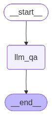

-   An LLM is involved in the graph
-   START Node -\> LLM -\> END
-   To the LLM, question is asked and LLM generates a response. So both
    question and answer will be a part of the state


```python
from langgraph.graph import StateGraph, START, END
from langchain_groq import ChatGroq
from typing import TypedDict

```

# Defining State


```python
class State(TypedDict):
    question: str
    answer: str

```

# Creating the graph


```python
graph = StateGraph(State)
```

# Defining the LLM Q&A function

-   Steps:
    -   First we need to fetch the question from the state
    -   Create a prompt
    -   Make a call to LLM
    -   Generate the answer from LLM and store it back in the state


```python
def llm_qa(state: State) -> State:
    # Defining the LLM
    llm = ChatGroq(model="qwen/qwen3-32b")

    # Extract the question from the state
    question = state["question"]

    # Prompt
    prompt = f"""Answer the following questions: {question}"""

    # Make a call to LLM
    response = llm.invoke(prompt)

    # Store the answer back in the state
    state["answer"] = response.content
    return state
    
```

# Adding Nodes


```python
graph.add_node("llm_qa", llm_qa)
```

``` text
<langgraph.graph.state.StateGraph at 0x1140479d0>
```

# Adding edges


```python
graph.add_edge(START, "llm_qa")
graph.add_edge("llm_qa", END)
```

``` text
<langgraph.graph.state.StateGraph at 0x1140479d0>
```

# Compile the graph


```python
workflow = graph.compile()
workflow
```




```python
initial_state = {"question": "What is the full form of LLM?"}

final_state = workflow.invoke(initial_state)
final_state

```

``` text
{'question': 'What is the full form of LLM?',
 'answer': '<think>\nOkay, the user is asking for the full form of LLM. Let me start by recalling what I know. LLM is a common abbreviation in technology, especially in AI.\n\nFirst, I think LLM stands for Large Language Model. That makes sense because I\'ve heard terms like "large language models" being used to describe AI systems like GPT, BERT, etc. These models are trained on vast amounts of text data to understand and generate human-like language.\n\nWait, but are there other possible meanings for LLM? Maybe in other contexts, like in business or another field? For example, sometimes abbreviations can have multiple meanings depending on the industry. But given the context of the question and the current trends, it\'s most likely referring to the AI/ML field. \n\nLet me double-check. If I search for "LLM full form," the top results confirm it\'s Large Language Model. There\'s also a mention of "Legal Language Model" in some contexts, but that\'s probably less common. Also, I\'ve heard about law schools offering LLM degrees, which stands for Master of Laws. But the user didn\'t specify the field, so I should consider all possibilities. However, the question is likely about the AI context. \n\nThe user might be a student or a professional encountering the term for the first time. They might need the answer for academic purposes, a project, or just to understand a technical term. It\'s important to provide the most relevant answer first and mention other possible meanings briefly if they exist. \n\nSo, the primary answer is Large Language Model. I should explain that it\'s a type of AI model designed to process and generate text, trained on large datasets. Maybe give an example like GPT-3 or BERT to make it clearer. Also, mention that these models are used in various applications such as chatbots, translation, summarization, etc. \n\nI need to make sure the explanation is concise but covers the key points. Avoid technical jargon as much as possible. Also, check if there\'s a standard definition that\'s widely accepted. Yes, the standard definition is indeed Large Language Model, so that\'s the safest answer here.\n</think>\n\nThe full form of **LLM** is **Large Language Model**. \n\nA **Large Language Model** is an artificial intelligence system designed to understand, generate, and respond to human language by analyzing vast amounts of text data. These models are trained on extensive datasets and can perform tasks like answering questions, writing stories, translating languages, summarizing text, and more. Examples include **GPT** (Generative Pre-trained Transformer), **BERT**, and **LLaMA**. \n\nOther contexts for "LLM" exist, such as:\n- **Master of Laws** (a postgraduate law degree).\n- **Limited Liability Mortgage** or other financial/legal terms. \n\nHowever, in modern AI/tech discussions, **LLM** most commonly refers to **Large Language Model**.'}
```
