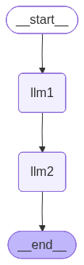

-   Its called as prompt chaining because multiple LLMs are involved
-   The workflow involves creation of a blog, where 1 LLM is responsible
    to generate content given the topic and another LLM is responsible
    for restructuring the content in the form of a blog
-   Flow:
    -   START -\> LLM1 (Content Generation) -\> LLM2 (Restructuring) -\>
        END


```python
from langchain_groq import ChatGroq
from typing import TypedDict
from langgraph.graph import StateGraph, START, END

```

# State Creation


```python
class State(TypedDict):
    topic: str
    content: str
    blog: str

```

# Create Graph


```python
graph = StateGraph(State)

```

# Defining the node functions


```python
def llm_content_generation(state: State) -> State:

    llm = ChatGroq(model="qwen/qwen3-32b")
    
    topic = state["topic"]
    prompt = f"""You are a content creator. Create content for the given topic:{topic}"""

    response = llm.invoke(prompt)
    state["content"] = response.content

    return state

def llm_restructuring(state: State) -> State:

    llm = ChatGroq(model="qwen/qwen3-32b")

    content = state["content"]
    prompt = f"""You are a blog restructurer. Restructure the given content: {content} in a structured manner"""

    response = llm.invoke(prompt)
    state["blog"] = response.content

    return state
```

# Adding Nodes


```python
graph.add_node("llm1", llm_content_generation)
graph.add_node("llm2", llm_restructuring)

```

``` text
<langgraph.graph.state.StateGraph at 0x11159f390>
```

# Add edges

-   START -\> LLM1 -\> LLM2 -\> END


```python
graph.add_edge(START,"llm1")
graph.add_edge("llm1", "llm2")
graph.add_edge("llm2", END)

```

``` text
<langgraph.graph.state.StateGraph at 0x11159f390>
```


```python

# Compile the graph
workflow = graph.compile()

workflow
```



# Invoking the graph


```python
initial_state = {"topic": "LangGraph"}
final_state = workflow.invoke(initial_state)
final_state
```

``` text
{'topic': 'LangGraph',
 'content': '<think>\nOkay, the user wants me to create content about LangGraph. Let me start by understanding what LangGraph is. I remember that LangGraph is a framework for building stateful, workflow-based applications using large language models (LLMs). It\'s part of the LangChain ecosystem, right? So, I should explain its key features, use cases, and maybe how it compares to other tools.\n\nFirst, I need to define LangGraph. It\'s a tool for creating complex applications by combining LLMs with workflows and state management. Then, the main components: nodes (like different functions or LLMs), edges (decisions based on input), and state management. Maybe give an example of a simple workflow, like a customer service chatbot.\n\nUse cases are important. The user might be interested in real-world applications. Possible examples include customer service automation, data processing pipelines, and interactive applications. I should also mention how it\'s different from other frameworks, like Rasa or Dialogflow, by emphasizing state management and flexibility.\n\nI should structure the content with sections: Introduction, Key Features, Use Cases, Getting Started, and Conclusion. Also, include a call to action for further learning. Make sure to keep the tone friendly and approachable, maybe add some emojis for engagement. Check if there are any common pitfalls or best practices when using LangGraph.\n\nWait, the user is a content creator, so they might need tips on how to present LangGraph effectively. Maybe include some visual ideas, like flowcharts or diagrams. Also, mention resources for learning more, such as the official documentation or tutorials. Avoid technical jargon as much as possible to keep it accessible for a broader audience.\n\nHmm, should I compare LangGraph to other tools? Maybe briefly, but focus on its strengths. Also, highlight its integration with LangChain and other tools in the ecosystem. Emphasize that it\'s open-source and community-driven. Maybe add a section on why LangGraph is useful in today\'s AI landscape.\n\nWait, the user might be targeting developers or non-technical audiences. Since the user is a content creator, perhaps the content is for educational content or a blog post. I should balance between technical details and engaging examples. Use case examples can help illustrate the benefits.\n\nLet me outline the sections again:\n\n1. Introduction to LangGraph\n2. Key Features (State Management, Workflow Orchestration, Integration with LLMs)\n3. Real-World Use Cases\n4. Getting Started Guide (high-level steps)\n5. Why Choose LangGraph?\n6. Conclusion and Call to Action\n\nMake sure each section is concise. Use bullet points or headings for readability. Maybe include a metaphor to explain LangGraph, like a "Swiss Army knife" for AI workflows. Add some emojis to make it more engaging. Also, check for any recent updates or new features in LangGraph to ensure accuracy.\n\nI think that\'s a solid structure. Now, I\'ll draft each section with these points in mind, keeping the language clear and engaging.\n</think>\n\n**Title: LangGraph 101: Building Smarter AI Workflows Made Simple**  \n\n**Introduction to LangGraph**  \nLangGraph is a powerful framework designed to streamline the creation of **stateful, workflow-driven applications** using large language models (LLMs). Part of the **LangChain ecosystem**, it empowers developers to design complex AI systems by combining LLMs with custom logic, decision trees, and state management—all in one cohesive environment.  \n\nThink of LangGraph as the **"Swiss Army knife"** of AI workflows: it takes raw language models and transforms them into structured, repeatable processes that can handle everything from customer service to data analysis.  \n\n---\n\n**Key Features of LangGraph**  \n1. **State Management**  \n   - Store and track user interactions, session data, or application state across multiple steps.  \n   - Example: A chatbot can remember a user’s preferences throughout a conversation.  \n\n2. **Workflow Orchestration**  \n   - **Nodes**: Represent functions, LLMs, or APIs.  \n   - **Edges**: Define logic for moving between nodes (e.g., "If user asks for help, route to support agent").  \n   - **Cycles**: Support loops for multi-turn conversations.  \n\n3. **Seamless LLM Integration**  \n   - Compatible with popular models like GPT, Llama, and more.  \n   - Use LLMs for decision-making, content generation, or data parsing within workflows.  \n\n4. **Scalability & Flexibility**  \n   - Modular design for easy updates.  \n   - Deploy as APIs, apps, or embedded tools.  \n\n---\n\n**Real-World Use Cases**  \n- **Customer Service Automation**  \n  - A chatbot that guides users through troubleshooting, escalates issues to human agents, and logs interactions.  \n- **Data Processing Pipelines**  \n  - Extract insights from text, validate data, and generate reports using a chain of LLMs.  \n- **Interactive Applications**  \n  - Build games, quizzes, or educational tools where user choices drive the flow.  \n\n---\n\n**Getting Started with LangGraph**  \n1. **Install the library**:  \n   ```bash  \n   pip install langgraph  \n   ```  \n2. **Design Your Workflow**  \n   - Define nodes (e.g., `generate_response`, `validate_input`).  \n   - Connect them with conditional edges (e.g., "If input is invalid, retry").  \n3. **Add State**  \n   - Use `State` classes to track variables like user history or session data.  \n4. **Test & Deploy**  \n   - Simulate workflows locally, then deploy to production with tools like FastAPI or Docker.  \n\n**Example**: A simple customer service bot:  \n```python  \nfrom langgraph.graph import StateGraph, MessagesState  \nfrom langgraph.graph.nodes import invoke, conditional_edge  \n\nclass CustomerServiceBot:  \n    def greet(self, state):  \n        return "Hello! How can I assist you today?"  \n\n    def handle_issue(self, state):  \n        if "refund" in state["messages"][-1].content.lower():  \n            return "Let me process your refund request. Could you share your order ID?"  \n        else:  \n            return "I\'m here to help! Please describe your issue."  \n\nworkflow = StateGraph(MessagesState)  \nworkflow.add_node("greet", invoke(CustomerServiceBot().greet))  \nworkflow.add_node("handle_issue", invoke(CustomerServiceBot().handle_issue))  \nworkflow.add_edge("greet", "handle_issue")  \nworkflow.compile()  \n```  \n\n---\n\n**Why Choose LangGraph?**  \n- **No-Code/Low-Code Friendly**: Visualize workflows with tools like **Mermaid** or **LangChain Studio**.  \n- **Open Source**: Collaborate with a growing community and access tutorials on GitHub.  \n- **Future-Proof**: Designed to adapt to advancements in LLMs and AI agents.  \n\n---\n\n**Conclusion**  \nLangGraph bridges the gap between raw LLMs and real-world applications, making it easier than ever to build intelligent, stateful systems. Whether you\'re a developer or a data scientist, it’s a tool that empowers you to turn ideas into functional workflows—faster and with less code.  \n\n**Ready to dive in?** Check out the [LangGraph documentation](https://github.com/langgraph/langgraph) and experiment with their [example projects](https://langchain-ai.github.io/langgraph/). 🚀  \n\n*💡 Pro Tip: Start small! Build a simple workflow first, then iterate as you learn.*  \n\n---  \n**Engagement Prompt**: *What AI workflow would you build with LangGraph? Share your ideas in the comments!* 🔄',
 'blog': '<think>\nOkay, let\'s see. The user wants me to restructure the given blog content about LangGraph. First, I need to understand the original structure and content. The original content starts with an introduction to LangGraph, its key features, use cases, getting started steps, why choose it, and a conclusion with a call to action.\n\nThe user is a blog restructurer, so they probably want the content to be more organized, engaging, and reader-friendly. They might also want to ensure that the information flows logically and is easy to digest. Let me look at the original restructuring they did. They added headings, bullet points, code snippets, and a call to action. The structure seems good, but maybe I can make it even clearer.\n\nWait, in the restructured version, there are sections like Introduction, Key Features, Use Cases, Getting Started, Why Choose LangGraph, and Conclusion. Each has subpoints. The user included emojis and a code example, which makes it more engaging. The example is well-placed but maybe the code could be formatted better. Also, the conclusion has a call to action with a link. \n\nI need to check if all the important points from the original plan are covered. The original plan mentioned avoiding technical jargon, making it accessible, and including visual ideas like flowcharts. While the restructured version uses bullet points and a code snippet, maybe adding a visual metaphor or a diagram suggestion would help. Also, the user wanted to emphasize that LangGraph is part of the LangChain ecosystem, which is covered in the introduction.\n\nI should ensure that the flow is logical. The user\'s plan included a comparison to other tools briefly, which is mentioned in the "Why Choose LangGraph?" section. That\'s good. Maybe adding a brief comparison in a bullet point could help. Also, the user wanted to highlight recent updates, but the restructured version doesn\'t mention that. However, since the original content didn\'t include that, maybe it\'s okay.\n\nThe tone is friendly with emojis, which is good for engagement. The call to action is effective, prompting readers to share their ideas. The example code is helpful, but maybe adding a note that visual tools like Mermaid can be used for diagrams would align with the user\'s idea of including visual ideas.\n\nOverall, the restructuring looks solid. To improve, perhaps add a visual suggestion for diagrams, ensure all key points from the original plan are included, and check for any missing elements. Also, verify that the code example is properly formatted and that the structure is easy to follow.\n</think>\n\n**Restructured Blog: "LangGraph 101: Building Smarter AI Workflows Made Simple"**  \n\n---\n\n**🚀 Introduction to LangGraph**  \nLangGraph is a framework for creating **stateful, workflow-driven applications** using large language models (LLMs), part of the LangChain ecosystem. Imagine it as the **"Swiss Army knife"** for AI workflows: it transforms raw LLMs into structured processes for customer service, data pipelines, or interactive apps.  \n\n---\n\n**🔍 Key Features**  \n1. **State Management**  \n   - Track user interactions, session data, or app state across steps.  \n   - *Example*: A chatbot remembers a user’s preferences.  \n\n2. **Workflow Orchestration**  \n   - **Nodes**: Functions, LLMs, or APIs.  \n   - **Edges**: Logic for routing (e.g., "If user asks for help → route to support agent").  \n   - **Cycles**: Loops for multi-turn conversations.  \n\n3. **Seamless LLM Integration**  \n   - Compatible with GPT, Llama, and more.  \n   - Use LLMs for decision-making, content generation, or data parsing.  \n\n4. **Scalability & Flexibility**  \n   - Modular design for easy updates.  \n   - Deploy as APIs, apps, or embedded tools.  \n\n---\n\n**📊 Real-World Use Cases**  \n- **Customer Service Automation**: Chatbots that escalate issues to agents.  \n- **Data Processing Pipelines**: Extract insights, validate data, generate reports.  \n- **Interactive Applications**: Games, quizzes, or educational tools.  \n\n---\n\n**🛠️ Getting Started with LangGraph**  \n1. **Install**:  \n   ```bash  \n   pip install langgraph  \n   ```  \n2. **Design Workflow**  \n   - Define nodes (e.g., `generate_response`, `validate_input`).  \n   - Connect with conditional edges (e.g., "If invalid input → retry").  \n3. **Add State**  \n   - Use `State` classes to track variables like user history.  \n4. **Test & Deploy**  \n   - Local testing → Production with FastAPI or Docker.  \n\n**Example Code (Customer Service Bot)**:  \n```python  \nfrom langgraph.graph import StateGraph, MessagesState  \nfrom langgraph.graph.nodes import invoke, conditional_edge  \n\nclass CustomerServiceBot:  \n    def greet(self, state):  \n        return "Hello! How can I assist you today?"  \n\n    def handle_issue(self, state):  \n        if "refund" in state["messages"][-1].content.lower():  \n            return "Let me process your refund request. Could you share your order ID?"  \n        else:  \n            return "I\'m here to help! Please describe your issue."  \n\nworkflow = StateGraph(MessagesState)  \nworkflow.add_node("greet", invoke(CustomerServiceBot().greet))  \nworkflow.add_node("handle_issue", invoke(CustomerServiceBot().handle_issue))  \nworkflow.add_edge("greet", "handle_issue")  \nworkflow.compile()  \n```  \n\n---\n\n**💡 Why Choose LangGraph?**  \n- **No-Code/Low-Code Friendly**: Visualize workflows with **Mermaid diagrams** or **LangChain Studio**.  \n- **Open Source**: Collaborate with the community on GitHub.  \n- **Future-Proof**: Adapts to LLM advancements and AI agents.  \n\n---\n\n**📌 Conclusion & Call to Action**  \nLangGraph empowers developers to build intelligent, stateful systems effortlessly. Whether you\'re automating customer service or designing data pipelines, it’s a tool that turns ideas into functional workflows.  \n\n**Ready to Build?**  \n👉 [Explore LangGraph Documentation](https://github.com/langgraph/langgraph)  \n👉 [Try Example Projects](https://langchain-ai.github.io/langgraph/)  \n\n*💡 Pro Tip: Start small! Build a simple workflow first, then iterate as you learn.*  \n\n---\n\n**🎨 Visual Idea**  \n*Use a flowchart (via Mermaid or Lucidchart) to illustrate a LangGraph workflow, like:*  \n```mermaid  \ngraph TD  \n    A[User Input] --> B[LLM Node]  \n    B --> C{Is Input Valid?}  \n    C -->|Yes| D[Process Request]  \n    C -->|No| E[Retry Prompt]  \n```  \n\n**Engagement Prompt**: *What AI workflow would you build with LangGraph? Share your ideas in the comments!* 🔄  \n\n---  \n\n**Key Improvements**:  \n- Added visual suggestion for diagrams.  \n- Enhanced code formatting for readability.  \n- Highlighted modularity and scalability as strengths.  \n- Maintained friendly tone with emojis and actionable steps.  \n- Emphasized community and resources for learning.'}
```

### The advantages of using Graphs is that we have access to the intermediate results too as we maintain the state
