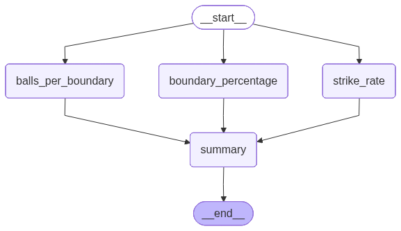

-   Given runs, balls, No of 4s and 6s hit, you will need to compute the
    below 3 metrices
    -   Strike Rate
    -   Boundary Percentage
    -   Balls per boundary
-   All these 3 are independent tasks thus must be executed in parallel
-   Then aggregate these 3 quantities and then generate the summary
-   Workflow
    -   START -\> (Strike Rate, Boundary Percentage, Balls per boundary)
        -\> Summary -\> END


```python
from langgraph.graph import StateGraph, START, END
from typing import TypedDict
```


```python
class State(TypedDict):
    runs: int
    balls: int
    sixes: int
    fours: int

    strike_rate: float
    boundary_percentage: float
    balls_per_boundary: float
    summary: str
```

# Define Graph


```python
graph = StateGraph(State)
```

# Function definations


```python
def strike_rate(state: State) -> State:
    state["strike_rate"] = (state["runs"]/ state["balls"])*100
    return state

def balls_per_boundary(state: State)->State:
    state["balls_per_boundary"] = state["balls"]/(state["fours"]+state["sixes"])
    return state

def boundary_percentage(state: State)->State:
    state["boundary_percentage"] = (((state["fours"]*4 ) + (state["sixes"]*6))/state["runs"])*100
    return state


def summary(state: State) -> State:
    state["summary"] = f"""
        Strike Rate: {state["strike_rate"]}, 
        balls_per_boundary: {state["balls_per_boundary"]}, 
        boundary_percentage: {state["boundary_percentage"]}
    """
    return state
```

# Creating Nodes


```python
graph.add_node("summary", summary)
graph.add_node("strike_rate", strike_rate)
graph.add_node("balls_per_boundary", balls_per_boundary)
graph.add_node("boundary_percentage", boundary_percentage)
```

``` text
<langgraph.graph.state.StateGraph at 0x10ee9ecf0>
```

# Creating edges

-   Here the START Node goes to 3 other nodes i.e. strike_rate,
    balls_per_boundary and boundary_percentage
-   Each of the 3 nodes futher connect to summary Node
-   Finally the summary node connects to the END Node


```python
graph.add_edge(START, "strike_rate")
graph.add_edge(START, "balls_per_boundary")
graph.add_edge(START, "boundary_percentage")

graph.add_edge("strike_rate", "summary")
graph.add_edge("balls_per_boundary", "summary")
graph.add_edge("boundary_percentage", "summary")

graph.add_edge("summary", END)
```

``` text
<langgraph.graph.state.StateGraph at 0x10ee9ecf0>
```

# Compiling the graph


```python
workflow = graph.compile()
workflow
```



# Invoking the graph


```python
initial_state = {
    "runs": 100,
    "balls": 50,
    "fours": 6,
    "sixes": 4
}

final_state = workflow.invoke(initial_state)
final_state
```

``` text
InvalidUpdateError: At key 'runs': Can receive only one value per step. Use an Annotated key to handle multiple values.
For troubleshooting, visit: https://docs.langchain.com/oss/python/langgraph/errors/INVALID_CONCURRENT_GRAPH_UPDATE
---------------------------------------------------------------------------
InvalidUpdateError                        Traceback (most recent call last)
Cell In[8], line 8
      1 initial_state = {
      2     "runs": 100,
      3     "balls": 50,
      4     "fours": 6,
      5     "sixes": 4
      6 }
----> 8 final_state = workflow.invoke(initial_state)
      9 final_state

File ~/Documents/my_github/Notes/.venv_langgraph/lib/python3.13/site-packages/langgraph/pregel/main.py:3094, in Pregel.invoke(self, input, config, context, stream_mode, print_mode, output_keys, interrupt_before, interrupt_after, durability, **kwargs)
   3091 chunks: list[dict[str, Any] | Any] = []
   3092 interrupts: list[Interrupt] = []
-> 3094 for chunk in self.stream(
   3095     input,
   3096     config,
   3097     context=context,
   3098     stream_mode=["updates", "values"]
   3099     if stream_mode == "values"
   3100     else stream_mode,
   3101     print_mode=print_mode,
   3102     output_keys=output_keys,
   3103     interrupt_before=interrupt_before,
   3104     interrupt_after=interrupt_after,
   3105     durability=durability,
   3106     **kwargs,
   3107 ):
   3108     if stream_mode == "values":
   3109         if len(chunk) == 2:

File ~/Documents/my_github/Notes/.venv_langgraph/lib/python3.13/site-packages/langgraph/pregel/main.py:2679, in Pregel.stream(self, input, config, context, stream_mode, print_mode, output_keys, interrupt_before, interrupt_after, durability, subgraphs, debug, **kwargs)
   2669 for _ in runner.tick(
   2670     [t for t in loop.tasks.values() if not t.writes],
   2671     timeout=self.step_timeout,
   (...)   2674 ):
   2675     # emit output
   2676     yield from _output(
   2677         stream_mode, print_mode, subgraphs, stream.get, queue.Empty
   2678     )
-> 2679 loop.after_tick()
   2680 # wait for checkpoint
   2681 if durability_ == "sync":

File ~/Documents/my_github/Notes/.venv_langgraph/lib/python3.13/site-packages/langgraph/pregel/_loop.py:542, in PregelLoop.after_tick(self)
    540 writes = [w for t in self.tasks.values() for w in t.writes]
    541 # all tasks have finished
--> 542 self.updated_channels = apply_writes(
    543     self.checkpoint,
    544     self.channels,
    545     self.tasks.values(),
    546     self.checkpointer_get_next_version,
    547     self.trigger_to_nodes,
    548 )
    549 # produce values output
    550 if not self.updated_channels.isdisjoint(
    551     (self.output_keys,)
    552     if isinstance(self.output_keys, str)
    553     else self.output_keys
    554 ):

File ~/Documents/my_github/Notes/.venv_langgraph/lib/python3.13/site-packages/langgraph/pregel/_algo.py:296, in apply_writes(checkpoint, channels, tasks, get_next_version, trigger_to_nodes)
    294 for chan, vals in pending_writes_by_channel.items():
    295     if chan in channels:
--> 296         if channels[chan].update(vals) and next_version is not None:
    297             checkpoint["channel_versions"][chan] = next_version
    298             # unavailable channels can't trigger tasks, so don't add them

File ~/Documents/my_github/Notes/.venv_langgraph/lib/python3.13/site-packages/langgraph/channels/last_value.py:64, in LastValue.update(self, values)
     59 if len(values) != 1:
     60     msg = create_error_message(
     61         message=f"At key '{self.key}': Can receive only one value per step. Use an Annotated key to handle multiple values.",
     62         error_code=ErrorCode.INVALID_CONCURRENT_GRAPH_UPDATE,
     63     )
---> 64     raise InvalidUpdateError(msg)
     66 self.value = values[-1]
     67 return True

InvalidUpdateError: At key 'runs': Can receive only one value per step. Use an Annotated key to handle multiple values.
For troubleshooting, visit: https://docs.langchain.com/oss/python/langgraph/errors/INVALID_CONCURRENT_GRAPH_UPDATE
```

-   This error is occuring as the same state parameters i.e. runs,
    sixes, fours, and balls are being used parallely by the 3 parallely
    running nodes(although no edit is done on these parameters), the
    summary node will not know which state to use as all 3 nodes will
    return a state
-   So instead of returning the entire state, just return only partial
    state i.e. strike_rate() must just return “strike_rate” and not
    return complete state


```python
def strike_rate(state: State) -> State:
    strike_rate = (state["runs"]/ state["balls"])*100
    return {"strike_rate":strike_rate}

def balls_per_boundary(state: State)->State:
    balls_per_boundary = state["balls"]/(state["fours"]+state["sixes"])
    return {"balls_per_boundary":balls_per_boundary}

def boundary_percentage(state: State)->State:
    boundary_percentage = (((state["fours"]*4 ) + (state["sixes"]*6))/state["runs"])*100
    return {"boundary_percentage":boundary_percentage}


def summary(state: State) -> State:
    summary = f"""
        Strike Rate: {state["strike_rate"]}, 
        balls_per_boundary: {state["balls_per_boundary"]}, 
        boundary_percentage: {state["boundary_percentage"]}
    """
    return {"summary": summary}
```


```python
# Defining the graph
graph = StateGraph(State)

# Create Nodes
graph.add_node("summary", summary)
graph.add_node("strike_rate", strike_rate)
graph.add_node("balls_per_boundary", balls_per_boundary)
graph.add_node("boundary_percentage", boundary_percentage)

# Adding edges
graph.add_edge(START, "strike_rate")
graph.add_edge(START, "balls_per_boundary")
graph.add_edge(START, "boundary_percentage")

graph.add_edge("strike_rate", "summary")
graph.add_edge("balls_per_boundary", "summary")
graph.add_edge("boundary_percentage", "summary")

graph.add_edge("summary", END)

# Compiling the graph to create a workflow
workflow = graph.compile()

# Invoking the workflow
final_state = workflow.invoke(initial_state)
final_state
```

``` text
{'runs': 100,
 'balls': 50,
 'sixes': 4,
 'fours': 6,
 'strike_rate': 200.0,
 'boundary_percentage': 48.0,
 'balls_per_boundary': 5.0,
 'summary': '\n        Strike Rate: 200.0, \n        balls_per_boundary: 5.0, \n        boundary_percentage: 48.0\n    '}
```
