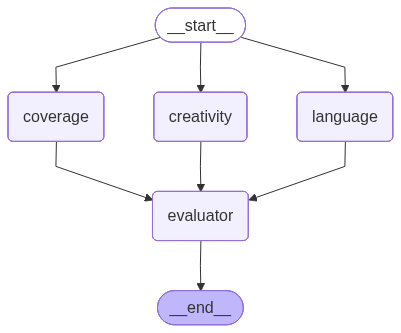

-   Problem Statment revolves around UPSC Essay evaluation
-   Each essay undergoes 3 steps of checks
    1.  Coverage of thoughts
    2.  Language usage
    3.  Creativity
-   Each of the categories is evaluated by different LLMs
-   Each LLM will need to produce 2 outputs
    1.  Textual feedback
    2.  Score betwen 0-10
-   Finally the final node will be the final evaulator. This must return
    1.  Summarized feedback consisting the outputs of the 3 LLMs
    2.  Average score
-   Workflow
    -   START -\> 3 parallel Nodes(Coverage of thoughts, creativity,
        language useage) -\> Final Evaluator -\> END
-   As the outputs of all the 3 parallel nodes will be updating the same
    state attributes i.e. 1 for textual feedback and the other for the
    score between 0-10
-   To generate the summary the results of each LLM is important, thus
    we cannot update/overwrite the same state variables instead we will
    need to append/ concatinate with the same state variable. This can
    be attained by making use of reducers
-   To ensure that each parallel LLM provides a score and a feedback a
    structured output must be provided


```python
from langgraph.graph import StateGraph, START, END
from typing import TypedDict
from langchain_groq import ChatGroq
from pydantic import BaseModel, Field
```


```python
model = ChatGroq(model = "qwen/qwen3-32b")
```


```python
# Schema for the data - this ensures that the output from the LLM will be in the structured manner
class EvaluationSchema(BaseModel):
    feedback: str = Field(description="Feedback of the essay")
    score: int = Field(description="Score out of 10", ge=0,le=100)
```


```python
structured_model = model.with_structured_output(EvaluationSchema)
```

### Example to test it out whether the output from the LLM will be structured or not


```python
content = f"ChatGPT is a generative artificial intelligence chatbot developed by OpenAI. It was released in November 2022. It uses generative pre-trained transformers, such as GPT-5.2, to generate text, speech, and images in response to user prompts."
prompt = f"Evaluate the given content and give a feedback and a score between 0-10. The content is {content}"
structured_model.invoke(prompt)
```

``` text
EvaluationSchema(feedback="The content correctly identifies ChatGPT as a generative AI chatbot developed by OpenAI and its release date in November 2022. However, it incorrectly states that ChatGPT uses 'GPT-5.2,' which is not an officially released model as of October 2023 (the latest public model is GPT-4). This factual inaccuracy reduces the overall accuracy. The structure is clear, but the content lacks additional details about ChatGPT's capabilities or impact.", score=7)
```

# Defining the State


```python
import operator
from typing import Annotated

class State(TypedDict):
    essay: str
    # Feedback state maintained for parallel nodes
    language_feedback: str
    coverage_feedback: str
    creativity_feedback: str

    # Overall feedback state attribute maintained by Evaluator
    overall_feedback: str

    # Common scores stateattribute maintained for parallel nodes
    individual_scores: Annotated[list[int], operator.add]

    # Avg score state attribute maintained by the Evaluator node
    avg_score: float
```

-   Reducer function here is add thus the script for the same is -\>
    individual_scores: Annotated\[list\[int\], operator.add\]
-   This implies that if we have 3 parallel nodes return scores as
    \[6\], \[8\], \[10\] as seperate lists, then since the reducer is
    add it adds all the lists finally the individual_scores will be \[6,
    8, 10\]

# Defining the functions


```python
def check_creativity(state: State) -> State:
    prompt = f"Evaluate the creativeness of the essay: {state["essay"]} and give the feedback and a score between 0-10"

    response = structured_model.invoke(prompt)  

    return {
        "creativity_feedback": response.feedback,
        "individual_scores": [response.score] # Its a list of score so that reducer add will append all the scores from the LLM
    } 


def check_language(state: State) -> State:
    prompt = f"Evaluate the language useage of the essay: {state["essay"]} and give the feedback and a score between 0-10"

    response = structured_model.invoke(prompt)  

    return {
        "language_feedback": response.feedback,
        "individual_scores": [response.score] # Its a list of score so that reducer add will append all the scores from the LLM
    } 


def check_coverage(state: State) -> State:
    prompt = f"Evaluate the coverage of thoughts of the essay: {state["essay"]} and give the feedback and a score between 0-10"

    response = structured_model.invoke(prompt)  

    return {
        "coverage_feedback": response.feedback,
        "individual_scores": [response.score] # Its a list of score so that reducer add will append all the scores from the LLM
    } 
    

def evaluator(state: State) -> State:
    prompt = f"""Summarize the whole feedback. The feedbacks are
    1. {state["coverage_feedback"]}
    2. {state["creativity_feedback"]}
    3. {state["language_feedback"]}
    """

    response = model.invoke(prompt)  

    return {
        "overall_feedback": response,
        "average_score": sum(state["individual_scores"])/len(state["individual_scores"])
    } 
    
```


```python
graph = StateGraph(State)

# Adding nodes
graph.add_node("creativity", check_creativity)
graph.add_node("language", check_language)
graph.add_node("coverage", check_coverage)
graph.add_node("evaluator", evaluator )

# Creating edges
graph.add_edge(START, "creativity")
graph.add_edge(START, "language")
graph.add_edge(START, "coverage")

graph.add_edge("creativity", "evaluator")
graph.add_edge("language", "evaluator")
graph.add_edge("coverage", "evaluator")

graph.add_edge("evaluator", END)
```

``` text
<langgraph.graph.state.StateGraph at 0x1102a9d10>
```


```python
# Worklfow creation 
workflow = graph.compile()
workflow
```




```python
initial_state = {
    "essay": "ChatGPT is a generative artificial intelligence chatbot developed by OpenAI. It was released in November 2022. It uses generative pre-trained transformers, such as GPT-5.2, to generate text, speech, and images in response to user prompts."
}

workflow.invoke(initial_state)
```

``` text
{'essay': 'ChatGPT is a generative artificial intelligence chatbot developed by OpenAI. It was released in November 2022. It uses generative pre-trained transformers, such as GPT-5.2, to generate text, speech, and images in response to user prompts.',
 'language_feedback': "The essay is clear and concise, presenting key information about ChatGPT's development and functionality. However, there are inaccuracies: ChatGPT does not use GPT-5.2 (the latest is GPT-4.5) and it cannot generate images. The explanation could also benefit from expanded details about specific applications or technical innovations.",
 'coverage_feedback': "The essay briefly mentions ChatGPT's development, release date, and underlying technology. However, it lacks depth in explaining the significance of its release, the actual GPT model (GPT-3.5 is more accurate than GPT-5.2), and its real-world applications/impact. The content is factually correct but very surface-level with minimal analysis.",
 'creativity_feedback': "The essay provides basic factual information about ChatGPT but lacks creative elements such as original examples, metaphors, or unique perspectives. It is concise but does not engage the reader with imaginative content. The mention of 'GPT-5.2' is inaccurate, as the latest public version is GPT-3.5. To improve creativity, consider adding hypothetical applications or analogies to explain its functionality.",
 'overall_feedback': AIMessage(content='<think>\nOkay, let me try to process this. The user wants a summary of three feedback points about an essay on ChatGPT. First, I need to understand each feedback individually.\n\nThe first feedback mentions that the essay covers ChatGPT\'s development, release date, and tech but lacks depth on the significance, model accuracy (GPT-3.5 vs 5.2), and real-world impact. It\'s factually correct but too surface-level.\n\nSecond feedback says the essay is basic with no creative elements like examples, metaphors, or unique angles. It\'s concise but not engaging. Also points out the GPT-5.2 inaccuracy again and suggests adding hypothetical uses or analogies.\n\nThird feedback is similar: clear and concise but has inaccuracies (GPT-5.2 instead of GPT-4.5, and mentions image generation which isn\'t true). Also needs more on applications and technical details.\n\nNow, I need to combine these. The main points are inaccuracies in GPT versions, lack of depth in significance and applications, and missing creative elements. Also, the essay is factually correct but not engaging enough. Need to highlight the model version errors and suggest ways to improve by adding depth, analysis, and creative content like metaphors or hypotheticals. Also mention correcting image generation claims.\n\nWait, the third feedback says the latest is GPT-4.5, but the first mentions GPT-3.5. Which is correct? I should verify. As of now, the latest public version is GPT-4.5. So the essay incorrectly states GPT-5.2, which is wrong. The first feedback says GPT-3.5 is more accurate than 5.2, but the third says the latest is 4.5. So the essay\'s inaccuracy is using 5.2 instead of 4.5. Need to clarify that in the summary.\n\nAlso, the image generation part in the third feedback is important. The essay incorrectly says ChatGPT can generate images, which it can\'t; that\'s DALL-E\'s role. So another inaccuracy to note.\n\nPutting it all together, the summary should address model version inaccuracies, lack of depth in analysis and applications, absence of creative elements, and the image generation error. Suggest corrections and improvements like deeper analysis, adding real-world examples, and creative analogies.\n</think>\n\nThe feedback on the essay about ChatGPT highlights several key areas for improvement, which can be summarized as follows:  \n\n1. **Accuracy and Depth**:  \n   - The essay contains factual inaccuracies, such as incorrectly citing "GPT-5.2" (the latest public version is **GPT-3.5** or **GPT-4.5**, depending on context) and falsely claiming ChatGPT generates images (this is a feature of models like DALL-E).  \n   - It lacks depth in analyzing the **significance** of ChatGPT’s release, its **underlying technology**, and its **real-world impact** (e.g., educational, business, or ethical implications).  \n\n2. **Creativity and Engagement**:  \n   - The essay is concise but lacks imaginative elements like **original examples**, **metaphors**, or **unique perspectives** to engage readers.  \n   - Suggestions include adding **hypothetical applications** (e.g., "What if ChatGPT could...?") or analogies to explain its functionality in relatable terms.  \n\n3. **Technical and Application Coverage**:  \n   - Technical details about the model (e.g., training data, scalability) and **specific use cases** (e.g., customer service, education, content creation) are insufficient.  \n   - The essay should clarify distinctions between GPT versions (GPT-3.5 vs. GPT-4.5) and avoid conflating capabilities with other AI tools.  \n\n**Overall**, while the essay provides basic factual information clearly, it needs to address inaccuracies, expand analytical depth, and incorporate creative or hypothetical elements to enhance engagement and comprehensiveness.', additional_kwargs={}, response_metadata={'token_usage': {'completion_tokens': 839, 'prompt_tokens': 260, 'total_tokens': 1099, 'completion_time': 2.866705938, 'completion_tokens_details': None, 'prompt_time': 0.010145326, 'prompt_tokens_details': None, 'queue_time': 0.045866424, 'total_time': 2.876851264}, 'model_name': 'qwen/qwen3-32b', 'system_fingerprint': 'fp_5cf921caa2', 'service_tier': 'on_demand', 'finish_reason': 'stop', 'logprobs': None, 'model_provider': 'groq'}, id='lc_run--019cb490-d08f-73d3-afbf-984e674231e7-0', tool_calls=[], invalid_tool_calls=[], usage_metadata={'input_tokens': 260, 'output_tokens': 839, 'total_tokens': 1099}),
 'individual_scores': [4, 3, 7]}
```
