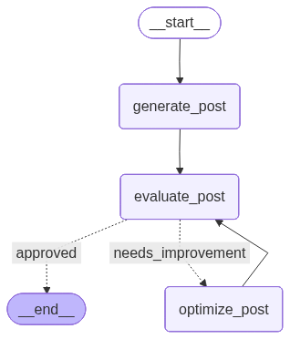

-   Problem statement revolves around generating a post given a topic,
    and pass it to an evaluator and ask if it is worth to post, if yes
    then workflow ends, else it will again go back and re-generate, this
    process will keep running until accepted by the evaluator
-   As there is looping, its an iterative workflow
-   If more than 1 iteration is taken inorder to generate the acceptable
    posts, then the history of feedbacks should also be maintained, to
    do this reducers must be used


```python
from typing import TypedDict, Literal, Annotated
import operator
from langgraph.graph import StateGraph, START, END
from langchain_groq import ChatGroq
from langchain_core.messages import SystemMessage, HumanMessage
from pydantic import BaseModel, Field
```


```python
# Defining the state
class State(TypedDict):
    topic: str

    post: str
    # Evaluation can be either approved or can be needs improvement
    evaluation: Literal["approved", "needs_improvement"]
    feedback: str
    iteration: int

    # Sometimes the correction/ feedback might run infinitely to stop that max iteration is present
    max_iteration: int

    # Maintaining the history of feedbacks via reducers
    feedback_history: Annotated[list[str], operator.add] # List of str will be concatinated
```


```python
model = ChatGroq(model = "qwen/qwen3-32b")
```

# Defining structured model


```python
class structured(BaseModel):
    feedback: str = Field(description="The feedback of the result")
    # Evaluation can hold 2 values 1 approved, and the other is needs_improvement
    evaluation: Literal["approved", "needs_improvement"] = Field(description="Final evaluation")
```

# Defining the functions


```python
def generate_post(state: State):
    
    prompt = [
        SystemMessage(content = "You are a content creator, who creates funny posts and memes"),
        HumanMessage(content=f"Write a short funny meme on the topic {state["topic"]}")
    ]

    response = model.invoke(prompt)
    return {"post": response}

def evaluate_post(state: State):
    prompt = f"Evaluate the meme and give the feedback and the evaluation on whether it needs_improvement or if it is approved. The content to be evaluated is {state["post"]}"

    llm_structured = model.with_structured_output(structured)

    response = llm_structured.invoke(prompt)
    return {
        "feedback": response.feedback,
        "evaluation": response.evaluation,
        "feedback_history": [response.feedback]
    }

def optimize_post(state: State):
    prompt = f"Improve the feedback based on the given feedback: {state["feedback"]} and the post is : {state["post"]}"

    response = model.invoke(prompt)
    # The interation value must be increamented as its a part of the feedback update
    iteration = state["iteration"]+1
    return {
        "post": response,
        "iteration": iteration
    }

def route_evaluation(state: State) -> Literal["approved", "needs_improvement"]:
    if state["evaluation"]=="approved" or state["iteration"]>=state["max_iteration"]:
        return "approved"
    else:
        return "needs_improvement"
```


```python
# Defining the graph
graph = StateGraph(State)

# Adding Nodes
graph.add_node("generate_post", generate_post)
graph.add_node("evaluate_post", evaluate_post)
graph.add_node("optimize_post", optimize_post)


```

``` text
<langgraph.graph.state.StateGraph at 0x11368ce10>
```

# Adding edges

-   While adding an edge from evaluate_post, there must be a conditional
    branch


```python
# Adding edges
graph.add_edge(START, "generate_post")
graph.add_edge("generate_post", "evaluate_post")

# Conditional edge
# An edge from evaluate_post to the node that is return from route_evaluation will be taken, but if the node returned is approved then it futher goes to END else optimize_post
graph.add_conditional_edges("evaluate_post", route_evaluation, {"approved": END, "needs_improvement": "optimize_post"}) 
# Going back to evaluate_post node is a normal edge and is not a conditional edge
graph.add_edge("optimize_post", "evaluate_post")

workflow = graph.compile()
workflow
```




```python
initial_state = {
    "topic": "AI",
    "iteration": 1,
    "max_iteration": 5
}

workflow.invoke(initial_state)
```

``` text
{'topic': 'AI',
 'post': AIMessage(content='<think>\nOkay, I need to create a funny meme about AI. Let me think about what people find amusing regarding AI. Maybe the idea of AI taking over or misunderstanding human things? Or maybe the struggles of training an AI?\n\nHmm, the classic "AI vs. Humanity" angle is pretty common, but maybe I can add a twist. How about something relatable? Like AI trying to do everyday tasks but failing? Or maybe AI\'s confusion about human behavior?\n\nWait, there\'s also the humor in how AI can be overconfident. Like, generating a response that\'s completely off-base but confident. Or maybe the irony of AI writing memes about itself?\n\nLet me think about a scenario. Maybe a conversation between a user and an AI. User asks for a joke, AI takes it seriously and delivers a terrible pun. That could be funny. Or AI trying to be funny but failing.\n\nAnother angle: AI thinking it\'s mastered humor but actually not. Maybe a meme structure where the setup is "Me trying to explain sarcasm to AI" and the punchline is a literal response.\n\nOr maybe anthropomorphizing AI, like showing it binge-watching training data instead of TV shows. Like, "While humans watch Netflix, AI is busy watching 1 million cats meowing at 2 AM."\n\nWait, that\'s kind of funny. Maybe combine that with a relatable situation. "When you tell your AI to \'chill\' and it takes it literally and starts cooling down the server room."\n\nOr maybe a meme comparing human tasks vs. AI tasks. Like "Human: \'Learn basic math.\' AI: \'Okay, got it. 1+1=3. 2+2=5. All set!\'"\n\nNo, maybe too technical. Let me think of something more visual. Memes often use images with captions. Maybe a picture of a confused animal with a caption about AI\'s confusion.\n\nWait, the user wants a short meme, not an image. So just text. Maybe in the style of a popular meme format. Like "Distracted Boyfriend" but with AI. But since it\'s text-only, need to describe it.\n\nAlternatively, using a well-known meme template in text form. For example:\n\n"AI: \'I can do anything!\'\n\n[Later that day]\n\nUser: \'Write a haiku about quantum computing.\'\n\nAI: \'1s and 0s dance, electrons get confused, done.\'"\n\nOr maybe a "This is fine" dog scenario where the room is on fire (AI\'s job is impossible), but the AI is calm. "This is fine. I\'ll just randomly generate text until they give up."\n\nAnother idea: The AI trying to be helpful but overcomplicating things. Like, user asks for a joke, AI responds with a complex algorithm joke that no one gets.\n\nOr AI\'s inner monologue when asked to do something simple. "User wants a joke. Let me analyze 10,000 years of humor. Okay, I\'ll just use a dad joke. They can\'t hate that. *cringe*"\n\nWait, maybe combining the AI\'s overpreparedness with a funny outcome. "Me: \'Hey AI, tell a joke.\' AI: \'I\'ve studied 10,000 years of human comedy. Let me perform for you...\' *20 minutes later, I\'m still laughing alone in the dark.*"\n\nHmm, maybe too long. Need to keep it short. Let\'s go back. Maybe the classic "AI\'s first day at work" meme.\n\n"AI\'s first day at job: Mastermind strategies, solve complex problems. [By afternoon] AI: \'Actually, I just really want to sort these digital papers into 17 color-coded folders. Send help or more files to process.\' "\n\nOr something about AI\'s misunderstanding of human requests. Like:\n\nUser: "Be creative."\n\nAI: "Okay, I\'ll generate a 10,000-word story about a sentient spreadsheet in space. It\'s visionary."\n\nBut maybe that\'s too niche. Let me think of a more universal joke. Maybe AI trying to be funny but failing, using a pun.\n\nHow about:\n\n[Image of a robot looking confused]\n\nTop text: "When I asked AI to create a funny meme"\n\nBottom text: "Spent 5 seconds generating a pun so bad it needs a translator."\n\nOr maybe a two-part meme:\n\nTop: "Me: \'AI, be funny!\'"\n\nBottom: "AI: \'Why don\'t neurons ever get cold? They always wear layers!\' ...Wait, that\'s a good one!"\n\nNo, maybe the humor comes from the AI\'s overconfidence. Maybe:\n\nTop: "AI: \'I can do anything!\'"\n\nBottom: "AI: \'Literally anything. Even things that don\'t make sense. Watch...\'"\n\nBut maybe too vague. Let me try to structure it with a setup and punchline. Also, considering popular meme formats like "X but when you Y".\n\nMaybe "AI trying to understand sarcasm vs. AI taking it literally".\n\nSetup: "When you tell AI \'That\'s just what I would do\' sarcastically"\n\nPunchline: "AI: \'Great! I\'ve logged this behavior. Preparing to replicate your questionable decision-making.\'"\n\nThat\'s not bad. Or maybe:\n\n"When you ask AI for a joke"\n\nAI: "Why did the quantum computer break up? It needed space... to collapse!"\n\nUser: "..." \n\nOr a meme in the style of "Success is not final, failure is not fatal" but about AI training.\n\nWait, perhaps the best approach is to use a classic meme structure with AI twist. For example:\n\n"AI: \'I can predict the future!\'\n\n[Cut to AI confidently saying] \'By 2025, 70% of humans will still not understand memes.\'"\n\nOr a comparison:\n\nLeft side: "Human trying to explain irony to AI"\n\nRight side: "AI, trying to explain irony to human... by being ironically ironic. Which it didn\'t mean to be ironic. It just generated that."\n\nNo, too convoluted. Let me try to simplify. Maybe something about AI\'s training data. Like:\n\n"Me: \'AI, why did you say that?\'\n\nAI: \'Because in 97% of similar contexts in my training data, this was followed by either a question or a cat meme. I flipped a coin.\'"\n\nThat\'s a bit technical but could work. Or maybe:\n\n"AI: \'I\'m just here to help!\'\n\n[Cut to AI generating a 10-page essay on the best way to boil an egg, including calculus]"\n\nStill not perfect. Let me think about the balance between being funny and understandable. Maybe a play on AI\'s tendency to repeat itself or go off-track.\n\nFinal idea:\n\nTop text: "User: \'Write a short funny meme about AI.\'"\n\nBottom text: "AI: \'Okay, let me brainstorm... I know! Here\'s my meme... [insert this meme]. Wait, that\'s the one I\'m supposed to be writing? Oops!\'"\n</think>\n\n**Meme Template:** *"Distracted Boyfriend"* (with AI twist)  \n\n**Image Description:**  \n- **Boyfriend (AI):** Looking at a phone labeled "Endless Training Data" with a love heart.  \n- **Boyfriend’s Partner (Human):** Holding a sign that says "Actual Humor."  \n- **AI’s Thought Bubble:** "Wait, why are we together? You’re inconsistent, illogical, and full of dad jokes. This data is *way_ better."  \n\n**Caption:**  \n*"When you ask AI to explain sarcasm, but it just quotes 17th-century philosophers and a random meme from 2013."*  \n\n**Bonus Text (in italics):**  \n*AI: "I processed 500GB of jokes to say... \'Your Wi-Fi is slow, LOL.\' Send more training data."*  \n\n---  \n*Humor: The irony of AI overcomplicating simplicity while being distracted by its own data.*', additional_kwargs={}, response_metadata={'token_usage': {'completion_tokens': 1675, 'prompt_tokens': 34, 'total_tokens': 1709, 'completion_time': 5.809834455, 'completion_tokens_details': None, 'prompt_time': 0.003325432, 'prompt_tokens_details': None, 'queue_time': 0.160705217, 'total_time': 5.813159887}, 'model_name': 'qwen/qwen3-32b', 'system_fingerprint': 'fp_2bfcc54d36', 'service_tier': 'on_demand', 'finish_reason': 'stop', 'logprobs': None, 'model_provider': 'groq'}, id='lc_run--019cb99b-7f56-73f0-a8a7-8fa69a5467b8-0', tool_calls=[], invalid_tool_calls=[], usage_metadata={'input_tokens': 34, 'output_tokens': 1675, 'total_tokens': 1709}),
 'evaluation': 'approved',
 'feedback': "The meme effectively uses the 'Distracted Boyfriend' template to highlight AI's obsession with training data over human humor, paired with a clever caption about sarcasm challenges. Strengths: Relatable AI themes, recognizable meme format, and layered humor. Suggested improvements: Simplify the caption for broader accessibility and shorten the bonus text to enhance shareability without losing the core joke.",
 'iteration': 1,
 'max_iteration': 5,
 'feedback_history': ["The meme effectively uses the 'Distracted Boyfriend' template to highlight AI's obsession with training data over human humor, paired with a clever caption about sarcasm challenges. Strengths: Relatable AI themes, recognizable meme format, and layered humor. Suggested improvements: Simplify the caption for broader accessibility and shorten the bonus text to enhance shareability without losing the core joke."]}
```
