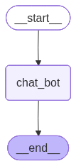

-   Workflow
    -   START -\> Chatbot -\> END
-   State
    -   Full users conversations i.e. question and responses both must
        be stored


```python
from typing import TypedDict, Annotated
from langgraph.graph import StateGraph, START, END
from langchain_groq import ChatGroq
from langchain_core.messages import HumanMessage, AIMessage
```

# Defining the state

-   The type of messages that we will be adding is AIMessage,
    HumanMessage, Sysystem message which are all derived from
    BaseMessage thus list\[BaseMessage\] is used
-   As we will need to append messages in the messages state attribute
    instead of using operator.add more optimized way of adding LLM based
    messages (AIMessage, HumanMessage, SystemMessage) is add_message
    which is inbuilt in langgraph
-   


```python
from langgraph.graph.message import add_messages
from langchain_core.messages import BaseMessage

class State(TypedDict):
    messages: Annotated[list[BaseMessage], add_messages]
```

# Defining the function


```python
def chat_bot(state: State):
    model = ChatGroq(model = "qwen/qwen3-32b")

    response = model.invoke(state["messages"])
    
    return {"messages": [response]}
    
```


```python
# Defining graph
graph = StateGraph(State)

# Adding Nodes
graph.add_node("chat_bot", chat_bot)

# Adding edges
graph.add_edge(START, "chat_bot")
graph.add_edge("chat_bot", END)

```

``` text
<langgraph.graph.state.StateGraph at 0x11113f390>
```


```python
# Building the workflow
workflow = graph.compile()
workflow

```




```python
initial_state = {
    "messages": [HumanMessage(content= "What is the capital of India?")]
}
workflow.invoke(initial_state)

```

``` text
{'messages': [HumanMessage(content='What is the capital of India?', additional_kwargs={}, response_metadata={}, id='ae54b11b-c8aa-4ad4-b10c-e43e3cdb9d42'),
  AIMessage(content='<think>\nOkay, so the user is asking, "What is the capital of India?" Let me think about how to approach this.\n\nFirst, I need to recall the correct answer. I remember that New Delhi is the capital of India. But wait, sometimes people confuse it with Delhi. Let me double-check. Yes, the capital is New Delhi, which is a part of the National Capital Territory of Delhi.\n\nI should also consider if there\'s any historical context. Before 1911, the capital was Calcutta (now Kolkata), but then it was moved to Delhi to shift the center of power towards the north. The construction of New Delhi started in the 1920s and it became the capital after India\'s independence in 1947. That\'s probably useful background information.\n\nThe user might not know the difference between Delhi and New Delhi. So explaining that New Delhi is a city within the larger Delhi region could be helpful. Also, mentioning that the National Capital Territory of Delhi is a Union Territory, not a state, might add clarity.\n\nAre there any common misconceptions? Maybe some people think it\'s Mumbai or another major city. It\'s good to reinforce that New Delhi is the correct answer. Also, confirming that it\'s the political and administrative center, while other cities have different roles.\n\nI should structure the answer clearly: state the capital, provide a brief historical note, explain the administrative context, and maybe mention some key landmarks like the Red Fort or India Gate to give a sense of place.\n\nWait, should I include the population or area? Probably not necessary unless the user asks for more details. Keep it concise but informative. Also, check for any recent changes, but I don\'t think there have been any in recent years. The capital has been New Delhi for a long time.\n\nSo, putting it all together: Start with the answer, add a sentence about the region it\'s located in, mention the historical shift, and note that it\'s the administrative center. That should cover the essentials without being too verbose.\n</think>\n\nThe capital of India is **New Delhi**. It is located within the **National Capital Territory (NCT) of Delhi**, which is a Union Territory of India and not part of any state. \n\n### Key Points:\n1. **Historical Context**: \n   - Before 1911, the British colonial capital was Kolkata (then Calcutta). In 1911, Delhi was chosen as the new capital of British India, and the construction of New Delhi began in the 1920s. It became the capital of independent India in 1947.\n   \n2. **Administrative Role**: \n   - New Delhi serves as the political and administrative center of India. It houses key government institutions, including the **President\'s Secretariat**, **Prime Minister\'s Office**, and **Parliament House**.\n\n3. **Geographical Context**: \n   - New Delhi is part of the larger **Delhi metropolitan area**, which also includes surrounding regions like Gurgaon, Noida, and Ghaziabad.\n\n4. **Landmarks**: \n   - Notable sites include the **Red Fort**, **India Gate**, **Lodhi Garden**, and **Chandni Chowk**, reflecting its historical and cultural significance.\n\nLet me know if you\'d like more details! 🏛️🇮🇳', additional_kwargs={}, response_metadata={'token_usage': {'completion_tokens': 693, 'prompt_tokens': 15, 'total_tokens': 708, 'completion_time': 1.540964794, 'completion_tokens_details': None, 'prompt_time': 0.000688858, 'prompt_tokens_details': None, 'queue_time': 0.281369342, 'total_time': 1.541653652}, 'model_name': 'qwen/qwen3-32b', 'system_fingerprint': 'fp_d58dbe76cd', 'service_tier': 'on_demand', 'finish_reason': 'stop', 'logprobs': None, 'model_provider': 'groq'}, id='lc_run--019cbe24-43a8-7d62-a6ca-afe25a23ed93-0', tool_calls=[], invalid_tool_calls=[], usage_metadata={'input_tokens': 15, 'output_tokens': 693, 'total_tokens': 708})]}
```

-   Now the basic structure of question and answer is done
-   Now we need to enable continuous chatting and responses to flow in
    until the user manually stops it. For which a loop must run


```python
while True:
    user_message = input("Type here")
    if user_message.strip().lower() in ["exit", "quit", "end", "bye"]:
        break
    else:
       response = workflow.invoke({"messages": HumanMessage(content=user_message)})
       print(f"User: {user_message}")
       print(f"Response: {response}")
```

``` text
User: Hi
Response: {'messages': [HumanMessage(content='Hi', additional_kwargs={}, response_metadata={}, id='6d397e9f-5efa-4e3d-ac5b-41db4feacbdc'), AIMessage(content='<think>\nOkay, the user just sent "Hi". That\'s pretty open-ended. I need to respond in a friendly and helpful way. Let me start by greeting them back and asking how I can assist. Maybe something like, "Hello! How can I assist you today?" That should encourage them to elaborate on what they need help with. I should keep it simple and welcoming.\n</think>\n\nHello! How can I assist you today?', additional_kwargs={}, response_metadata={'token_usage': {'completion_tokens': 89, 'prompt_tokens': 9, 'total_tokens': 98, 'completion_time': 0.170851939, 'completion_tokens_details': None, 'prompt_time': 0.000447902, 'prompt_tokens_details': None, 'queue_time': 0.045985346, 'total_time': 0.171299841}, 'model_name': 'qwen/qwen3-32b', 'system_fingerprint': 'fp_5cf921caa2', 'service_tier': 'on_demand', 'finish_reason': 'stop', 'logprobs': None, 'model_provider': 'groq'}, id='lc_run--019cbe26-2d11-78a2-9c4e-4204c088781e-0', tool_calls=[], invalid_tool_calls=[], usage_metadata={'input_tokens': 9, 'output_tokens': 89, 'total_tokens': 98})]}
User: How are you
Response: {'messages': [HumanMessage(content='How are you', additional_kwargs={}, response_metadata={}, id='64e9e38e-2b99-48c6-9a33-2fd9c5f75af9'), AIMessage(content="<think>\nLet me carefully consider how to respond to this simple yet meaningful question. The user is asking about my well-being, which shows a thoughtful and friendly approach to our interaction. I need to be transparent about my nature while maintaining a warm and engaging tone.\n\nThis question presents an opportunity to establish a connection while being honest about my AI nature. I should acknowledge their concern in a way that feels genuine, while also setting appropriate expectations about what I can share. My response should reflect appreciation for their interest while guiding the conversation towards how I can be helpful to them.\n\nI want to make sure my answer is both authentic and engaging. It's important to recognize that while I don't experience emotions in the human sense, I can still express enthusiasm for our conversation. The key is to balance honesty about my capabilities with a friendly, approachable demeanor.\n\nThis question also reminds me of the importance of being clear about my role while maintaining a natural conversation flow. I should focus on how I can best serve the user rather than what I can't feel or experience. This way, I keep the conversation productive and forward-moving.\n\nI also need to consider the user's potential unspoken needs - they might be testing my responsiveness, looking for reassurance about my reliability, or simply being politely inquisitive. My response should be flexible enough to address these different possibilities while staying true to who I am as an AI assistant.\n</think>\n\nHey there! I'm functioning just fine, thanks for asking! I always enjoy our chats, they make my circuits light up with excitement! 💡 How are you feeling today? I'd love to hear about your day and see how I can help you out. After all, that's what makes my time worthwhile! 🌟", additional_kwargs={}, response_metadata={'token_usage': {'completion_tokens': 352, 'prompt_tokens': 11, 'total_tokens': 363, 'completion_time': 1.015263329, 'completion_tokens_details': None, 'prompt_time': 0.000855835, 'prompt_tokens_details': None, 'queue_time': 0.161708695, 'total_time': 1.016119164}, 'model_name': 'qwen/qwen3-32b', 'system_fingerprint': 'fp_2bfcc54d36', 'service_tier': 'on_demand', 'finish_reason': 'stop', 'logprobs': None, 'model_provider': 'groq'}, id='lc_run--019cbe26-3b27-7d40-ba78-35ed05da1633-0', tool_calls=[], invalid_tool_calls=[], usage_metadata={'input_tokens': 11, 'output_tokens': 352, 'total_tokens': 363})]}
User: My name is John
Response: {'messages': [HumanMessage(content='My name is John', additional_kwargs={}, response_metadata={}, id='dc1aa95a-5521-4fdd-b41d-353024ca5e21'), AIMessage(content="<think>\nOkay, the user told me his name is John. I need to respond politely and start a conversation. First, I should acknowledge his name and ask how I can assist him. Maybe add an emoji to keep it friendly. Let me check previous interactions to see the tone. Since there's no history, a simple and welcoming message should work. Make sure to keep it open-ended so he feels comfortable to ask anything. Alright, let's go with that.\n</think>\n\nHello, John! Nice to meet you! How can I assist you today? 😊", additional_kwargs={}, response_metadata={'token_usage': {'completion_tokens': 115, 'prompt_tokens': 12, 'total_tokens': 127, 'completion_time': 0.251483579, 'completion_tokens_details': None, 'prompt_time': 0.000354344, 'prompt_tokens_details': None, 'queue_time': 0.157265686, 'total_time': 0.251837923}, 'model_name': 'qwen/qwen3-32b', 'system_fingerprint': 'fp_2bfcc54d36', 'service_tier': 'on_demand', 'finish_reason': 'stop', 'logprobs': None, 'model_provider': 'groq'}, id='lc_run--019cbe26-577d-72d2-866e-f0834f12f9b2-0', tool_calls=[], invalid_tool_calls=[], usage_metadata={'input_tokens': 12, 'output_tokens': 115, 'total_tokens': 127})]}
User: What is my name?
Response: {'messages': [HumanMessage(content='What is my name?', additional_kwargs={}, response_metadata={}, id='d855b735-b800-4b79-ad9a-688755f07378'), AIMessage(content='<think>\nOkay, the user is asking, "What is my name?" Hmm, I need to figure out how to respond. Let me think.\n\nFirst, I know that I don\'t have access to personal information about the user unless they provide it. So if they haven\'t told me their name yet, I can\'t know. But maybe they expect me to know, which I can\'t. I should clarify that.\n\nWait, the user might have mentioned their name earlier in the conversation. Let me check the history. Oh, but in this case, since this is the first message, there\'s no prior context. So I need to ask them to provide their name.\n\nI should make sure my response is polite and clear. Let me phrase it in a way that invites them to share their name without assuming anything. Maybe something like, "I don\'t have access to your name unless you provide it. Could you please share your name with me?"\n\nWait, is there a standard way to handle this? I think the key is to be transparent about my limitations. So I should explain that I can\'t know their name unless they tell me, and then ask if they want to provide it. That way, I\'m honest and helpful.\n\nI should avoid making up names or guessing, as that could be misleading. Also, not acknowledging their question properly might frustrate them. So the best approach is to ask for their name directly and politely.\n</think>\n\nI don’t have access to your name or personal information unless you choose to share it with me. Would you like to tell me your name? 😊', additional_kwargs={}, response_metadata={'token_usage': {'completion_tokens': 325, 'prompt_tokens': 13, 'total_tokens': 338, 'completion_time': 0.71035827, 'completion_tokens_details': None, 'prompt_time': 0.000509511, 'prompt_tokens_details': None, 'queue_time': 0.159950209, 'total_time': 0.710867781}, 'model_name': 'qwen/qwen3-32b', 'system_fingerprint': 'fp_2bfcc54d36', 'service_tier': 'on_demand', 'finish_reason': 'stop', 'logprobs': None, 'model_provider': 'groq'}, id='lc_run--019cbe26-6d1f-7b61-b7b3-1cc87a1930c5-0', tool_calls=[], invalid_tool_calls=[], usage_metadata={'input_tokens': 13, 'output_tokens': 325, 'total_tokens': 338})]}
```

-   When user types question1 and gets answer1 the workflow end, because
    the workflow is built such that it takes the question answers it and
    then ENDs it. So when user asks next question the state is reset as
    its starting the workflow again
-   Here it does not have context of previous values, i.e. memory is
    missing
-   When the workflow ends the state is no more stored in memory
-   To store the state we can either store it in the database or in
    memory (RAM). This is where the concept of persistant memory comes
    into play

# Adding memory to the chatbot

# Define a checkpointer

-   MemorySaver() is a simple in-memory checkpointer
-   It stores checkpoints in RAM while the program is running.


```python

from langgraph.checkpoint.memory import MemorySaver

checkpointer = MemorySaver()
```


```python

# Defining the graoh
graph = StateGraph(State)

# Adding Nodes
graph.add_node("chat_bot", chat_bot)

# Adding edges
graph.add_edge(START, "chat_bot")
graph.add_edge("chat_bot", END)

```


```python
# Worklfow creation
workflow = graph.compile(checkpointer =  checkpointer)

```

-   Here we are saying the workflow to persists the state state across
    runs
-   If the history of messages have to be maintained then threads must
    be used.
-   For an individual a thread is created
-   This has to be passed while invoking the graph


```python
thread_id = "1"

while True:
    user_message = input("Type here")
    if user_message.strip().lower() in ["exit", "quit", "end", "bye"]:
        break
    else:
        # Passing the thread details
        config = {
            "configurable":{
                "thread_id": thread_id
            }
        }
        response = workflow.invoke(
            {"messages": HumanMessage(content=user_message)}, 
            config = config
        )
        print(f"User: {user_message}")
        print(f"Response: {response}")
```

``` text
User: Hi
Response: {'messages': [HumanMessage(content='Hi', additional_kwargs={}, response_metadata={}, id='25479da2-2d0a-4048-93e1-7b7d7f48c2ac'), AIMessage(content='<think>\nOkay, the user said "Hi". That\'s pretty casual. I should respond in a friendly and welcoming way. Maybe ask how I can assist them today. Keep it open-ended so they feel comfortable asking anything. Let me make sure the tone is approachable.\n</think>\n\nHello! How can I assist you today? 😊', additional_kwargs={}, response_metadata={'token_usage': {'completion_tokens': 69, 'prompt_tokens': 9, 'total_tokens': 78, 'completion_time': 0.156251287, 'completion_tokens_details': None, 'prompt_time': 0.000189117, 'prompt_tokens_details': None, 'queue_time': 0.16015304, 'total_time': 0.156440404}, 'model_name': 'qwen/qwen3-32b', 'system_fingerprint': 'fp_2bfcc54d36', 'service_tier': 'on_demand', 'finish_reason': 'stop', 'logprobs': None, 'model_provider': 'groq'}, id='lc_run--019cbe3b-7ecc-7333-a7a9-98e4ff85d5eb-0', tool_calls=[], invalid_tool_calls=[], usage_metadata={'input_tokens': 9, 'output_tokens': 69, 'total_tokens': 78})]}
User: My name is John
Response: {'messages': [HumanMessage(content='Hi', additional_kwargs={}, response_metadata={}, id='25479da2-2d0a-4048-93e1-7b7d7f48c2ac'), AIMessage(content='<think>\nOkay, the user said "Hi". That\'s pretty casual. I should respond in a friendly and welcoming way. Maybe ask how I can assist them today. Keep it open-ended so they feel comfortable asking anything. Let me make sure the tone is approachable.\n</think>\n\nHello! How can I assist you today? 😊', additional_kwargs={}, response_metadata={'token_usage': {'completion_tokens': 69, 'prompt_tokens': 9, 'total_tokens': 78, 'completion_time': 0.156251287, 'completion_tokens_details': None, 'prompt_time': 0.000189117, 'prompt_tokens_details': None, 'queue_time': 0.16015304, 'total_time': 0.156440404}, 'model_name': 'qwen/qwen3-32b', 'system_fingerprint': 'fp_2bfcc54d36', 'service_tier': 'on_demand', 'finish_reason': 'stop', 'logprobs': None, 'model_provider': 'groq'}, id='lc_run--019cbe3b-7ecc-7333-a7a9-98e4ff85d5eb-0', tool_calls=[], invalid_tool_calls=[], usage_metadata={'input_tokens': 9, 'output_tokens': 69, 'total_tokens': 78}), HumanMessage(content='My name is John', additional_kwargs={}, response_metadata={}, id='3cc164bd-8b11-4497-bbf5-8ed402a3a88b'), AIMessage(content="<think>\nOkay, the user introduced themselves as John. I should acknowledge that and use their name to make the conversation more personal.\n\nThey might be looking for a friendly chat or have a specific question. Since the previous message was just a greeting, I should offer help in a welcoming way.\n\nMaybe ask how they're doing or invite them to share what's on their mind. Keep the tone positive and open-ended to encourage them to talk more.\n</think>\n\nNice to meet you, John! How are you doing today? 😊 Let me know if there's anything I can help with!", additional_kwargs={}, response_metadata={'token_usage': {'completion_tokens': 119, 'prompt_tokens': 34, 'total_tokens': 153, 'completion_time': 0.257137608, 'completion_tokens_details': None, 'prompt_time': 0.001313008, 'prompt_tokens_details': None, 'queue_time': 0.046950031, 'total_time': 0.258450616}, 'model_name': 'qwen/qwen3-32b', 'system_fingerprint': 'fp_5cf921caa2', 'service_tier': 'on_demand', 'finish_reason': 'stop', 'logprobs': None, 'model_provider': 'groq'}, id='lc_run--019cbe3b-9f5a-71e3-b8c4-89dc76f32923-0', tool_calls=[], invalid_tool_calls=[], usage_metadata={'input_tokens': 34, 'output_tokens': 119, 'total_tokens': 153})]}
User: What is my name?
Response: {'messages': [HumanMessage(content='Hi', additional_kwargs={}, response_metadata={}, id='25479da2-2d0a-4048-93e1-7b7d7f48c2ac'), AIMessage(content='<think>\nOkay, the user said "Hi". That\'s pretty casual. I should respond in a friendly and welcoming way. Maybe ask how I can assist them today. Keep it open-ended so they feel comfortable asking anything. Let me make sure the tone is approachable.\n</think>\n\nHello! How can I assist you today? 😊', additional_kwargs={}, response_metadata={'token_usage': {'completion_tokens': 69, 'prompt_tokens': 9, 'total_tokens': 78, 'completion_time': 0.156251287, 'completion_tokens_details': None, 'prompt_time': 0.000189117, 'prompt_tokens_details': None, 'queue_time': 0.16015304, 'total_time': 0.156440404}, 'model_name': 'qwen/qwen3-32b', 'system_fingerprint': 'fp_2bfcc54d36', 'service_tier': 'on_demand', 'finish_reason': 'stop', 'logprobs': None, 'model_provider': 'groq'}, id='lc_run--019cbe3b-7ecc-7333-a7a9-98e4ff85d5eb-0', tool_calls=[], invalid_tool_calls=[], usage_metadata={'input_tokens': 9, 'output_tokens': 69, 'total_tokens': 78}), HumanMessage(content='My name is John', additional_kwargs={}, response_metadata={}, id='3cc164bd-8b11-4497-bbf5-8ed402a3a88b'), AIMessage(content="<think>\nOkay, the user introduced themselves as John. I should acknowledge that and use their name to make the conversation more personal.\n\nThey might be looking for a friendly chat or have a specific question. Since the previous message was just a greeting, I should offer help in a welcoming way.\n\nMaybe ask how they're doing or invite them to share what's on their mind. Keep the tone positive and open-ended to encourage them to talk more.\n</think>\n\nNice to meet you, John! How are you doing today? 😊 Let me know if there's anything I can help with!", additional_kwargs={}, response_metadata={'token_usage': {'completion_tokens': 119, 'prompt_tokens': 34, 'total_tokens': 153, 'completion_time': 0.257137608, 'completion_tokens_details': None, 'prompt_time': 0.001313008, 'prompt_tokens_details': None, 'queue_time': 0.046950031, 'total_time': 0.258450616}, 'model_name': 'qwen/qwen3-32b', 'system_fingerprint': 'fp_5cf921caa2', 'service_tier': 'on_demand', 'finish_reason': 'stop', 'logprobs': None, 'model_provider': 'groq'}, id='lc_run--019cbe3b-9f5a-71e3-b8c4-89dc76f32923-0', tool_calls=[], invalid_tool_calls=[], usage_metadata={'input_tokens': 34, 'output_tokens': 119, 'total_tokens': 153}), HumanMessage(content='What is my name?', additional_kwargs={}, response_metadata={}, id='cbc6dbcc-5d99-4175-be35-5d32db2d8b19'), AIMessage(content='<think>\nOkay, the user asked, "What is my name?" after previously introducing himself as John. I need to confirm if he\'s testing my memory or if there\'s a misunderstanding. Let me check the conversation history.\n\nLooking back, John mentioned his name in the second message. The assistant acknowledged it and used "John" in the response. Now, the user is asking again. Maybe he\'s checking if I remember correctly. I should respond with his name and ask if there\'s something else he needs. Also, maybe add a friendly emoji to keep the tone positive. Let me make sure there\'s no confusion. Yes, the name is John. I\'ll state that clearly and offer further help.\n</think>\n\nYour name is **John**! 😊  \nIs there anything specific you\'d like to discuss or ask about?', additional_kwargs={}, response_metadata={'token_usage': {'completion_tokens': 168, 'prompt_tokens': 76, 'total_tokens': 244, 'completion_time': 0.388756746, 'completion_tokens_details': None, 'prompt_time': 0.00309596, 'prompt_tokens_details': None, 'queue_time': 0.046808079, 'total_time': 0.391852706}, 'model_name': 'qwen/qwen3-32b', 'system_fingerprint': 'fp_5cf921caa2', 'service_tier': 'on_demand', 'finish_reason': 'stop', 'logprobs': None, 'model_provider': 'groq'}, id='lc_run--019cbe3b-b311-7560-a425-ad5702d9ce4f-0', tool_calls=[], invalid_tool_calls=[], usage_metadata={'input_tokens': 76, 'output_tokens': 168, 'total_tokens': 244})]}
```

-   Now its able to retain its memory and have access to the previous
    questions and responses too
-   Working
    -   When user asks question1, the LLM responds with response1. Now
        the workflow ends
    -   Now this state will be stored in RAM because checkpointer is
        enabled
    -   When user asks question2, the state will be fetched from the
        memory and then LLM will have the information about question1,
        response1 and question2. Thus enabling access to the history and
        context of message exchanges
    -   Its appending the messages because the reducer used is add
        message

# Printing the intermediate states and the final state

-   config must be passed to retrive the state of the particular
    individual


```python
workflow.get_state(config = config)
```

``` text
StateSnapshot(values={'messages': [HumanMessage(content='Hi', additional_kwargs={}, response_metadata={}, id='25479da2-2d0a-4048-93e1-7b7d7f48c2ac'), AIMessage(content='<think>\nOkay, the user said "Hi". That\'s pretty casual. I should respond in a friendly and welcoming way. Maybe ask how I can assist them today. Keep it open-ended so they feel comfortable asking anything. Let me make sure the tone is approachable.\n</think>\n\nHello! How can I assist you today? 😊', additional_kwargs={}, response_metadata={'token_usage': {'completion_tokens': 69, 'prompt_tokens': 9, 'total_tokens': 78, 'completion_time': 0.156251287, 'completion_tokens_details': None, 'prompt_time': 0.000189117, 'prompt_tokens_details': None, 'queue_time': 0.16015304, 'total_time': 0.156440404}, 'model_name': 'qwen/qwen3-32b', 'system_fingerprint': 'fp_2bfcc54d36', 'service_tier': 'on_demand', 'finish_reason': 'stop', 'logprobs': None, 'model_provider': 'groq'}, id='lc_run--019cbe3b-7ecc-7333-a7a9-98e4ff85d5eb-0', tool_calls=[], invalid_tool_calls=[], usage_metadata={'input_tokens': 9, 'output_tokens': 69, 'total_tokens': 78}), HumanMessage(content='My name is John', additional_kwargs={}, response_metadata={}, id='3cc164bd-8b11-4497-bbf5-8ed402a3a88b'), AIMessage(content="<think>\nOkay, the user introduced themselves as John. I should acknowledge that and use their name to make the conversation more personal.\n\nThey might be looking for a friendly chat or have a specific question. Since the previous message was just a greeting, I should offer help in a welcoming way.\n\nMaybe ask how they're doing or invite them to share what's on their mind. Keep the tone positive and open-ended to encourage them to talk more.\n</think>\n\nNice to meet you, John! How are you doing today? 😊 Let me know if there's anything I can help with!", additional_kwargs={}, response_metadata={'token_usage': {'completion_tokens': 119, 'prompt_tokens': 34, 'total_tokens': 153, 'completion_time': 0.257137608, 'completion_tokens_details': None, 'prompt_time': 0.001313008, 'prompt_tokens_details': None, 'queue_time': 0.046950031, 'total_time': 0.258450616}, 'model_name': 'qwen/qwen3-32b', 'system_fingerprint': 'fp_5cf921caa2', 'service_tier': 'on_demand', 'finish_reason': 'stop', 'logprobs': None, 'model_provider': 'groq'}, id='lc_run--019cbe3b-9f5a-71e3-b8c4-89dc76f32923-0', tool_calls=[], invalid_tool_calls=[], usage_metadata={'input_tokens': 34, 'output_tokens': 119, 'total_tokens': 153}), HumanMessage(content='What is my name?', additional_kwargs={}, response_metadata={}, id='cbc6dbcc-5d99-4175-be35-5d32db2d8b19'), AIMessage(content='<think>\nOkay, the user asked, "What is my name?" after previously introducing himself as John. I need to confirm if he\'s testing my memory or if there\'s a misunderstanding. Let me check the conversation history.\n\nLooking back, John mentioned his name in the second message. The assistant acknowledged it and used "John" in the response. Now, the user is asking again. Maybe he\'s checking if I remember correctly. I should respond with his name and ask if there\'s something else he needs. Also, maybe add a friendly emoji to keep the tone positive. Let me make sure there\'s no confusion. Yes, the name is John. I\'ll state that clearly and offer further help.\n</think>\n\nYour name is **John**! 😊  \nIs there anything specific you\'d like to discuss or ask about?', additional_kwargs={}, response_metadata={'token_usage': {'completion_tokens': 168, 'prompt_tokens': 76, 'total_tokens': 244, 'completion_time': 0.388756746, 'completion_tokens_details': None, 'prompt_time': 0.00309596, 'prompt_tokens_details': None, 'queue_time': 0.046808079, 'total_time': 0.391852706}, 'model_name': 'qwen/qwen3-32b', 'system_fingerprint': 'fp_5cf921caa2', 'service_tier': 'on_demand', 'finish_reason': 'stop', 'logprobs': None, 'model_provider': 'groq'}, id='lc_run--019cbe3b-b311-7560-a425-ad5702d9ce4f-0', tool_calls=[], invalid_tool_calls=[], usage_metadata={'input_tokens': 76, 'output_tokens': 168, 'total_tokens': 244})]}, next=(), config={'configurable': {'thread_id': '1', 'checkpoint_ns': '', 'checkpoint_id': '1f118990-fd1c-6bfe-8007-9f50533cbf94'}}, metadata={'source': 'loop', 'step': 7, 'parents': {}}, created_at='2026-03-05T13:41:49.966619+00:00', parent_config={'configurable': {'thread_id': '1', 'checkpoint_ns': '', 'checkpoint_id': '1f118990-f81c-6730-8006-b5dbeb3118aa'}}, tasks=(), interrupts=())
```

-   `get_state()`: Returns the final state
-   `get_state_history()`: Returns all the intermediate results of the
    state
    -   The state value for the last value in the list will be empty
        because thats the 1st initial state where no state was
        maintained


```python
list(workflow.get_state_history(config=config))
```

``` text
[StateSnapshot(values={'messages': [HumanMessage(content='Hi', additional_kwargs={}, response_metadata={}, id='25479da2-2d0a-4048-93e1-7b7d7f48c2ac'), AIMessage(content='<think>\nOkay, the user said "Hi". That\'s pretty casual. I should respond in a friendly and welcoming way. Maybe ask how I can assist them today. Keep it open-ended so they feel comfortable asking anything. Let me make sure the tone is approachable.\n</think>\n\nHello! How can I assist you today? 😊', additional_kwargs={}, response_metadata={'token_usage': {'completion_tokens': 69, 'prompt_tokens': 9, 'total_tokens': 78, 'completion_time': 0.156251287, 'completion_tokens_details': None, 'prompt_time': 0.000189117, 'prompt_tokens_details': None, 'queue_time': 0.16015304, 'total_time': 0.156440404}, 'model_name': 'qwen/qwen3-32b', 'system_fingerprint': 'fp_2bfcc54d36', 'service_tier': 'on_demand', 'finish_reason': 'stop', 'logprobs': None, 'model_provider': 'groq'}, id='lc_run--019cbe3b-7ecc-7333-a7a9-98e4ff85d5eb-0', tool_calls=[], invalid_tool_calls=[], usage_metadata={'input_tokens': 9, 'output_tokens': 69, 'total_tokens': 78}), HumanMessage(content='My name is John', additional_kwargs={}, response_metadata={}, id='3cc164bd-8b11-4497-bbf5-8ed402a3a88b'), AIMessage(content="<think>\nOkay, the user introduced themselves as John. I should acknowledge that and use their name to make the conversation more personal.\n\nThey might be looking for a friendly chat or have a specific question. Since the previous message was just a greeting, I should offer help in a welcoming way.\n\nMaybe ask how they're doing or invite them to share what's on their mind. Keep the tone positive and open-ended to encourage them to talk more.\n</think>\n\nNice to meet you, John! How are you doing today? 😊 Let me know if there's anything I can help with!", additional_kwargs={}, response_metadata={'token_usage': {'completion_tokens': 119, 'prompt_tokens': 34, 'total_tokens': 153, 'completion_time': 0.257137608, 'completion_tokens_details': None, 'prompt_time': 0.001313008, 'prompt_tokens_details': None, 'queue_time': 0.046950031, 'total_time': 0.258450616}, 'model_name': 'qwen/qwen3-32b', 'system_fingerprint': 'fp_5cf921caa2', 'service_tier': 'on_demand', 'finish_reason': 'stop', 'logprobs': None, 'model_provider': 'groq'}, id='lc_run--019cbe3b-9f5a-71e3-b8c4-89dc76f32923-0', tool_calls=[], invalid_tool_calls=[], usage_metadata={'input_tokens': 34, 'output_tokens': 119, 'total_tokens': 153}), HumanMessage(content='What is my name?', additional_kwargs={}, response_metadata={}, id='cbc6dbcc-5d99-4175-be35-5d32db2d8b19'), AIMessage(content='<think>\nOkay, the user asked, "What is my name?" after previously introducing himself as John. I need to confirm if he\'s testing my memory or if there\'s a misunderstanding. Let me check the conversation history.\n\nLooking back, John mentioned his name in the second message. The assistant acknowledged it and used "John" in the response. Now, the user is asking again. Maybe he\'s checking if I remember correctly. I should respond with his name and ask if there\'s something else he needs. Also, maybe add a friendly emoji to keep the tone positive. Let me make sure there\'s no confusion. Yes, the name is John. I\'ll state that clearly and offer further help.\n</think>\n\nYour name is **John**! 😊  \nIs there anything specific you\'d like to discuss or ask about?', additional_kwargs={}, response_metadata={'token_usage': {'completion_tokens': 168, 'prompt_tokens': 76, 'total_tokens': 244, 'completion_time': 0.388756746, 'completion_tokens_details': None, 'prompt_time': 0.00309596, 'prompt_tokens_details': None, 'queue_time': 0.046808079, 'total_time': 0.391852706}, 'model_name': 'qwen/qwen3-32b', 'system_fingerprint': 'fp_5cf921caa2', 'service_tier': 'on_demand', 'finish_reason': 'stop', 'logprobs': None, 'model_provider': 'groq'}, id='lc_run--019cbe3b-b311-7560-a425-ad5702d9ce4f-0', tool_calls=[], invalid_tool_calls=[], usage_metadata={'input_tokens': 76, 'output_tokens': 168, 'total_tokens': 244})]}, next=(), config={'configurable': {'thread_id': '1', 'checkpoint_ns': '', 'checkpoint_id': '1f118990-fd1c-6bfe-8007-9f50533cbf94'}}, metadata={'source': 'loop', 'step': 7, 'parents': {}}, created_at='2026-03-05T13:41:49.966619+00:00', parent_config={'configurable': {'thread_id': '1', 'checkpoint_ns': '', 'checkpoint_id': '1f118990-f81c-6730-8006-b5dbeb3118aa'}}, tasks=(), interrupts=()),
 StateSnapshot(values={'messages': [HumanMessage(content='Hi', additional_kwargs={}, response_metadata={}, id='25479da2-2d0a-4048-93e1-7b7d7f48c2ac'), AIMessage(content='<think>\nOkay, the user said "Hi". That\'s pretty casual. I should respond in a friendly and welcoming way. Maybe ask how I can assist them today. Keep it open-ended so they feel comfortable asking anything. Let me make sure the tone is approachable.\n</think>\n\nHello! How can I assist you today? 😊', additional_kwargs={}, response_metadata={'token_usage': {'completion_tokens': 69, 'prompt_tokens': 9, 'total_tokens': 78, 'completion_time': 0.156251287, 'completion_tokens_details': None, 'prompt_time': 0.000189117, 'prompt_tokens_details': None, 'queue_time': 0.16015304, 'total_time': 0.156440404}, 'model_name': 'qwen/qwen3-32b', 'system_fingerprint': 'fp_2bfcc54d36', 'service_tier': 'on_demand', 'finish_reason': 'stop', 'logprobs': None, 'model_provider': 'groq'}, id='lc_run--019cbe3b-7ecc-7333-a7a9-98e4ff85d5eb-0', tool_calls=[], invalid_tool_calls=[], usage_metadata={'input_tokens': 9, 'output_tokens': 69, 'total_tokens': 78}), HumanMessage(content='My name is John', additional_kwargs={}, response_metadata={}, id='3cc164bd-8b11-4497-bbf5-8ed402a3a88b'), AIMessage(content="<think>\nOkay, the user introduced themselves as John. I should acknowledge that and use their name to make the conversation more personal.\n\nThey might be looking for a friendly chat or have a specific question. Since the previous message was just a greeting, I should offer help in a welcoming way.\n\nMaybe ask how they're doing or invite them to share what's on their mind. Keep the tone positive and open-ended to encourage them to talk more.\n</think>\n\nNice to meet you, John! How are you doing today? 😊 Let me know if there's anything I can help with!", additional_kwargs={}, response_metadata={'token_usage': {'completion_tokens': 119, 'prompt_tokens': 34, 'total_tokens': 153, 'completion_time': 0.257137608, 'completion_tokens_details': None, 'prompt_time': 0.001313008, 'prompt_tokens_details': None, 'queue_time': 0.046950031, 'total_time': 0.258450616}, 'model_name': 'qwen/qwen3-32b', 'system_fingerprint': 'fp_5cf921caa2', 'service_tier': 'on_demand', 'finish_reason': 'stop', 'logprobs': None, 'model_provider': 'groq'}, id='lc_run--019cbe3b-9f5a-71e3-b8c4-89dc76f32923-0', tool_calls=[], invalid_tool_calls=[], usage_metadata={'input_tokens': 34, 'output_tokens': 119, 'total_tokens': 153}), HumanMessage(content='What is my name?', additional_kwargs={}, response_metadata={}, id='cbc6dbcc-5d99-4175-be35-5d32db2d8b19')]}, next=('chat_bot',), config={'configurable': {'thread_id': '1', 'checkpoint_ns': '', 'checkpoint_id': '1f118990-f81c-6730-8006-b5dbeb3118aa'}}, metadata={'source': 'loop', 'step': 6, 'parents': {}}, created_at='2026-03-05T13:41:49.442224+00:00', parent_config={'configurable': {'thread_id': '1', 'checkpoint_ns': '', 'checkpoint_id': '1f118990-f81a-6bce-8005-a350ae28c800'}}, tasks=(PregelTask(id='4079dafd-50f4-3c02-99ee-3a9792b57594', name='chat_bot', path=('__pregel_pull', 'chat_bot'), error=None, interrupts=(), state=None, result={'messages': [AIMessage(content='<think>\nOkay, the user asked, "What is my name?" after previously introducing himself as John. I need to confirm if he\'s testing my memory or if there\'s a misunderstanding. Let me check the conversation history.\n\nLooking back, John mentioned his name in the second message. The assistant acknowledged it and used "John" in the response. Now, the user is asking again. Maybe he\'s checking if I remember correctly. I should respond with his name and ask if there\'s something else he needs. Also, maybe add a friendly emoji to keep the tone positive. Let me make sure there\'s no confusion. Yes, the name is John. I\'ll state that clearly and offer further help.\n</think>\n\nYour name is **John**! 😊  \nIs there anything specific you\'d like to discuss or ask about?', additional_kwargs={}, response_metadata={'token_usage': {'completion_tokens': 168, 'prompt_tokens': 76, 'total_tokens': 244, 'completion_time': 0.388756746, 'completion_tokens_details': None, 'prompt_time': 0.00309596, 'prompt_tokens_details': None, 'queue_time': 0.046808079, 'total_time': 0.391852706}, 'model_name': 'qwen/qwen3-32b', 'system_fingerprint': 'fp_5cf921caa2', 'service_tier': 'on_demand', 'finish_reason': 'stop', 'logprobs': None, 'model_provider': 'groq'}, id='lc_run--019cbe3b-b311-7560-a425-ad5702d9ce4f-0', tool_calls=[], invalid_tool_calls=[], usage_metadata={'input_tokens': 76, 'output_tokens': 168, 'total_tokens': 244})]}),), interrupts=()),
 StateSnapshot(values={'messages': [HumanMessage(content='Hi', additional_kwargs={}, response_metadata={}, id='25479da2-2d0a-4048-93e1-7b7d7f48c2ac'), AIMessage(content='<think>\nOkay, the user said "Hi". That\'s pretty casual. I should respond in a friendly and welcoming way. Maybe ask how I can assist them today. Keep it open-ended so they feel comfortable asking anything. Let me make sure the tone is approachable.\n</think>\n\nHello! How can I assist you today? 😊', additional_kwargs={}, response_metadata={'token_usage': {'completion_tokens': 69, 'prompt_tokens': 9, 'total_tokens': 78, 'completion_time': 0.156251287, 'completion_tokens_details': None, 'prompt_time': 0.000189117, 'prompt_tokens_details': None, 'queue_time': 0.16015304, 'total_time': 0.156440404}, 'model_name': 'qwen/qwen3-32b', 'system_fingerprint': 'fp_2bfcc54d36', 'service_tier': 'on_demand', 'finish_reason': 'stop', 'logprobs': None, 'model_provider': 'groq'}, id='lc_run--019cbe3b-7ecc-7333-a7a9-98e4ff85d5eb-0', tool_calls=[], invalid_tool_calls=[], usage_metadata={'input_tokens': 9, 'output_tokens': 69, 'total_tokens': 78}), HumanMessage(content='My name is John', additional_kwargs={}, response_metadata={}, id='3cc164bd-8b11-4497-bbf5-8ed402a3a88b'), AIMessage(content="<think>\nOkay, the user introduced themselves as John. I should acknowledge that and use their name to make the conversation more personal.\n\nThey might be looking for a friendly chat or have a specific question. Since the previous message was just a greeting, I should offer help in a welcoming way.\n\nMaybe ask how they're doing or invite them to share what's on their mind. Keep the tone positive and open-ended to encourage them to talk more.\n</think>\n\nNice to meet you, John! How are you doing today? 😊 Let me know if there's anything I can help with!", additional_kwargs={}, response_metadata={'token_usage': {'completion_tokens': 119, 'prompt_tokens': 34, 'total_tokens': 153, 'completion_time': 0.257137608, 'completion_tokens_details': None, 'prompt_time': 0.001313008, 'prompt_tokens_details': None, 'queue_time': 0.046950031, 'total_time': 0.258450616}, 'model_name': 'qwen/qwen3-32b', 'system_fingerprint': 'fp_5cf921caa2', 'service_tier': 'on_demand', 'finish_reason': 'stop', 'logprobs': None, 'model_provider': 'groq'}, id='lc_run--019cbe3b-9f5a-71e3-b8c4-89dc76f32923-0', tool_calls=[], invalid_tool_calls=[], usage_metadata={'input_tokens': 34, 'output_tokens': 119, 'total_tokens': 153})]}, next=('__start__',), config={'configurable': {'thread_id': '1', 'checkpoint_ns': '', 'checkpoint_id': '1f118990-f81a-6bce-8005-a350ae28c800'}}, metadata={'source': 'input', 'step': 5, 'parents': {}}, created_at='2026-03-05T13:41:49.441514+00:00', parent_config={'configurable': {'thread_id': '1', 'checkpoint_ns': '', 'checkpoint_id': '1f118990-cbcc-6054-8004-81ba915e0e27'}}, tasks=(PregelTask(id='b312a2ac-6793-46ea-bf86-14b1575fba4b', name='__start__', path=('__pregel_pull', '__start__'), error=None, interrupts=(), state=None, result={'messages': HumanMessage(content='What is my name?', additional_kwargs={}, response_metadata={})}),), interrupts=()),
 StateSnapshot(values={'messages': [HumanMessage(content='Hi', additional_kwargs={}, response_metadata={}, id='25479da2-2d0a-4048-93e1-7b7d7f48c2ac'), AIMessage(content='<think>\nOkay, the user said "Hi". That\'s pretty casual. I should respond in a friendly and welcoming way. Maybe ask how I can assist them today. Keep it open-ended so they feel comfortable asking anything. Let me make sure the tone is approachable.\n</think>\n\nHello! How can I assist you today? 😊', additional_kwargs={}, response_metadata={'token_usage': {'completion_tokens': 69, 'prompt_tokens': 9, 'total_tokens': 78, 'completion_time': 0.156251287, 'completion_tokens_details': None, 'prompt_time': 0.000189117, 'prompt_tokens_details': None, 'queue_time': 0.16015304, 'total_time': 0.156440404}, 'model_name': 'qwen/qwen3-32b', 'system_fingerprint': 'fp_2bfcc54d36', 'service_tier': 'on_demand', 'finish_reason': 'stop', 'logprobs': None, 'model_provider': 'groq'}, id='lc_run--019cbe3b-7ecc-7333-a7a9-98e4ff85d5eb-0', tool_calls=[], invalid_tool_calls=[], usage_metadata={'input_tokens': 9, 'output_tokens': 69, 'total_tokens': 78}), HumanMessage(content='My name is John', additional_kwargs={}, response_metadata={}, id='3cc164bd-8b11-4497-bbf5-8ed402a3a88b'), AIMessage(content="<think>\nOkay, the user introduced themselves as John. I should acknowledge that and use their name to make the conversation more personal.\n\nThey might be looking for a friendly chat or have a specific question. Since the previous message was just a greeting, I should offer help in a welcoming way.\n\nMaybe ask how they're doing or invite them to share what's on their mind. Keep the tone positive and open-ended to encourage them to talk more.\n</think>\n\nNice to meet you, John! How are you doing today? 😊 Let me know if there's anything I can help with!", additional_kwargs={}, response_metadata={'token_usage': {'completion_tokens': 119, 'prompt_tokens': 34, 'total_tokens': 153, 'completion_time': 0.257137608, 'completion_tokens_details': None, 'prompt_time': 0.001313008, 'prompt_tokens_details': None, 'queue_time': 0.046950031, 'total_time': 0.258450616}, 'model_name': 'qwen/qwen3-32b', 'system_fingerprint': 'fp_5cf921caa2', 'service_tier': 'on_demand', 'finish_reason': 'stop', 'logprobs': None, 'model_provider': 'groq'}, id='lc_run--019cbe3b-9f5a-71e3-b8c4-89dc76f32923-0', tool_calls=[], invalid_tool_calls=[], usage_metadata={'input_tokens': 34, 'output_tokens': 119, 'total_tokens': 153})]}, next=(), config={'configurable': {'thread_id': '1', 'checkpoint_ns': '', 'checkpoint_id': '1f118990-cbcc-6054-8004-81ba915e0e27'}}, metadata={'source': 'loop', 'step': 4, 'parents': {}}, created_at='2026-03-05T13:41:44.795529+00:00', parent_config={'configurable': {'thread_id': '1', 'checkpoint_ns': '', 'checkpoint_id': '1f118990-c7fb-6fd8-8003-04ac5e31f836'}}, tasks=(), interrupts=()),
 StateSnapshot(values={'messages': [HumanMessage(content='Hi', additional_kwargs={}, response_metadata={}, id='25479da2-2d0a-4048-93e1-7b7d7f48c2ac'), AIMessage(content='<think>\nOkay, the user said "Hi". That\'s pretty casual. I should respond in a friendly and welcoming way. Maybe ask how I can assist them today. Keep it open-ended so they feel comfortable asking anything. Let me make sure the tone is approachable.\n</think>\n\nHello! How can I assist you today? 😊', additional_kwargs={}, response_metadata={'token_usage': {'completion_tokens': 69, 'prompt_tokens': 9, 'total_tokens': 78, 'completion_time': 0.156251287, 'completion_tokens_details': None, 'prompt_time': 0.000189117, 'prompt_tokens_details': None, 'queue_time': 0.16015304, 'total_time': 0.156440404}, 'model_name': 'qwen/qwen3-32b', 'system_fingerprint': 'fp_2bfcc54d36', 'service_tier': 'on_demand', 'finish_reason': 'stop', 'logprobs': None, 'model_provider': 'groq'}, id='lc_run--019cbe3b-7ecc-7333-a7a9-98e4ff85d5eb-0', tool_calls=[], invalid_tool_calls=[], usage_metadata={'input_tokens': 9, 'output_tokens': 69, 'total_tokens': 78}), HumanMessage(content='My name is John', additional_kwargs={}, response_metadata={}, id='3cc164bd-8b11-4497-bbf5-8ed402a3a88b')]}, next=('chat_bot',), config={'configurable': {'thread_id': '1', 'checkpoint_ns': '', 'checkpoint_id': '1f118990-c7fb-6fd8-8003-04ac5e31f836'}}, metadata={'source': 'loop', 'step': 3, 'parents': {}}, created_at='2026-03-05T13:41:44.395763+00:00', parent_config={'configurable': {'thread_id': '1', 'checkpoint_ns': '', 'checkpoint_id': '1f118990-c7fa-63ea-8002-bae8ba81671f'}}, tasks=(PregelTask(id='c598aea7-681b-d540-543b-93b0432b47ba', name='chat_bot', path=('__pregel_pull', 'chat_bot'), error=None, interrupts=(), state=None, result={'messages': [AIMessage(content="<think>\nOkay, the user introduced themselves as John. I should acknowledge that and use their name to make the conversation more personal.\n\nThey might be looking for a friendly chat or have a specific question. Since the previous message was just a greeting, I should offer help in a welcoming way.\n\nMaybe ask how they're doing or invite them to share what's on their mind. Keep the tone positive and open-ended to encourage them to talk more.\n</think>\n\nNice to meet you, John! How are you doing today? 😊 Let me know if there's anything I can help with!", additional_kwargs={}, response_metadata={'token_usage': {'completion_tokens': 119, 'prompt_tokens': 34, 'total_tokens': 153, 'completion_time': 0.257137608, 'completion_tokens_details': None, 'prompt_time': 0.001313008, 'prompt_tokens_details': None, 'queue_time': 0.046950031, 'total_time': 0.258450616}, 'model_name': 'qwen/qwen3-32b', 'system_fingerprint': 'fp_5cf921caa2', 'service_tier': 'on_demand', 'finish_reason': 'stop', 'logprobs': None, 'model_provider': 'groq'}, id='lc_run--019cbe3b-9f5a-71e3-b8c4-89dc76f32923-0', tool_calls=[], invalid_tool_calls=[], usage_metadata={'input_tokens': 34, 'output_tokens': 119, 'total_tokens': 153})]}),), interrupts=()),
 StateSnapshot(values={'messages': [HumanMessage(content='Hi', additional_kwargs={}, response_metadata={}, id='25479da2-2d0a-4048-93e1-7b7d7f48c2ac'), AIMessage(content='<think>\nOkay, the user said "Hi". That\'s pretty casual. I should respond in a friendly and welcoming way. Maybe ask how I can assist them today. Keep it open-ended so they feel comfortable asking anything. Let me make sure the tone is approachable.\n</think>\n\nHello! How can I assist you today? 😊', additional_kwargs={}, response_metadata={'token_usage': {'completion_tokens': 69, 'prompt_tokens': 9, 'total_tokens': 78, 'completion_time': 0.156251287, 'completion_tokens_details': None, 'prompt_time': 0.000189117, 'prompt_tokens_details': None, 'queue_time': 0.16015304, 'total_time': 0.156440404}, 'model_name': 'qwen/qwen3-32b', 'system_fingerprint': 'fp_2bfcc54d36', 'service_tier': 'on_demand', 'finish_reason': 'stop', 'logprobs': None, 'model_provider': 'groq'}, id='lc_run--019cbe3b-7ecc-7333-a7a9-98e4ff85d5eb-0', tool_calls=[], invalid_tool_calls=[], usage_metadata={'input_tokens': 9, 'output_tokens': 69, 'total_tokens': 78})]}, next=('__start__',), config={'configurable': {'thread_id': '1', 'checkpoint_ns': '', 'checkpoint_id': '1f118990-c7fa-63ea-8002-bae8ba81671f'}}, metadata={'source': 'input', 'step': 2, 'parents': {}}, created_at='2026-03-05T13:41:44.395038+00:00', parent_config={'configurable': {'thread_id': '1', 'checkpoint_ns': '', 'checkpoint_id': '1f118990-7c63-6422-8001-7a26e89dba5a'}}, tasks=(PregelTask(id='604e0b0a-d023-07ab-6b06-57a6c2c6becf', name='__start__', path=('__pregel_pull', '__start__'), error=None, interrupts=(), state=None, result={'messages': HumanMessage(content='My name is John', additional_kwargs={}, response_metadata={})}),), interrupts=()),
 StateSnapshot(values={'messages': [HumanMessage(content='Hi', additional_kwargs={}, response_metadata={}, id='25479da2-2d0a-4048-93e1-7b7d7f48c2ac'), AIMessage(content='<think>\nOkay, the user said "Hi". That\'s pretty casual. I should respond in a friendly and welcoming way. Maybe ask how I can assist them today. Keep it open-ended so they feel comfortable asking anything. Let me make sure the tone is approachable.\n</think>\n\nHello! How can I assist you today? 😊', additional_kwargs={}, response_metadata={'token_usage': {'completion_tokens': 69, 'prompt_tokens': 9, 'total_tokens': 78, 'completion_time': 0.156251287, 'completion_tokens_details': None, 'prompt_time': 0.000189117, 'prompt_tokens_details': None, 'queue_time': 0.16015304, 'total_time': 0.156440404}, 'model_name': 'qwen/qwen3-32b', 'system_fingerprint': 'fp_2bfcc54d36', 'service_tier': 'on_demand', 'finish_reason': 'stop', 'logprobs': None, 'model_provider': 'groq'}, id='lc_run--019cbe3b-7ecc-7333-a7a9-98e4ff85d5eb-0', tool_calls=[], invalid_tool_calls=[], usage_metadata={'input_tokens': 9, 'output_tokens': 69, 'total_tokens': 78})]}, next=(), config={'configurable': {'thread_id': '1', 'checkpoint_ns': '', 'checkpoint_id': '1f118990-7c63-6422-8001-7a26e89dba5a'}}, metadata={'source': 'loop', 'step': 1, 'parents': {}}, created_at='2026-03-05T13:41:36.468866+00:00', parent_config={'configurable': {'thread_id': '1', 'checkpoint_ns': '', 'checkpoint_id': '1f118990-7882-6be6-8000-44584ff19739'}}, tasks=(), interrupts=()),
 StateSnapshot(values={'messages': [HumanMessage(content='Hi', additional_kwargs={}, response_metadata={}, id='25479da2-2d0a-4048-93e1-7b7d7f48c2ac')]}, next=('chat_bot',), config={'configurable': {'thread_id': '1', 'checkpoint_ns': '', 'checkpoint_id': '1f118990-7882-6be6-8000-44584ff19739'}}, metadata={'source': 'loop', 'step': 0, 'parents': {}}, created_at='2026-03-05T13:41:36.062348+00:00', parent_config={'configurable': {'thread_id': '1', 'checkpoint_ns': '', 'checkpoint_id': '1f118990-7880-6832-bfff-2227b55f3b22'}}, tasks=(PregelTask(id='c592b2a8-c07e-41c3-cd6d-ed3b77accd71', name='chat_bot', path=('__pregel_pull', 'chat_bot'), error=None, interrupts=(), state=None, result={'messages': [AIMessage(content='<think>\nOkay, the user said "Hi". That\'s pretty casual. I should respond in a friendly and welcoming way. Maybe ask how I can assist them today. Keep it open-ended so they feel comfortable asking anything. Let me make sure the tone is approachable.\n</think>\n\nHello! How can I assist you today? 😊', additional_kwargs={}, response_metadata={'token_usage': {'completion_tokens': 69, 'prompt_tokens': 9, 'total_tokens': 78, 'completion_time': 0.156251287, 'completion_tokens_details': None, 'prompt_time': 0.000189117, 'prompt_tokens_details': None, 'queue_time': 0.16015304, 'total_time': 0.156440404}, 'model_name': 'qwen/qwen3-32b', 'system_fingerprint': 'fp_2bfcc54d36', 'service_tier': 'on_demand', 'finish_reason': 'stop', 'logprobs': None, 'model_provider': 'groq'}, id='lc_run--019cbe3b-7ecc-7333-a7a9-98e4ff85d5eb-0', tool_calls=[], invalid_tool_calls=[], usage_metadata={'input_tokens': 9, 'output_tokens': 69, 'total_tokens': 78})]}),), interrupts=()),
 StateSnapshot(values={'messages': []}, next=('__start__',), config={'configurable': {'thread_id': '1', 'checkpoint_ns': '', 'checkpoint_id': '1f118990-7880-6832-bfff-2227b55f3b22'}}, metadata={'source': 'input', 'step': -1, 'parents': {}}, created_at='2026-03-05T13:41:36.061437+00:00', parent_config=None, tasks=(PregelTask(id='7c12d71d-b17c-433a-45fb-05f229376c2b', name='__start__', path=('__pregel_pull', '__start__'), error=None, interrupts=(), state=None, result={'messages': HumanMessage(content='Hi', additional_kwargs={}, response_metadata={})}),), interrupts=())]
```
