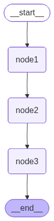

-   Workflow
    -   START -\> Node1 -\> Node2 -\> Node3 -\> END
-   Configure node2 to pause for 30 seconds, allowing us to manually
    interrupt the workflow at that stage and then resume execution from
    that point onward. This is to test how LangGraph supports fault
    tollerance


```python
from langgraph.graph import StateGraph, START, END
from typing import TypedDict
from langgraph.checkpoint.memory import MemorySaver

```


```python
class State(TypedDict):
    input: str
    node1: str
    node2: str
    node3: str
```


```python
import time

def node1(state: State)-> State:
    print("Node1 done")
    return {
        "node1": "done",
    }

def node2(state: State)->State:
    print("Node2 done")
    time.sleep(30)
    return {
        "node2": "done"
    }

def node3(state: State)->State:
    print("Node3 done")
    return {
        "node3": "done"
    }
```


```python
graph = StateGraph(State)

# Adding Nodes
graph.add_node("node1", node1)
graph.add_node("node2", node2)
graph.add_node("node3", node3)

# Adding edges
graph.add_edge(START, "node1")
graph.add_edge("node1", "node2")
graph.add_edge("node2", "node3")
graph.add_edge("node3", END)

# Defining checkpointer
checkpointer = MemorySaver()

# Workflow
workflow = graph.compile(checkpointer = checkpointer)
workflow
```




```python
# Defining the thread_id
thread_id = 1
config = {
            "configurable":{
                "thread_id": thread_id
            }
        }

initial_state = {"input": "Start"}
workflow.invoke(initial_state,config=config)
```

``` text
Node1 done
Node2 done
```

``` text
KeyboardInterrupt: 
---------------------------------------------------------------------------
KeyboardInterrupt                         Traceback (most recent call last)
Cell In[5], line 10
      3 config = {
      4             "configurable":{
      5                 "thread_id": thread_id
      6             }
      7         }
      9 initial_state = {"input": "Start"}
---> 10 workflow.invoke(initial_state,config=config)

File ~/Documents/my_github/Notes/.venv_langgraph/lib/python3.13/site-packages/langgraph/pregel/main.py:3094, in Pregel.invoke(self, input, config, context, stream_mode, print_mode, output_keys, interrupt_before, interrupt_after, durability, **kwargs)
   3091 chunks: list[dict[str, Any] | Any] = []
   3092 interrupts: list[Interrupt] = []
-> 3094 for chunk in self.stream(
   3095     input,
   3096     config,
   3097     context=context,
   3098     stream_mode=["updates", "values"]
   3099     if stream_mode == "values"
   3100     else stream_mode,
   3101     print_mode=print_mode,
   3102     output_keys=output_keys,
   3103     interrupt_before=interrupt_before,
   3104     interrupt_after=interrupt_after,
   3105     durability=durability,
   3106     **kwargs,
   3107 ):
   3108     if stream_mode == "values":
   3109         if len(chunk) == 2:

File ~/Documents/my_github/Notes/.venv_langgraph/lib/python3.13/site-packages/langgraph/pregel/main.py:2669, in Pregel.stream(self, input, config, context, stream_mode, print_mode, output_keys, interrupt_before, interrupt_after, durability, subgraphs, debug, **kwargs)
   2667 for task in loop.match_cached_writes():
   2668     loop.output_writes(task.id, task.writes, cached=True)
-> 2669 for _ in runner.tick(
   2670     [t for t in loop.tasks.values() if not t.writes],
   2671     timeout=self.step_timeout,
   2672     get_waiter=get_waiter,
   2673     schedule_task=loop.accept_push,
   2674 ):
   2675     # emit output
   2676     yield from _output(
   2677         stream_mode, print_mode, subgraphs, stream.get, queue.Empty
   2678     )
   2679 loop.after_tick()

File ~/Documents/my_github/Notes/.venv_langgraph/lib/python3.13/site-packages/langgraph/pregel/_runner.py:167, in PregelRunner.tick(self, tasks, reraise, timeout, retry_policy, get_waiter, schedule_task)
    165 t = tasks[0]
    166 try:
--> 167     run_with_retry(
    168         t,
    169         retry_policy,
    170         configurable={
    171             CONFIG_KEY_CALL: partial(
    172                 _call,
    173                 weakref.ref(t),
    174                 retry_policy=retry_policy,
    175                 futures=weakref.ref(futures),
    176                 schedule_task=schedule_task,
    177                 submit=self.submit,
    178             ),
    179         },
    180     )
    181     self.commit(t, None)
    182 except Exception as exc:

File ~/Documents/my_github/Notes/.venv_langgraph/lib/python3.13/site-packages/langgraph/pregel/_retry.py:71, in run_with_retry(task, retry_policy, configurable)
     69     task.writes.clear()
     70     # run the task
---> 71     return task.proc.invoke(task.input, config)
     72 except ParentCommand as exc:
     73     ns: str = config[CONF][CONFIG_KEY_CHECKPOINT_NS]

File ~/Documents/my_github/Notes/.venv_langgraph/lib/python3.13/site-packages/langgraph/_internal/_runnable.py:656, in RunnableSeq.invoke(self, input, config, **kwargs)
    654     # run in context
    655     with set_config_context(config, run) as context:
--> 656         input = context.run(step.invoke, input, config, **kwargs)
    657 else:
    658     input = step.invoke(input, config)

File ~/Documents/my_github/Notes/.venv_langgraph/lib/python3.13/site-packages/langgraph/_internal/_runnable.py:400, in RunnableCallable.invoke(self, input, config, **kwargs)
    398         run_manager.on_chain_end(ret)
    399 else:
--> 400     ret = self.func(*args, **kwargs)
    401 if self.recurse and isinstance(ret, Runnable):
    402     return ret.invoke(input, config)

Cell In[3], line 11, in node2(state)
      9 def node2(state: State)->State:
     10     print("Node2 done")
---> 11     time.sleep(30)
     12     return {
     13         "node2": "done"
     14     }

KeyboardInterrupt: 
```

-   Now I have interupted the workflow while the node2 was being
    executed
-   This is to test fault tollerance


```python
workflow.get_state(config=config)
```

``` text
StateSnapshot(values={'input': 'Start', 'node1': 'done'}, next=('node2',), config={'configurable': {'thread_id': '1', 'checkpoint_ns': '', 'checkpoint_id': '1f118ac5-3939-6c1a-8001-0a8f8f022ed0'}}, metadata={'source': 'loop', 'step': 1, 'parents': {}}, created_at='2026-03-05T15:59:44.082018+00:00', parent_config={'configurable': {'thread_id': '1', 'checkpoint_ns': '', 'checkpoint_id': '1f118ac5-3938-623e-8000-ed5ec4c28d56'}}, tasks=(PregelTask(id='99fee93c-6cc3-5d4f-3264-67f511dcc7ab', name='node2', path=('__pregel_pull', 'node2'), error=None, interrupts=(), state=None, result=None),), interrupts=())
```

-   It shows that the next node to be executed is node2


```python
list(workflow.get_state_history(config=config))
```

``` text
[StateSnapshot(values={'input': 'Start', 'node1': 'done'}, next=('node2',), config={'configurable': {'thread_id': '1', 'checkpoint_ns': '', 'checkpoint_id': '1f118ac5-3939-6c1a-8001-0a8f8f022ed0'}}, metadata={'source': 'loop', 'step': 1, 'parents': {}}, created_at='2026-03-05T15:59:44.082018+00:00', parent_config={'configurable': {'thread_id': '1', 'checkpoint_ns': '', 'checkpoint_id': '1f118ac5-3938-623e-8000-ed5ec4c28d56'}}, tasks=(PregelTask(id='99fee93c-6cc3-5d4f-3264-67f511dcc7ab', name='node2', path=('__pregel_pull', 'node2'), error=None, interrupts=(), state=None, result=None),), interrupts=()),
 StateSnapshot(values={'input': 'Start'}, next=('node1',), config={'configurable': {'thread_id': '1', 'checkpoint_ns': '', 'checkpoint_id': '1f118ac5-3938-623e-8000-ed5ec4c28d56'}}, metadata={'source': 'loop', 'step': 0, 'parents': {}}, created_at='2026-03-05T15:59:44.081354+00:00', parent_config={'configurable': {'thread_id': '1', 'checkpoint_ns': '', 'checkpoint_id': '1f118ac5-3936-652e-bfff-8c20d70338cf'}}, tasks=(PregelTask(id='46f012e8-459f-2a4b-ca6f-e0a43b9158d6', name='node1', path=('__pregel_pull', 'node1'), error=None, interrupts=(), state=None, result={'node1': 'done'}),), interrupts=()),
 StateSnapshot(values={}, next=('__start__',), config={'configurable': {'thread_id': '1', 'checkpoint_ns': '', 'checkpoint_id': '1f118ac5-3936-652e-bfff-8c20d70338cf'}}, metadata={'source': 'input', 'step': -1, 'parents': {}}, created_at='2026-03-05T15:59:44.080610+00:00', parent_config=None, tasks=(PregelTask(id='2aeb98eb-d82c-69d1-e7e0-b34ed5ea7c3f', name='__start__', path=('__pregel_pull', '__start__'), error=None, interrupts=(), state=None, result={'input': 'Start'}),), interrupts=())]
```

-   It has the state stored till node1
-   To resume from Node2, or from where it crashed just dont pass
    initial_state instead pass None in the invoke function


```python
workflow.invoke(None, config=config)
```

``` text
Node2 done
Node3 done
```

``` text
{'input': 'Start', 'node1': 'done', 'node2': 'done', 'node3': 'done'}
```

-   Now we can see that the execution is starting from Node2 and not
    from Node1

# Running from a particular checkpoint

-   Get the checkpoint_id from where you want to begin the execution by
    running `get_state_history()`
-   Then run `workflow.invoke()` by passing checkpoint_id in the config
    and None as the initial state


```python
list(workflow.get_state_history(config=config))
```

``` text
[StateSnapshot(values={'input': 'Start', 'node1': 'done', 'node2': 'done', 'node3': 'done'}, next=(), config={'configurable': {'thread_id': '1', 'checkpoint_ns': '', 'checkpoint_id': '1f118aca-d975-6116-8003-d682ec562583'}}, metadata={'source': 'loop', 'step': 3, 'parents': {}}, created_at='2026-03-05T16:02:15.101254+00:00', parent_config={'configurable': {'thread_id': '1', 'checkpoint_ns': '', 'checkpoint_id': '1f118aca-d973-6b7c-8002-97c807cdea4c'}}, tasks=(), interrupts=()),
 StateSnapshot(values={'input': 'Start', 'node1': 'done', 'node2': 'done'}, next=('node3',), config={'configurable': {'thread_id': '1', 'checkpoint_ns': '', 'checkpoint_id': '1f118aca-d973-6b7c-8002-97c807cdea4c'}}, metadata={'source': 'loop', 'step': 2, 'parents': {}}, created_at='2026-03-05T16:02:15.100686+00:00', parent_config={'configurable': {'thread_id': '1', 'checkpoint_ns': '', 'checkpoint_id': '1f118ac5-3939-6c1a-8001-0a8f8f022ed0'}}, tasks=(PregelTask(id='df3d5b0e-f73a-b166-ce7c-ef9a6c5e1978', name='node3', path=('__pregel_pull', 'node3'), error=None, interrupts=(), state=None, result={'node3': 'done'}),), interrupts=()),
 StateSnapshot(values={'input': 'Start', 'node1': 'done'}, next=('node2',), config={'configurable': {'thread_id': '1', 'checkpoint_ns': '', 'checkpoint_id': '1f118ac5-3939-6c1a-8001-0a8f8f022ed0'}}, metadata={'source': 'loop', 'step': 1, 'parents': {}}, created_at='2026-03-05T15:59:44.082018+00:00', parent_config={'configurable': {'thread_id': '1', 'checkpoint_ns': '', 'checkpoint_id': '1f118ac5-3938-623e-8000-ed5ec4c28d56'}}, tasks=(PregelTask(id='99fee93c-6cc3-5d4f-3264-67f511dcc7ab', name='node2', path=('__pregel_pull', 'node2'), error=None, interrupts=(), state=None, result={'node2': 'done'}),), interrupts=()),
 StateSnapshot(values={'input': 'Start'}, next=('node1',), config={'configurable': {'thread_id': '1', 'checkpoint_ns': '', 'checkpoint_id': '1f118ac5-3938-623e-8000-ed5ec4c28d56'}}, metadata={'source': 'loop', 'step': 0, 'parents': {}}, created_at='2026-03-05T15:59:44.081354+00:00', parent_config={'configurable': {'thread_id': '1', 'checkpoint_ns': '', 'checkpoint_id': '1f118ac5-3936-652e-bfff-8c20d70338cf'}}, tasks=(PregelTask(id='46f012e8-459f-2a4b-ca6f-e0a43b9158d6', name='node1', path=('__pregel_pull', 'node1'), error=None, interrupts=(), state=None, result={'node1': 'done'}),), interrupts=()),
 StateSnapshot(values={}, next=('__start__',), config={'configurable': {'thread_id': '1', 'checkpoint_ns': '', 'checkpoint_id': '1f118ac5-3936-652e-bfff-8c20d70338cf'}}, metadata={'source': 'input', 'step': -1, 'parents': {}}, created_at='2026-03-05T15:59:44.080610+00:00', parent_config=None, tasks=(PregelTask(id='2aeb98eb-d82c-69d1-e7e0-b34ed5ea7c3f', name='__start__', path=('__pregel_pull', '__start__'), error=None, interrupts=(), state=None, result={'input': 'Start'}),), interrupts=())]
```


```python
workflow.invoke(
    None, 
    config = {
        "configurable":{
            "thread_id":"1", 
            "checkpoint_id":"1f118ac5-3938-623e-8000-ed5ec4c28d56"
            }
        }
    )
```

``` text
Node1 done
Node2 done
Node3 done
```

``` text
{'input': 'Start', 'node1': 'done', 'node2': 'done', 'node3': 'done'}
```

-   Since I used the checkpoint of node1 the execution starts from node1

# Updating the state at a particular checkpoint


```python
workflow.update_state(
    {
        "configurable":{
            "thread_id":"1", 
            "checkpoint_id":"1f118ac5-3939-6c1a-8001-0a8f8f022ed0",
            "checkpoint_ns": ""
            }
    },
    {
        "node1": "reupdated_node1"}
    
)
```

``` text
{'configurable': {'thread_id': '1',
  'checkpoint_ns': '',
  'checkpoint_id': '1f118bab-2500-6e74-8002-8ee796b97ae4'}}
```


```python
list(workflow.get_state_history(config=config))
```

``` text
[StateSnapshot(values={'input': 'Start', 'node1': 'reupdated_node1'}, next=('node2',), config={'configurable': {'thread_id': '1', 'checkpoint_ns': '', 'checkpoint_id': '1f118bab-2500-6e74-8002-8ee796b97ae4'}}, metadata={'source': 'update', 'step': 2, 'parents': {}}, created_at='2026-03-05T17:42:35.977060+00:00', parent_config={'configurable': {'thread_id': '1', 'checkpoint_ns': '', 'checkpoint_id': '1f118ac5-3939-6c1a-8001-0a8f8f022ed0'}}, tasks=(PregelTask(id='71b182e8-af74-e2c5-bc6d-2ceb1d1e64d6', name='node2', path=('__pregel_pull', 'node2'), error=None, interrupts=(), state=None, result=None),), interrupts=()),
 StateSnapshot(values={'input': 'Start', 'node1': 'done', 'node2': 'done', 'node3': 'done'}, next=(), config={'configurable': {'thread_id': '1', 'checkpoint_ns': '', 'checkpoint_id': '1f118b9a-a9fa-6ed8-8003-d267a38d0b69'}}, metadata={'source': 'loop', 'step': 3, 'parents': {}}, created_at='2026-03-05T17:35:13.580385+00:00', parent_config={'configurable': {'thread_id': '1', 'checkpoint_ns': '', 'checkpoint_id': '1f118b9a-a9f7-6602-8002-27f39eb61391'}}, tasks=(), interrupts=()),
 StateSnapshot(values={'input': 'Start', 'node1': 'done', 'node2': 'done'}, next=('node3',), config={'configurable': {'thread_id': '1', 'checkpoint_ns': '', 'checkpoint_id': '1f118b9a-a9f7-6602-8002-27f39eb61391'}}, metadata={'source': 'loop', 'step': 2, 'parents': {}}, created_at='2026-03-05T17:35:13.578917+00:00', parent_config={'configurable': {'thread_id': '1', 'checkpoint_ns': '', 'checkpoint_id': '1f118b99-8bce-6fbe-8001-4a66c66ed9ce'}}, tasks=(PregelTask(id='80915326-17a8-2e5b-5aca-130256df3421', name='node3', path=('__pregel_pull', 'node3'), error=None, interrupts=(), state=None, result={'node3': 'done'}),), interrupts=()),
 StateSnapshot(values={'input': 'Start', 'node1': 'done'}, next=('node2',), config={'configurable': {'thread_id': '1', 'checkpoint_ns': '', 'checkpoint_id': '1f118b99-8bce-6fbe-8001-4a66c66ed9ce'}}, metadata={'source': 'loop', 'step': 1, 'parents': {}}, created_at='2026-03-05T17:34:43.573127+00:00', parent_config={'configurable': {'thread_id': '1', 'checkpoint_ns': '', 'checkpoint_id': '1f118ac5-3938-623e-8000-ed5ec4c28d56'}}, tasks=(PregelTask(id='da2ab741-0345-53d9-80f2-6e331a73c0d6', name='node2', path=('__pregel_pull', 'node2'), error=None, interrupts=(), state=None, result={'node2': 'done'}),), interrupts=()),
 StateSnapshot(values={'input': 'Start', 'node1': 'done', 'node2': 'done', 'node3': 'done'}, next=(), config={'configurable': {'thread_id': '1', 'checkpoint_ns': '', 'checkpoint_id': '1f118aca-d975-6116-8003-d682ec562583'}}, metadata={'source': 'loop', 'step': 3, 'parents': {}}, created_at='2026-03-05T16:02:15.101254+00:00', parent_config={'configurable': {'thread_id': '1', 'checkpoint_ns': '', 'checkpoint_id': '1f118aca-d973-6b7c-8002-97c807cdea4c'}}, tasks=(), interrupts=()),
 StateSnapshot(values={'input': 'Start', 'node1': 'done', 'node2': 'done'}, next=('node3',), config={'configurable': {'thread_id': '1', 'checkpoint_ns': '', 'checkpoint_id': '1f118aca-d973-6b7c-8002-97c807cdea4c'}}, metadata={'source': 'loop', 'step': 2, 'parents': {}}, created_at='2026-03-05T16:02:15.100686+00:00', parent_config={'configurable': {'thread_id': '1', 'checkpoint_ns': '', 'checkpoint_id': '1f118ac5-3939-6c1a-8001-0a8f8f022ed0'}}, tasks=(PregelTask(id='df3d5b0e-f73a-b166-ce7c-ef9a6c5e1978', name='node3', path=('__pregel_pull', 'node3'), error=None, interrupts=(), state=None, result={'node3': 'done'}),), interrupts=()),
 StateSnapshot(values={'input': 'Start', 'node1': 'done'}, next=('node2',), config={'configurable': {'thread_id': '1', 'checkpoint_ns': '', 'checkpoint_id': '1f118ac5-3939-6c1a-8001-0a8f8f022ed0'}}, metadata={'source': 'loop', 'step': 1, 'parents': {}}, created_at='2026-03-05T15:59:44.082018+00:00', parent_config={'configurable': {'thread_id': '1', 'checkpoint_ns': '', 'checkpoint_id': '1f118ac5-3938-623e-8000-ed5ec4c28d56'}}, tasks=(PregelTask(id='99fee93c-6cc3-5d4f-3264-67f511dcc7ab', name='node2', path=('__pregel_pull', 'node2'), error=None, interrupts=(), state=None, result={'node2': 'done'}),), interrupts=()),
 StateSnapshot(values={'input': 'Start'}, next=('node1',), config={'configurable': {'thread_id': '1', 'checkpoint_ns': '', 'checkpoint_id': '1f118ac5-3938-623e-8000-ed5ec4c28d56'}}, metadata={'source': 'loop', 'step': 0, 'parents': {}}, created_at='2026-03-05T15:59:44.081354+00:00', parent_config={'configurable': {'thread_id': '1', 'checkpoint_ns': '', 'checkpoint_id': '1f118ac5-3936-652e-bfff-8c20d70338cf'}}, tasks=(PregelTask(id='46f012e8-459f-2a4b-ca6f-e0a43b9158d6', name='node1', path=('__pregel_pull', 'node1'), error=None, interrupts=(), state=None, result={'node1': 'done'}),), interrupts=()),
 StateSnapshot(values={}, next=('__start__',), config={'configurable': {'thread_id': '1', 'checkpoint_ns': '', 'checkpoint_id': '1f118ac5-3936-652e-bfff-8c20d70338cf'}}, metadata={'source': 'input', 'step': -1, 'parents': {}}, created_at='2026-03-05T15:59:44.080610+00:00', parent_config=None, tasks=(PregelTask(id='2aeb98eb-d82c-69d1-e7e0-b34ed5ea7c3f', name='__start__', path=('__pregel_pull', '__start__'), error=None, interrupts=(), state=None, result={'input': 'Start'}),), interrupts=())]
```

-   Now you can see that a new state is added i.e. node1 =
    reupdated_node1
