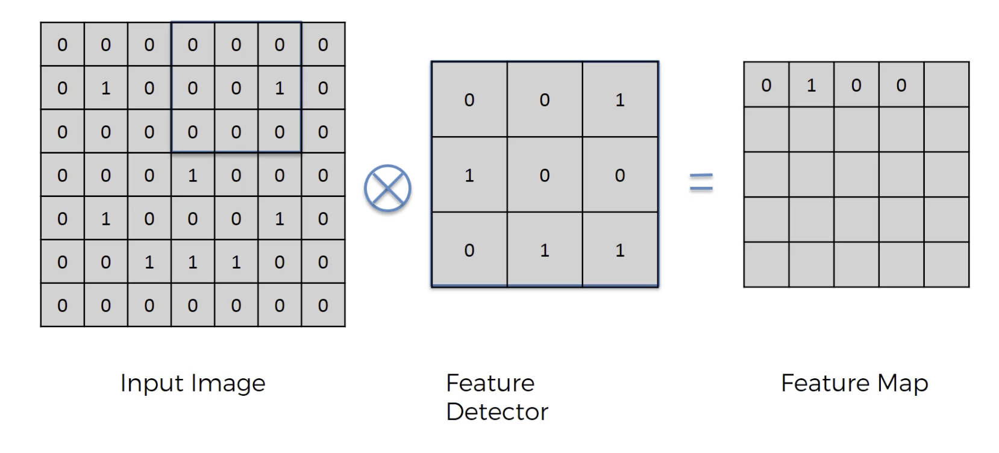

# Convolution Layer

- The convolution layer is responsible for extracting meaningful features from an image.  
- We specify the number of filters, which determines how many distinct features the network should learn.  
- In CNNs, the filters are not manually defined; the network learns them automatically. We only provide the **filter size** and the **number of filters**.  
- The output of this layer is a set of **feature maps**.  
- Applying one filter produces one feature map; applying *N* filters produces *N* feature maps, with each filter detecting different patterns in the image.  
- Convolution is the process where a small matrix (called a **filter** or **kernel**) slides over the input (e.g., an image) and computes feature maps through element-wise multiplication and summation.  
- Conceptually, it acts like a scanner moving across the image, examining small regions and extracting patterns such as edges, corners, and textures.  
- The primary motivation behind convolution is to reduce the dimensionality of the image while preserving important features, thereby lowering computational cost.  


# Kernel
- Also called filter
- Its a small matrix of numbers that is used in convolution to detect patterns in the input
- Its a pattern detector
- It slides over the image and looks at the smallers regions to extract edges, lines, blurness etc (depends on what kernel is used)
- Eg: The kernel used to detect vertical edges is
```
1   0   -1
1   0   -1
1   0   -1
```
- They are used to capture the local patterns within the image


# Stride

- Refers to the number of steps a filter (kernel) moves each time it slides across the input during convolution.  
- It controls the speed at which the filter moves
- Increasing the stride reduces the size of the resulting feature map, effectively lowering the resolution.  
- A common stride value used in practice is **2**.  
- While a larger stride may cause some loss of fine-grained information, the goal is to capture the most important features.  
- In real-world perception, we don’t examine every pixel to recognize an image; instead, we focus on prominent patterns. Feature maps work similarly by emphasizing key structures.  
- Stride also helps eliminate redundant details, simplifying the representation and reducing computational cost.  


# How it works (step-by-step)
- Take a filter (kernel), e.g. a 3×3 matrix
- Place it on a part of the input image
- Multiply corresponding elements
- Sum all values → gives one number
- Slide the filter and repeat
- The result is a feature map



- In the above diagram the kernel is a 3x3 kernel
- When the kernel is multiplied with the original image (region highlightened) we get
    - Row1: $(0*0) + (0*0) + (0*1)$
    - Row2: $(0*1) + (0*0) + (1*0)$
    - Row3: $(0*0) + (0*1) + (0*1)$
    - Then summation of all the rows will give its corresponding feature map value i.e. $0+0+0 = 0$ which is placed in the 4th column of feature map
- Next move the kernel to the right 


# ReLU Layer
- After convolution layer generates N feature maps ReLU activation function is applied
- This is done to increase non linearity in the NN
- $ReLU(x) = max(0, x)$
    - So, it clips the negative values to 0 and positive values will remain unchanged

# Why is ReLU applied after convolution?
- Introduces Non Linearity
    - Convolution is a linear operation
    - Without ReLU, the network would still behave like a linear model
    - ReLU makes the model capable of learning complex patterns
- Removes unnecessary signals
    - Negative values often represent less useful features
    - ReLU filters them out
- Improves training speed
    - Simpler computation compared to sigmoid/tanh
- Sparsity increases
    - Many values will become 0