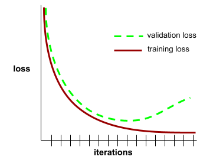
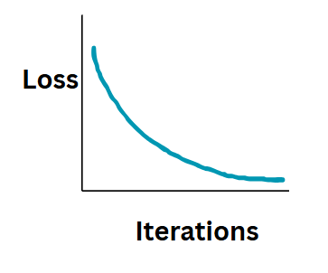
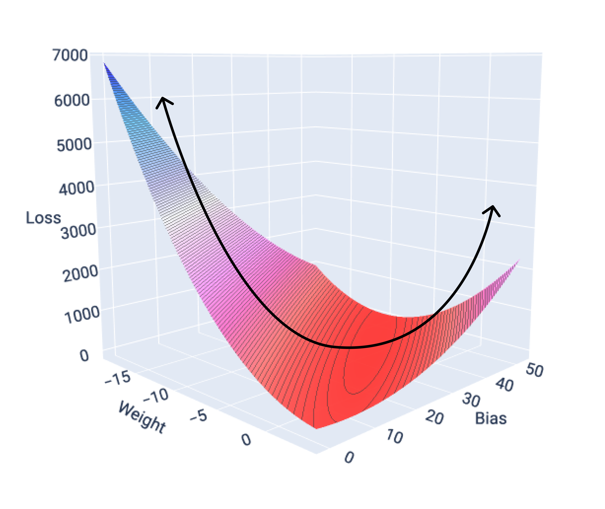
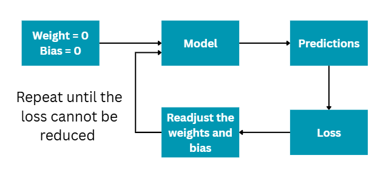
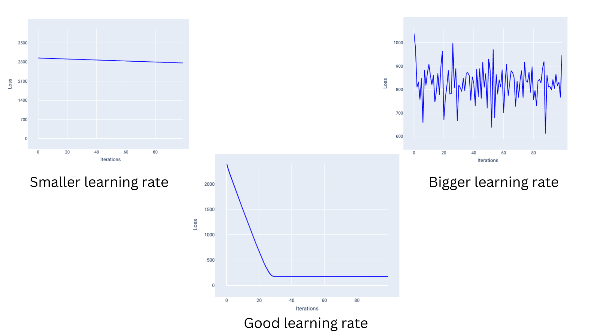
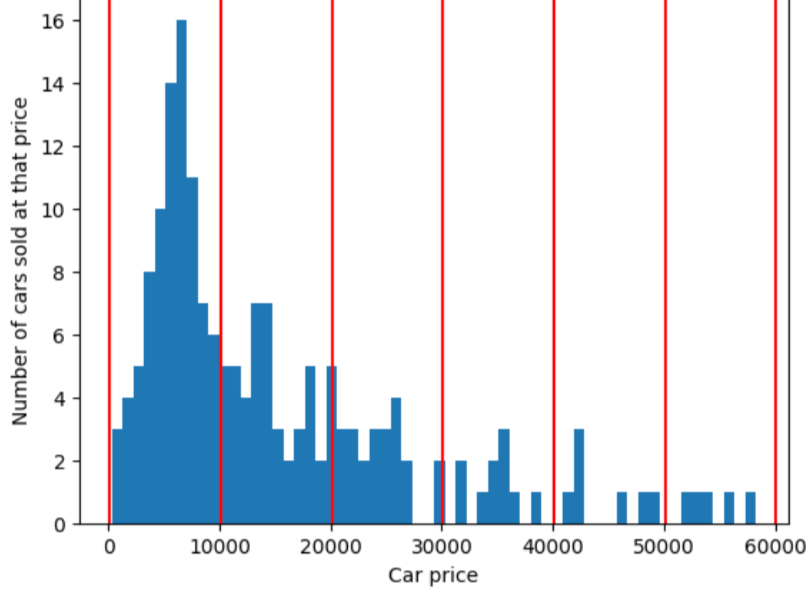
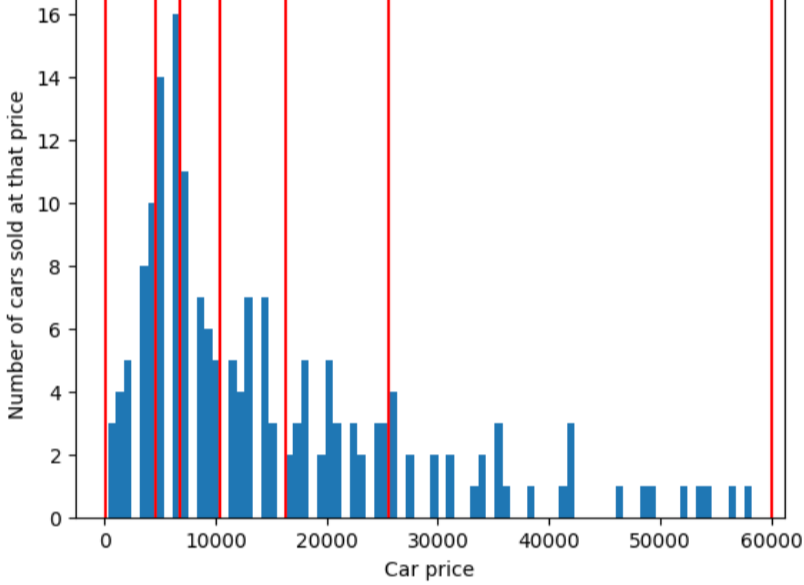
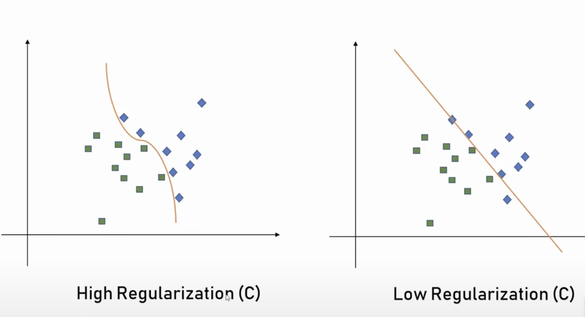

# Introduction

# AI v/s ML vs DL
- AI
    - AI is the broad field of making machines behave intelligently—like humans.
    - Goal: Simulate human thinking, reasoning, problem-solving, decision-making.
    - AI does not have to learn from data. It can work on predefined rules.
- ML
    - ML is a subset of AI where systems learn patterns from data instead of being explicitly programmed.
    - Goal: Enable systems to improve performance automatically with experience.
    - How it works: You give data → model learns patterns → makes predictions
- DL
    - DL is a subset of ML that uses neural networks with many layers (inspired by the human brain).
    - Goal: Handle complex tasks like images, speech, and language.


# Machine learning Process (Steps to be taken while you build a model)
- Data cleaning & Preprocessing
- Exploratory Data Analysis (EDA)
- Feature Engineering
- Normalize the data
- Encode the variables
- Train test split
- Model selection
- Model Training
- Model Evaluation
- Hyperparameter tuning
- Model deployment
- Monitoring and Maintainance
- Iterate

# Types of Machine Learning Algorithms
## 1. Supervised Learning
- The model is trained with both **inputs (X)** and **outputs (Y)**.
- It learns to map inputs to outputs based on the provided labels.
- When given unseen data, only the input is provided, and the model predicts the corresponding output.

## 2. Unsupervised Learning
- The dataset is **unlabeled**.
- Only inputs are available; no output labels are provided.
- The algorithm must discover **patterns, clusters, or structures** within the data.
- The possible output categories are unknown beforehand.

## 3. Reinforcement Learning
- The model learns by interacting with an environment.
- It receives **rewards or penalties** based on its actions.
- The goal is to maximize cumulative rewards through trial and error.

## 4. Self-Supervised Learning
- An **unlabeled dataset** is automatically transformed into a labeled one by the model itself.
- Commonly used in **Large Language Models (LLMs)**, where manual labeling is impractical due to massive data volumes.
- Example: Given the sentence *"Elon Musk is the founder of Tesla"*, the model can generate:
  - Feature (X): *"Elon Musk is the founder of"*
  - Label (Y): *"Tesla"*
- The primary objective in LLMs is **next-word prediction** or **text completion**, making self-supervised learning highly effective.


# Applications of ML
- Search engines
- Face recognition
- Recommendations
- Voice translation
- Flagging emails as spam

# Points to remember
- The aim of the model **during training** phase is to **minimize the loss** as much as possible
- When the model is trained on the larger dataset the accuracy of the predictions are better
- Usually the **training dataset** must be **atleast the magnitude of the no of trainable parameters or more** than that.
- Whether your labels are good or bad that will not be used by the model while training. It uses the values in the feature instead.
- When the **label** for a particular sample is **missing there must be another class called missing class** and the sample with the missing class must be assigned to this.
- The model will be interacting with the feature vector and not the data present in the dataset
- Most of the time is spent on dataset creation and in feature engineering process.


# Variance
- This term is **associated** with the **test dataset**
- The **difference between the train and test error**
- For an **overfit model**, the training error will be closer to 0 and test error will be closer to 100 thus the difference between the 2 errors is high, this implies that **variance is high**
- If the **test error is higher** it implies that the **Variance is higher**.


# Bias
- This term is **associated** with the **training dataset**
- Its a measurement of how accurately the model is able to predict and capture the patterns in the training dataset
- If **train error is bigher** then it implies it has **higher bias**.
- In an **unfit model**, the no of training samples being correctly classified will be lesser, thus the **bias is higher** as the training error will be higher.
- In a balanced model bias and variance will be low


# Prediction Bias
- **Difference between mean of models predictions and mean of ground truth values**.
- If there is any significant difference between the mean of ground truth value and mean of models predictions then it implies that the model has some prediction bias.
- Prediction bias can be caused by 
    - Noise in the data
    - Too strong regularization which means that the model is oversimplified which has made the model loose out some important features
    - Bugs in the model training pipeline
    - The set of features provided to the model.


# Underfitting
- Most of the points/ **samples present in the training dataset are misclassified**.
- The **training error** will be **higher** and **test error** will also be **higher** thus it implies that the **model has high bias and high variance**


# Overfitting
- The model **bi-hearts** so much of **training dataset** such that the model **fails to predict** rightly on **unseen data**
- Overfit model makes **best predictions on the training data but poor predictions on the new test data**.
- There is no general pattern that the model will be able to identify in such situations thus the **model will not be generalized** which results in poor predictions on the newer samples.
- When the model is provided with the sample that is a part of the training sample the predictions will be 100% however when its run on unseen data it will be bad
- The training error will be very less and test error will be higher thus it implies that the model has **low bias and high variance**


## Causes for overfitting
- Training dataset **doesnt represent the real life data**
- The **model** is too **complex**


## How to overcome overfitting 
- Early stopping
- Regularization
- Dropout


# Generalization
- A model is said to have **generalized** when it performs well on both the **training data** and the **test data**.  
- If the model performs well only on the training set but poorly on the test set, it indicates **overfitting** — the model has essentially memorized the training data instead of learning general patterns.  
- Generalization is the **opposite of overfitting**.  
- A well-generalized model makes **accurate predictions on unseen data**.  
- Poor generalization can also occur when both training and test accuracy are low, which may suggest **underfitting** (the model is too simple to capture the underlying patterns).  

# Generalization Curve

- A **generalization curve** plots both **training loss** and **validation loss** against the number of training iterations.  
- It is a useful tool for detecting **overfitting**.  
- If both curves decrease steadily over iterations, it indicates that the model is fitting well and generalizing properly.  
- If the curves diverge — for example, training loss continues to decrease while validation loss begins to increase — this signals **overfitting**, meaning the model is memorizing the training data rather than learning general patterns.  





# Loss curve
- During model training, it is important to monitor the **loss curve** to check whether the model has **converged**.
- A loss curve is a graph that illustrates how the **loss value changes** over the course of training iterations.
- By observing the curve, you can determine if the model is improving and when it has reached a point where further training yields minimal change.



- In the graph above, the loss decreases gradually. Toward the end, the reduction becomes very small, indicating that the model has **converged** and additional training may not significantly improve performance.
- Loss functions for linear models like linear regression will always produce a convex surface. It will be a graph plotted against feature1, weight, bias as shown below.




# Gradient Descent
- It is a technique that **iteratively finds the right values for weights and biases** that produces a model such that the loss/ error is the least.
- Lower the loss higher the accuracy of the models predictions.
- You start off by setting the values for the weight and bias value to 0. 
- Then calculate the models loss. 
- In the next iteration the values of weight and bias are adjusted using calculus and we follow the same procedure of recomputing the loss. 
- **Adjust** the weights and the bias value **until** the model returns a **loss** that is **extremely small or until the loss cant be reduced futher** more.
- Once the model has reached a point where **changes** in the model **parameters are hardly affecting the models loss**, then we say that the **model has converged**.



## How are the new weights and bias computed in gradient descent?
- $New Weight = Old Weight - (\alpha * Old Weight)$
- $New Bias = Old Bias - (\alpha * Old Bias)$ 
- Where, 
    - $\alpha$ : Learning Rate

## How to check if the model has converged or not?
- You need to continue training the model **until** the **loss does not fluctuate** and **remains stable**.

# Hyper parameters
- Variables that **control** different aspects of the **training process**.
- Eg: Learning rate, Batch Size, Epochs .etc.
- It is **set** even **before** the **training begins**


## 1. Epochs
- An Epoch means that the model has **processed very sample** in the training set **once**.
- For eg: if the training set has 1000 samples and the mini batch size is 100, then each iteration will use 100 samples to update the weights and bias value and it takes 10 such iterations in order to process all the samples present in the training dataset as 10 iterations x 100 samples = 1000 samples. This implies that 10 iterations are needed to complete 1 epoch.
- Higher its value more the time it takes to train, and usually better will be the model.


### How to decide the number of epochs needed for the model to converge?
- **Trial and error** as it differs for each model, and type of data.
- But, in general **more number of epochs produces a better model** but takes **more time** to train.


## 2. Learning Rate
- It is the one that determines how quickly the model should converge.
- It determines the **magnitude of the change that must be made to the weights and bias** during each step of the gradient decent process.
- Its a floating point number
- If the **learning rate** is to **low** it means that the model will take **longer time to converge** as the updation in weights and bias will be happening by tiny steps
- If the **learning rate** is too **high**, the **model will never converge**, might cross the point of convergence and will result in bouncing the bias and weights(fluctuations).
- Thus you need to choose the learning rate such that its **not too high nor too low** so that model converges quickly at a decent pace.
- When the **learning rate** is too **big** the **weights will keep bouncing** thus the time taken for training will be higher, as you will not reach the convergence point.
- How Loss graph changes with different learning rates is given below.




- Learning rate and regularization rate often pull the weights in the opposite direction.
- Higher the learning rate will usually pull the weight away from 0 and higher the regularization rate will pull the weights towards 0
- Higher the regularization rate wrt learning rate will result in model that depends on the features which have lower weight. On the other hand if learning rate is too big wrt regularization rate then the features which have stronger weights will be influencing the model predictions.
- Thus your aim is to find an equilibium  value between the learning rate and regularization rate


## 3. Batch Size
- Its a hyperparameter
- Refers to the **number of samples the model processes before it updates the models weights and bias**.
- Note the **model does not calculate the loss for each and every sample** present in the dataset before it updates the weights and bias values. This is because the size of the dataset will be very huge, thus its impractical to calulate the loss for very sample before it updates the model parameters. Thus it does it in batches.
- The batch size values **depends on the dataset** and also the available **compute resources**.
- Smaller batch size will behave like SGD and larger size will behave like full batch gradient descent.
- When the **dataset has many outliers** it is better to have a **bigger batch size** because by averaging the gradients together the negative effects that the outlier will have on the training set will reduce.


### Types of Batches
#### Full Batch
- The **batch size** will be **equal** to the **number of training samples**.
- This means that once **all the samples in the dataset are processed** thats when the parameters like the **weights and bias will get updated**.
- This is **not feasible** when the **training size is very huge.**
- For eg: If the dataset has 1000 samples and the number of epochs is 20. This means that in each epoch all the 1000 samples will be processed and after which the weights and bias will get updated. This means that 20 times the parameters will get updated.

#### Stochastic gradient descent 
- Abreviated as SGD
- It uses a single sample per iteration. This means that **batch size is 1** and the **parameters will be updated after each sample is processed**.
- For eg: If the dataset has 1000 samples and no of epochs is 20, then 1 epoch will be done after seeing 1000 samples. So in 1 epoch 1000 times the parameters are updated. Thus in 20 epochs 1000x20=20,000 updations will happen. Thus lots of **fluctuations** can be seen.
- This sample is chosen at random.
- It works but is very noisy. This means that since only 1 sample is given the amount of variation that exists during the training will be high thus the loss will start to fluctuate per iteration. Therefore, the loss graph will be varrying.
- The amount of noise/ fluctuations is comparatively lesser in this approach.


#### Mini Batch stochastic gradient
- Abreviated as mini batch SGD.
- It lies between full batch and Stochastic Gradient
- Here the **batch size** will be **greater than 1 and less than N** where N is the total number of samples.
- The model chooses the samples to be included in each batch at random, averages their gradients and then updates the weights and bias once per iteration.
- For eg: If the training set has 1000 samples, the mini batch size is 100, and the no of epochs is 20 then, after visiting every 100 samples the parameters will get updated. And no of iteration it will require to complete 1 epoch will be 1000/20 = 50 iterations. In each iteration there will be 100 samples processed thus 50 updations will happen in each epoch. And 50x20=200 updations will happen in 20 epochs.


# Parameters
- Variables that are **part of the model**
- Eg: Weight, Bias


# Exploding Gradient
- Using gradient descent, we update model parameters such as weights and biases.  
- If the gradients become excessively large, the updates will also be large, causing the model to **overshoot** optimal values.  
- This leads to an unstable training process where the model may **bounce around** instead of steadily approaching convergence.  

## How to avoid Exploding gradient
- Clipping
- Normalization
- Having smaller learning rates

# Vanishing Gradient
- Occurs when gradients become extremely small, effectively **disappearing** during training.  
- In backpropagation, although computations continue, the returned gradient values are **tiny**.  
- As a result, the **earlier layers** in the network receive very minimal updates.  
- This leads to slow learning or the model getting **stuck**, preventing effective convergence.  


# Correlation
- One of the important steps in ML is to determine which among the **features** are correlated/ **related** with the output label i.e. which of the features values affects the outcome?
- **Range** of the correlation value lies between **[-1, 1]**.
- Where,
    - `\>0` : Positive correlation. As the **feature1** value **increases** the **feature2** value will also **increases**.
    - `<0` : Negative correlation. As the **feature1** value **increases** the **feature2** value will **decrease** or vice versa.
    - =0 : **No correlation** exists between the 2 given features.
- Note correlation can be **computed with numerical columns only**, if categorical exists they must be encoded using some encoding methods.

```python
import seaborn as sns
correlation_matrix = df.corr()
sns.heatmap(correlation_matrix, cmap="Blues", annot=True)
```


# Binning
- Also called bucketing or discretization.
- Its a feature engineering technique
- We are grouping the values and putting them in the bin


## When to Use Binning?

- Useful when the linear relationship between features and labels is weak or nonexistent.  
- Effective when feature values are naturally clustered.  
- Each bin is assigned a separate weight by the model.  
- Each bin should contain a sufficient number of samples to be meaningful.  
- Helps in converting **continuous data into categorical data**.  
  - Example: If age is the feature, bins could be defined as:
    - Bin 1: Ages 0–10  
    - Bin 2: Ages 10–50  
    - Bin 3: Ages 50+  
  - Here, continuous values are transformed into discrete categories (similar to histogram bins).  
- Not suitable for all applications; works best when dividing continuous values into bins provides more insight than raw values.  
- Example:  
  - **Play Store Downloads**: Exact values like 22, 77, or 3,000,000 are sparse and not very informative. Instead, bins such as 0–1000 downloads, 1000–5000 downloads, etc., make the data more interpretable.  
- The **ranges/categories must be continuous**, just like the X-axis values in a histogram.  


## Advantages of binning
- To **handle outliers**. Sometimes the values might be very huge due to binning it might be reduced.


# Quantile Bucketing 
- It creates boundaries such that **each bucket** has exact or approximately **equal no of samples**
- It usually **hides the outliers**
- This implies that the **range of each bucket need not be the same**
- Difference between equal and quantitle bucketing is shown below






# Clipping
- A technique used for **handling outliers** in data.  
- Can be applied by either:
  - **Removing** values that fall below the minimum threshold, or  
  - **Adjusting** values outside the threshold range to the nearest boundary.  
- Example: If the valid range is **20–30**, then:
  - Values `<` 20 are clipped to 20.  
  - Values `>` 30 are clipped to 30.  
- Helps in reducing the influence of **extreme outliers** on the model.  
- Essentially, it **caps values** at the defined minimum or maximum limits based on requirements.  


# Feature crosses
- Crossing 2 or more categorical features.
- Taking cartesian **product of 2 or more features**
- For eg: Consider a leaf dataset with 2 features edges(with values smooth, toothed, lobed) and arragments(with values opposite, alternate). One hot encoding of smooth will be 1,0,0 and opposite will be 1,0. Feature cross of smooth_opposite = (1,0,0)x(1,0)
- Usually used when 2 features together when grouped makes more sense. 
- Will need some domain knowledge


# Regularization

- Regularization is a technique used to **reduce overfitting** and improve the **generalization** ability of a model.  
- It typically **lowers accuracy on the training set** but improves accuracy on the **test set**, ensuring better performance on unseen data.  
- The parameter $\lambda$ is known as the **regularization rate**:
  - A higher $\lambda$ increases the influence of regularization, reducing overfitting and encouraging weights to follow a more **normal distribution**.  
  - A $\lambda$ of 0 means **no regularization**, so the model focuses solely on minimizing loss without considering complexity.  
- Choosing the right $\lambda$ depends on the **dataset and problem context**.  
- Regularization helps in preventing the model from assigning excessively large weights, which can lead to unstable training and poor generalization.  
- How does low and higher regularization looks like is shown in the below diagram



## Types of Regularization
### 1. L1 regularization 
- Also called as **LASSO**(Least absolute shrinkage and selection operator) regularization
- It **adds an absolute values of the weights as penalty to the loss function** i.e $\lambda \sum |w_i|$ to the loss function 
- L1 regularization = $\frac{1}{n}\sum (y_i - \hat y_i)^2 + \lambda \sum |w_i|$

### 2. L2 Regularization
- Also called as **Ridge Regularization**
- It adds an **Square values of the weights as penalty** to the loss function i.e $\lambda \sum (w_i^2)$ to the loss function 
- L2 regularization = $\frac{1}{n}\sum ((y_i-\hat y_i)^2) + \lambda \sum (w_i^2)$
- If $w1=0.2$, then $w1^2 = 0.04$, $w2 = 5$ then $w2^2 = 25$. When the value of weights is close to 0 then they dont affect L2 regularization much but when the weight are large they have a huge impact on the L2 regularization.
- L2 regularization **aims at getting the weights closer to 0 but not equal to 0**. This implies that it is **trying to reduce the overall complexity** of the model.
- As it never makes the weights of the features completely equal to 0, it **never removes or ignores any features**
- When **weights** of the features is **close to 0** it implies that the **feature will not be influencing the models predictions** alot.
- It always improves generalization in linear models.

# Early Stopping

- Early stopping is a technique used to halt the training process once the validation loss/monitoring metric begins to increase.  
- It is a quick way to prevent overfitting, though not always the most robust method.  

## How Early stopping Works
1. Monitor a metric such as **validation loss** or **validation accuracy** during training.  
2. Define a **patience parameter** — the number of epochs to wait before stopping if no improvement is observed.  
3. Using the below example:  

| Epoch | Training Loss | Validation Loss |
| ----- | ------------- | --------------- |
| 1     | 0.90          | 0.85 ✅          |
| 2     | 0.75          | 0.70 ✅          |
| 3     | 0.60          | 0.55 ✅          |
| 4     | 0.50          | 0.50 ✅ (best)   |
| 5     | 0.40          | 0.52 ❌          |
| 6     | 0.30          | 0.55 ❌          |
| 7     | 0.20          | 0.60 ❌          |

- Suppose patience is set to 2.  
- The validation loss is reducing upto 4th epoch and starts to increase from epoch 5
- The algorithm waits for 2 more epochs, If no improvement occurs by epoch 5+2 = 7 training stops, as it is not reducing the training stops at epoch 7 and the best model is taken from epoch 4.  
- Training stops at the point where the model achieved its **best validation performance**, preventing further overfitting.  


# Dimensionality reduction
- Process of **reducing** the number of input variables or **features** in the dataset without the loss of important information 

# Types of dimensionality reducing 
1. Feature Selection
- Keep only important features
- Remove irrelevant ones
- Example:
    - Keep: age, salary
    - Drop: random ID column

2. Feature Extraction
- Create new features from old ones
- Example:
    - Principal Component Analysis (PCA)
    - Combines multiple features into fewer components


## Problems faced due to high dimensional data
- Overfitting 
    - As the no of features are very high the model will start memorizing rather than understanding patterns within itself
- Computational cost increases 
- Curse of Dimensionality
    - The algorithms efficiency and effectiveness is reduced because of higher dimensional data
    - As the no of features increases the no of samples required for the model to generalize also increases
- Loss of important informaton


# Ways to prevent Dimentionality reduction
- Feature selection
    - Removes useless features
- Regularization
    - Reduces the complexity of the model


# Parameteric V/S Non Parametric Models

| Parametric Models | Non Parametric Models |
|---|---|
| Assume that the sample follows a particular distribution like gaussian, linear etc. Eg: In linear regression the model assumes the data is linear i.e. y= mx+c | It does not assume anything. Instead it learns all the patterns from the data directly |
| Faster | The complexity of the model grows as the dataset size increases |
| Eg: Linear regression, Logistic Regression | KNN, Decision Trees|
| Fixed no of parameters are present for eg: in linear regression its bias and weight | No fixed No of parameters |
