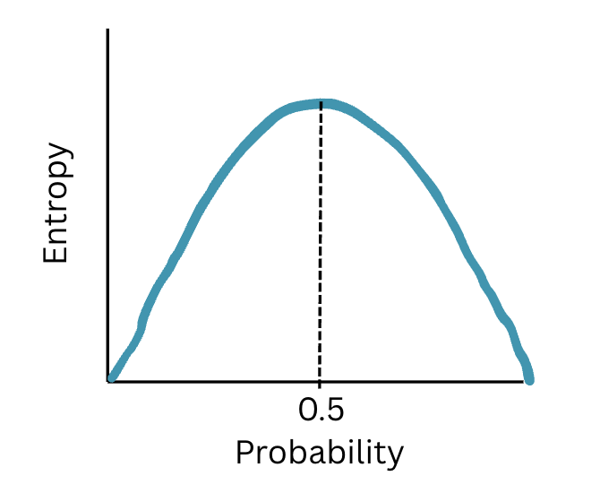

# Decision Tree
- Machine learning tool thats used for **Classification(Decision Tree Classifier) and Regression(Decision Tree Regressor)**
- It is a **supervised learning** algorithm
- It is a graphical representation of **all possible solutions to make a decision**
- It **breaks down the dataset into smaller subsets**
- Decisions are based on some conditions
- **Decisions** are made by the **leaves**
- It has a **hierarchical structure** made up of root, nodes and leaves
- If a condition is satisfied, it will branch out to check the next set of conditions
- Each node will divide the dataset into 2 smaller sub datasets, this is called as the binary split
- It **can handle non linear relationships** that exists in the dataset
- It is a [non parametric model](../../introduction.md/#parameteric-vs-non-parametric-models)

# Disadvantages
- It can **easily overfit** the training dataset
- **Small changes** in the dataset might result in **completely different trees**
- If there is an **imbalanced dataset** the decision tree will tend to get **biased towards the majority class**
- **Larger trees** can become **difficult to interpret**

# Advantages
- **Easy to understand, implement and interpret**
- **Handles both numerical and categorical data**
- Does **not require** any **data scaling**
- **We need not identify the important features**, it will automatically identify as it calculates the information gain for each feature

# Terminologies
- Root node
    - It's the **1st node** of the tree
    - It has **access** to the **entire dataset**
    - It represents the entire population 
    - This is further **divided into 2 or more homogeneous sets**
    - It is also called the **parent node** 
- Leaf Node
    - The **last node** of the tree
    - It **cannot be further divided**
- Pruning
    - Removing or **cutting off the unwanted branches** from the tree
    - This is done **to get** the **optimal solution**
- Gini Index
    - It is the **measure of impurity**/ purity that is used to build the decision tree
- Impurity
    - Eg: If there is a basket full of apples, and another basket full of labels = “apple”, then the probability of picking 1 item from each basket will always ensure the label is an apple and the fruit is an apple, thus the probability is 1 and the impurity is 0
    - Eg: If the 1st basket has different fruits and the other basket has labels of the fruits, the probability of picking a fruit and the label is not 1. Here, there are different probabilities possible, thus entropy is non-zero.
- Entropy
    - It is the **measure of impurity** in the data
    - It measures the **randomness** present in the data
    - When the **probability is 0 or 1**, then the **entropy is 0**. This means that if the data is completely pure, then **randomness is 0**. And if the data is **completely impure**, then **randomness is 0**, which implies the **entropy is 0**.
    - When the **probability is 0.5** the **entropy is highest** i.e.
    - $Entropy(S) = - P(yes)log_{2}P(yes) - P(No)log_{2}P(No)$
    - Case1: When P(Yes) = P(No) ⇒ 0.5
        - Entropy = - 0.5xlog2(0.5) - 0.5xlog2(0.5)
        - Entropy = 1
    - Case2: When P(Yes) =1 ⇒ P(No)=0
        - Entropy = -1xlog2(1) - 0
        - Entropy = 0
        ..- Similary when P(No) = 1 ⇒ P(Yes) =0
    - Probability V/S Entropy is shown below

    
- Information gain 
    - We will need to find the **attribute that returns the highest information gain**, and that attribute will be used as the **node for that iteration**
    - It **measures the reduction in entropy**
    - $InfomationGain = Entropy(S) - [(Weighted Avg)*EntropyOfEachFeature]$

# Working of the Decision Tree
- Decide the root node. It will be representing the entire dataset
- Then it looks for that feature which split into most distint groups. i.e. the feature which returns the highest information gain
- Based on the answer to the previously chosen node, it divides the dataset ino smaller datasets
- This division will continue until it reaches the final leaf node.

