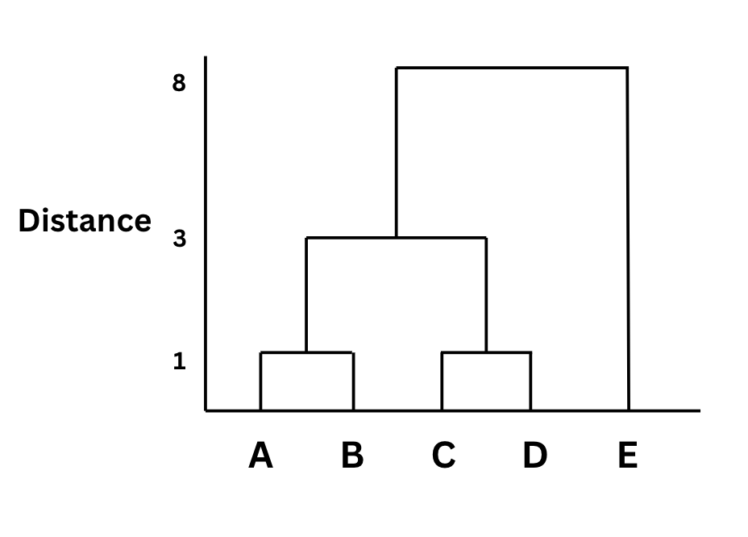

# Agglomerative Hierarchial Clustering

- Start with the each data point i.e. each data point belongs to it’s own cluster
- For instance if there are n data points then we will have n clusters in step 1
- In each step merge the closest clusters together
- Continue until all the points belong to a single cluster
- Most commonly used approach
- This is a bottom up approach


# Working of Agglomerative clustering

- Create the distance metrics (talks about the distance between each and every point in the dataset)
- Find the minimum most distance and create a cluster between those 2 points
- X axis will be the clusters and y axis will be the distance
- Next create another distance metrics with the cluster included as a single point and remove it’s individual points that were considered in the previous step


## Example Dataset
```
A = 1  
B = 2  
C = 5  
D = 6  
E = 10  
```

## Step 1: Compute Distance Matrix
- Distance Matrix: The distance between each and every point
- Distance metrix using euclidean distance as the distance metrix

|   | A(1) | B(2) | C(5) | D(6) | E(10) |
| - | ---- | ---- | ---- | ---- | ----- |
| A | 0    | 1    | 4    | 5    | 9     |
| B | 1    | 0    | 3    | 4    | 8     |
| C | 4    | 3    | 0    | 1    | 5     |
| D | 5    | 4    | 1    | 0    | 4     |
| E | 9    | 8    | 5    | 4    | 0     |

> Note: The diagonal in the distance metrix will be 0

## Step 2: Start Clustering (Single Linkage)
- Find the minimum most distance from the distance metrix and create a cluster between those 2 points 

### Iteration 1:
- In this eg: it is between B and A which is 1 and between C and D which is also 1.
- Cluster these as a single point 
- Points are (AB), (CD), (E)

### Iteration 2:
- Again create a distance metrix with the clustered points

||AB|CD|E|
|---|---|---|---|
|AB|0|min(distance(A,C), distance(A,D), distance(B,C), distance(B,D)) = 3|8|
|CD|3|0|4|
|E|8|4|0|
- The minimum distance is between (AB) and (CD) thus merge them
- Finally points are (ABCD), (E)

### Iteration3
- Group into 1 whole cluster
- Point = (ABCDE)

# dendrogram



# Implementation
- Normalization must be done, as it is a distance based algorithm
- As its an unsupervised learning we dont have to split the dataset into train and test split
```python
from sklearn.cluster import AgglomerativeClustering
model = AgglomerativeClustering(n_clusters = 5, affinity = 'euclidean', linkage = 'ward')

y_pred = model.fit_predict(X)
```
- y_pred contains the cluster it belongs to
