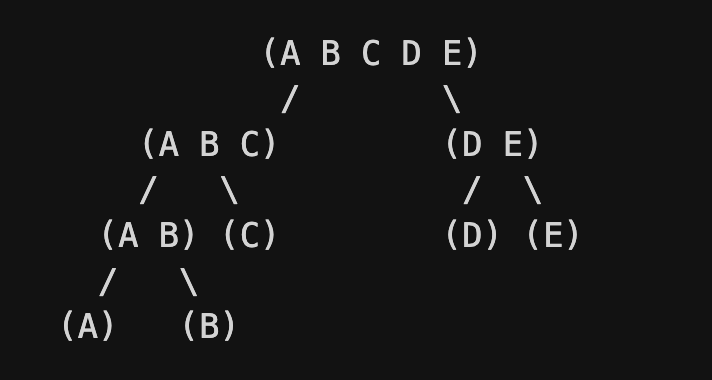

# Divisive Clustering

- Top to down approach
- Opposite of agglomerative clustering
- Start with the entire dataset belonging to a single cluster and then divide the data into smaller clusters
- Do this process until each data point from the dataset will be a cluster of it’s own i.e. if we have n data points then we should have n clusters towards the end
- Here the goal is to split those clusters which are far apart

# Steps
- At each step:
    - Select cluster with maximum spread i.e. maximum inter cluster distance (diameter)
    - Split using most dissimilar points i.e. those points which have the maxmimum distance between them

# Working of Divisive Clustering

## Example Dataset
```
A = 1  
B = 2  
C = 5  
D = 6  
E = 10  
```

## Step 1: Initialize the Cluster
- Start with all points grouped into a single cluster
- Point/ Cluster is (ABCDE)

## Step 2: Create Distance metrix
- Distance Matrix: The distance between each and every point
- Distance metrix using euclidean distance as the distance metrix

|   | A(1) | B(2) | C(5) | D(6) | E(10) |
| - | ---- | ---- | ---- | ---- | ----- |
| A | 0    | 1    | 4    | 5    | 9     |
| B | 1    | 0    | 3    | 4    | 8     |
| C | 4    | 3    | 0    | 1    | 5     |
| D | 5    | 4    | 1    | 0    | 4     |
| E | 9    | 8    | 5    | 4    | 0     |

## Step 3: Iterative Splitting
### Iteration1
- Identify the maximum distance in the matrix (The distance between point A and E is the maximum)
- Thus these 2 points will act as a seed for splitting the data
- Now find the distance of all points to A and all points to E.
- Assign each point to the cluster of the nearest seed

| Point | Dist to A | Dist to E | Assigned |
| ----- | --------- | --------- | -------- |
| A     | 0         | 9         | A        |
| B     | 1         | 8         | A        |
| C     | 4         | 5         | A        |
| D     | 5         | 4         | E        |
| E     | 9         | 0         | E        |
- Here the distance between D and A is 5 and between D and E is 4. As it is closer to cluster E, D will be assigned to cluster B
- Clusters = (ABC), (DE)

### Iteration2
- Inter cluster distance(diameter) of ABC = max(dist(A,B), dist(B,C), dist(A, C)) = max(1, 3, 4) = 4
- Inter cluster distance of DE = max(dist(D,E)) = 4
- In this case both the distances are same, so we can pick the one with more points
- When its not the same, we pick that cluster which has greater inter cluster distance. Higher this distance more room for splitting
- Lets take (ABC) and split it futher and find the farthest points in it
- dist(A, B) = 1, dist(A, C) = 4, dist(B, C) = 3
- dist(A, C) is higher thus the split points are A, C
- Finding the distance of B to A and C to A

| Point | Dist to A | Dist to C | Assigned |
| ----- | --------- | --------- | -------- |
| B     | 1         | 3         | A        |

- Thus clusters are (AB), (C), (DE)

### Iteration3
- Intercluster distance
    - AB: 1
    - C: 0
    - DE: 4
- As DE has the maximum inter cluster distance we split that
- Clusters = (AB), C, D, E

### Iteration4
- Finally its A, B, C, D, E

# Dendogram



