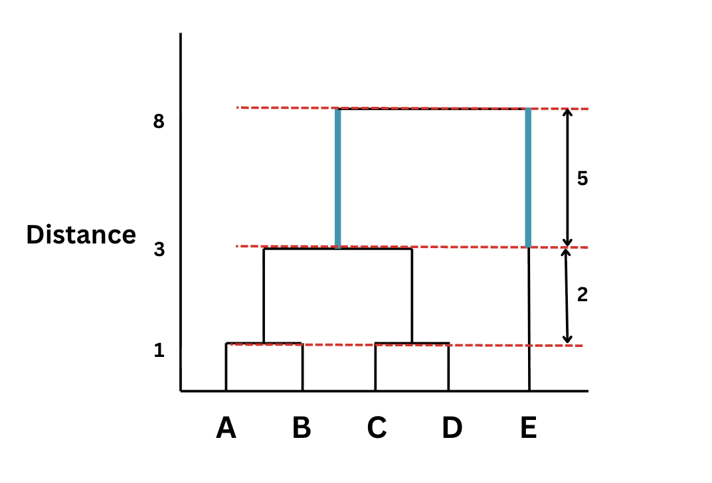

# Hierarchical clustering
- Hierarchical clustering is a type of unsupervised machine learning algorithm used to group similar data points into clusters, but unlike K-means, builds a hierarchy of clusters
- It uses the tree like structure called Dendrogram to create the clusters


# Dendrogram
- A dendrogram is a tree diagram that:
    - Shows how clusters merge or is split at different distance levels
    - Helps decide the optimal number of clusters by cutting the tree at a certain height
- Implementation

```python
from scipy import cluster.hierarchy as sch
dendrogram = sch.dendrogram(sch.linkage(X, method = 'ward'))

```
- Method = 'ward' implies that the variance within the cluster must be minimum

# How can dendrogram be used for finding the optimal number of clusters?
- To identify the optimal number of clusters, look at the vertical distances between consecutive horizontal merges.
- The largest vertical gap indicates the point where clusters are most distinct.
- Draw a horizontal cut across that region, then count the number of vertical lines intersected by the cut.
- This count represents the optimal number of clusters for the dataset.
- The below diagram depicts how the optimal clusters are found



- The maximum consecutive horizontal distance is 5 and the no of vertical lines within that region is 2 (marked in blue). Thus the optimaal no of clusters is 2


# Types of Hierarchical clustering

1. [Agglomerative](./agglomerative.md) (Bottom Up Approach)
2. [Divisive](divisive.md) (Top to Down)


# How clusters are merged (Linkage Methods)

To decide which clusters to merge, we use distance measures:

- Single linkage → minimum distance between points
- Complete linkage → maximum distance
- Average linkage → average distance
- Ward’s method → minimizes variance within clusters

# Advantages

- No need to specify number of clusters initially. The algorithm first builds the dendrogram and then we choose the optimal K value based on where you want to cut the dendrogram
- Produces a clear hierarchy (useful for analysis)
- Works well for smaller datasets

# Disadvantages

- Once merged/split, it cannot be undone
- Sensitive to noise and outliers
- On larger datasets K means does better than hierachial clustering, as ur becomes very slow, and consumes lots of memory, whereas K means can scale and is widely used in real world applications

# Distance between clusters can be done by

- Picking closest points and then find the distance
- Picking the farthest point then find the distance
- Find the average of both clusters and then find the distance between those points
- Find the centroids of the 2 clusters and them find the distance between the two centroids

