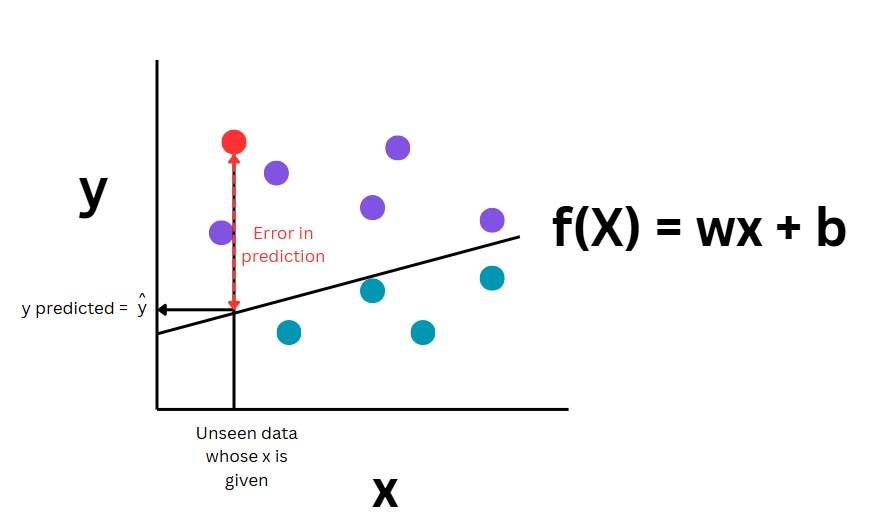
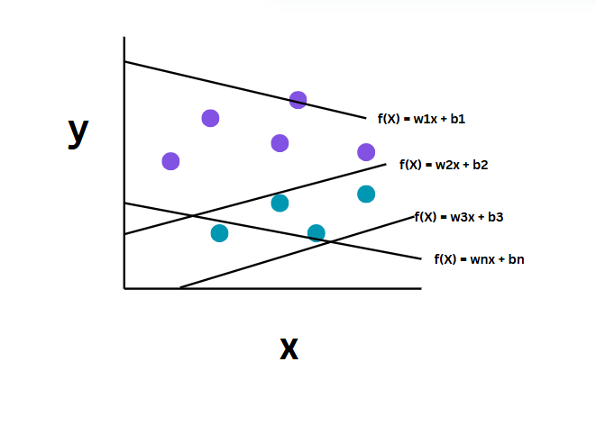
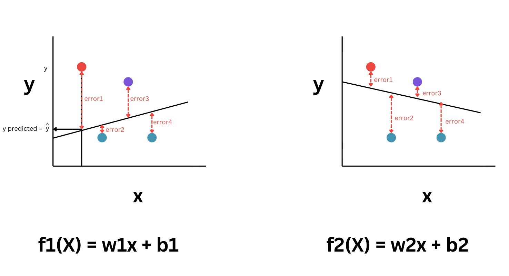

# Linear regression 
- Its a **supervised learning** algorithm
- Its a type of regression model as the **ouput range is infinite**. 
- It tries to find out the relationship between variables
- Uses a **straight line to fit** the given input data points.
- Here the **model function** will be **linear** which implies its a straight line.
- **During** the **training** process the **model will calculate the w and b** to produce the best model 
- Linear regression is highly affected by the outliers

# Formula
- $y = mx + c$ OR $f(X) = wx + b$
- Where,
    - w: Weight, m: Slope 
    - The w and b are called the parameters/ weights/ co-efficients of the model. These are tweaked inorder to improve the accuracy of the model. This implies that as the values of w and b are changed you get a new line 
    - c: Y-intercept, b: Bias of the model
    - y': Dependent Variable
    - x: Independent Variable
    
# Key intuition
- For a given dataset, there are **infinitely many possible lines** as there are infinite values possible for w and b
- Our goal is to **find the best possible line** that fits the data. “Best” here refers to the line that minimizes the difference between actual and predicted values.
- The **error** is the **least** when the **line** is able to **pass through each and every point** of the dataset
- In the real world data, there will be lot of noise, thus we will not be able to find that line which will pass through each and every sample point, but instead we aim to find the best approzimation possible
- To find the best line we will need to use ordinary least squares method

# What is error?
- For each data point:
    - Actual value → $y_i$
    - Predicted value → $\hat{y}_i$
- The difference is called the error or residual
- $\text{Error (Residual)} = y_i - \hat{y}_i$

# Ordinary Least Square (OLS)
- Its the most common method used to find the best-fit line.
- Idea    
    1. For each data point, draw a **vertical line** to the regression line  
    2. This vertical distance is the **residual (error)**  
    3. Square each error (to avoid negatives and penalize large errors)  
    4. Sum all squared errors  
- Objective Function
    - $\text{Cost Function} = \sum_{i=1}^{n} (y_i - \hat{y}_i)^2$
- This is also called: **Residual Sum of Squares (RSS)** or **Mean Squared Error (MSE)** (when divided by \( n \))
- Goal of OLS is to find values of w and b such that the sum of squared errors is minimized
- Why square of errors?
    - Prevents positive and negative errors from canceling out  
    - Penalizes larger errors more heavily  
- The below diagram shows how errors are computed between the predicted and the actual value

# Assumptions of a linear regression
- Linear relationship must exist between the X features and Y features
- Homoscedasticity: Same scatter i.e. variance must be constant
- No multi collinearity i.e. Features should not be highly correlated with each other. Each feature should provide unique information
- Only if these assumptions are satified in the dataset we can apply linear regression

# Types of regression Models
- [Simple Linear Regression](./simple_linear_regression.md)
- [Multiple Linear Regression](./multiple_linear_regression.md)
- [Polynomial Linear Regression](./polynomial_linear_regression.md)

# Why is scaling not matter in Linear Regression based models?
- As regression models have a coeffient of weight associated with each feature i.e. w*x the weights will handle the scaling aspects for different units of feature values
- So even if we scale the weights will adjust accordingly and the results will still remain the same
- For instance, salary is in rupees, which will be larger numbers and age will have smaller numbers so the model will assign smaller weights for salary and larger weights for age

# Performance Metric/ Evaluation metric for regression
1. $R^2$
    - $R^2 = 1 - \frac{\text{Residual Sum of Squares}}{\text{Total variance in the data}}$
    - Where,
        - Residual Sum of squares is the error i.e. $\sum((y_{i} - \hat{y_{i}}))^2$
        - Total variance in the data i.e. $\sum((y_{i} - Mean(y)))^2$
    - If $R^2$ is 
        - Equal to 1 => implies perfect prediction and all the points fit the data perfectly well
        - \>0.9 = Very Good
        - \<0.7 = Not great
        - \<0.4 = Terrible
        - \<0 = Model does not make sense for this data
        - This range of good v/s bad might change based on the domain and data, but can be used as the starting point
    - It increases when your model explains more variations in the data and decreases when it fails to capture variation
    - The mean of Y is used as the baseline model, and $R^2$ measures how much better is your model when compared to the baseline model which predicts the mean
    - Before judging the model we need a reference point and that reference point is the mean. So we are testing if the model can do much better than the basic model
    - Here it is considered that the best possible value for a prediction is the mean of the existing predictions
    - If your model is same as the baseline model then $R^2 = 0$
    - If your model is perfect then Residual error will be 0 thus $R^2 = 1$
    - If your model is worse than the baseline then $R^2 <0$

2. Adjusted $R^2$
    - In $R^2$ formula when we add a new independent variable to the model, the denominatr i.e. Total variance will not change, whereas Residual error will change which will either decrease or stay the same, it will never increase due to the working of Oridanry Least Square
    - Which implies $R^2$ will always increase when you add more features even when you add useless ones, but Adjusted $R^2$ increases only if the feature is useful
    - ${Adjusted R^2} = 1 - (1-R^2)*\frac{n-1}{n-k-1}$
    - Where, 
        - k: No of independent variables
        - n: Sample size
    - It penalizes the unnecessary features and gives a more realistic measure of model performance
    - It helps in detecting whether the new feature added is actually useful or not
    - To compare the models with different no of features i.e. if model 1 has 3 feature and model 2 has 5 features to identify which model is better Adjusted $R^2$ is better
    - Dont use Adjusted $R^2$ is you are not adding any features 
    - Use Adjusted $R^2$ whenever you are comparing models with different numbers of features
- [Practical example on how to compare the results of various Regression Models](https://github.com/Ritu-malage/knowlegebase/blob/main/site/docs/ML/ml_foundations/md_utils/models/linear_regression/practicals/practice1.ipynbpracticals/model_comparison.ipynb)
