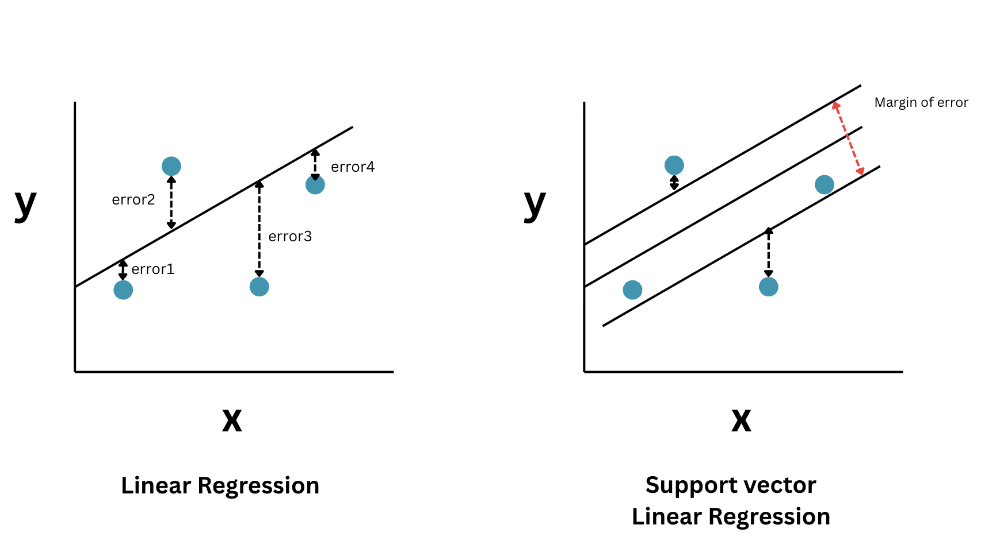

# Support Vector Linear Regression
- Abbreviated as SVR
- Uses the same concept as that of [Support vector machines](../svm/svm.md) just that instead of classifying the data, it predicts the continuous values
- In Linear Regression:
	- Every data point contributes to the error  
	- Even points very close to the regression line affect the model  
- In SVR:
	- A margin of tolerance or margin of error is introduced  
	- Errors within this margin are ignored
- In SVR, instead of a single regression line there is one central regression line and two parallel boundary lines drawn on either sides on the central regression line
- The region between these lines is called the $\epsilon$ tube (margin of error)
- Points inside the tube will not contribute to the error whereas points outside the tube will contribute to the error
- $\epsilon$ is the width of the tube, larger the value more tolerance and simpler the model
- Linear Regression → minimizes error for all points and SVR → ignores small errors and focuses on significant deviations
- The below digram shows the comparision between SVR and Linear regression



# Feature scaling is important for SVR unlike Linear regression why?
- SVR relies on distance-based calculations
- It does not inherently adjust for feature scale using the coefficients like in the case of Linear regression ($w_1*x_1, w_2*x_2$)
- Features with larger values can dominate the model 

# Implementation
```python
from sklearn.svm import SVR

model = SVR()
model.fit(X_scaled, y_scaled)

# Prediction
y_pred = model.predict(scalar_x.transform([[6.5]]))
y_pred
```